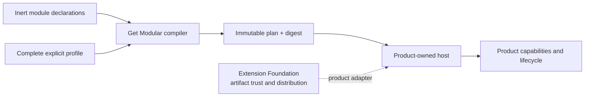

# Get Modular


Get Modular is a product-neutral TypeScript module composition toolkit. It
turns inert module declarations and an explicit profile into a deterministic,
immutable composition plan. Product hosts retain authorization, executable
loading, lifecycle, readiness, publication, routing, and recovery authority.



Get Modular is intentionally independent from
[`extension-foundation`](https://github.com/agent-teams-ai/extension-foundation).
The two neutral cores do not depend on each other. A product-owned adapter may
consume both.

## Packages

- [`@get-modular/core`](packages/core/README.md) owns portable declarations,
  validation, deterministic compilation, plans, digests, and diagnostics.
- [`@get-modular/assembly`](packages/assembly/README.md) optionally constructs
  Host-authorized factories from a successful Core plan. It passes closed,
  typed dependency records to each factory; the Host retains lifecycle,
  readiness, permissions, and cleanup ownership.
- `@get-modular/conformance` is reserved for a development-only conformance suite for core,
  alternative implementations, and adapters. Applications do not install it at
  runtime.

`conformance` uses the conventional protocol-testing meaning: independently
owned fixtures prove that an implementation follows the contract. The
conformance package may depend on core; core never depends on conformance.

Core and Assembly `0.1.0` are available from npm. Install both when the Host
needs construction, or Core alone when it only needs a portable plan:

```sh
npm install @get-modular/core@0.1.0 @get-modular/assembly@0.1.0
```

Start with the [consumer quickstart](docs/guides/consumer-quickstart.md) and its
[executable Host example](packages/assembly/examples/basic-host.mjs).

Accepted ADR-0009 fixes one unversioned
pre-1.0 public API surface: no export or internal identifier carries a
generation suffix, and before 1.0 a breaking change simply replaces the current
surface and is recorded in the package changelog with the consumer migration.
`schemaVersion` is an inert data-format discriminator. Historical qualification
files retain `V1` and `v2` labels so their immutable evidence identities remain
auditable; those labels do not by themselves require parallel application API
generations. See the [current contract](docs/architecture/current-contract.md).

## Start here

- [Documentation index](docs/README.md)
- [System boundary](docs/architecture/system-boundary.md)
- [Accepted decisions](docs/decisions/README.md)
- [Open decisions](docs/open-decisions/README.md)
- [Normative requirements](docs/requirements/module-system-v1.md)
- [Provenance map](docs/provenance/source-map.yaml)

The packages are pre-1.0. Core and Assembly are published for real consumer
adoption, without a stable `1.0`, runtime-conformance, or lifecycle-management
claim.
Deterministic, product-neutral TypeScript module composition with explicit capabilities, immutable plans, and conformance tooling.
