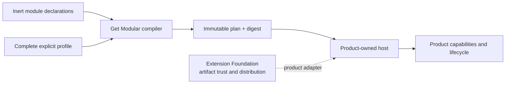

# Get Modular

Get Modular is a product-neutral TypeScript module composition toolkit. It
turns inert module declarations and an explicit profile into a deterministic,
immutable composition plan. Product hosts retain authorization, executable
loading, lifecycle, readiness, publication, routing, and recovery authority.

Get Modular is intentionally independent from
[`extension-foundation`](https://github.com/agent-teams-ai/extension-foundation).
The two neutral cores do not depend on each other. A product-owned adapter may
consume both.

## V1 packages

- `@get-modular/core` is the only production dependency. It owns portable
  declarations, validation, deterministic compilation, plans, digests, and
  diagnostics.
- `@get-modular/conformance` is a development-only conformance suite for core,
  alternative implementations, and adapters. Applications do not install it at
  runtime.

`conformance` uses the conventional protocol-testing meaning: independently
owned fixtures prove that an implementation follows the contract. The
conformance package may depend on core; core never depends on conformance.

## Start here

- [Documentation index](docs/README.md)
- [System boundary](docs/architecture/system-boundary.md)
- [Accepted decisions](docs/decisions/README.md)
- [Open decisions](docs/open-decisions/README.md)
- [Normative requirements](docs/requirements/module-system-v1.md)
- [Provenance map](docs/provenance/source-map.yaml)

The repository is in pre-1.0 bootstrap. No production Module API is published
yet.
Deterministic, product-neutral TypeScript module composition with explicit capabilities, immutable plans, and conformance tooling.
