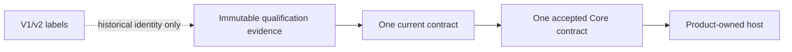

# Current contract

This document is the navigation and implementation guide for the current
pre-1.0 contract. It does not replace an accepted ADR or mutate immutable
qualification artifacts.

## Accepted contract and proposed public naming

Get Modular has one accepted contract and no production package yet. The
accepted contract currently names `compileCompositionV1` and
`compileCompositionJsonV1`. ADR-0009 proposes replacing those names with one
unversioned pre-1.0 public surface, including `compileComposition`,
`compileCompositionJson`, `ModuleDeclaration`, `CompositionProfile`,
`CompositionPlan`, `Diagnostic`, `PlanDigest`, `defineModule`, `required`,
`optional`, and `many`.

ADR-0009 and ADR-0010 remain proposed until they pass the repository's governed
acceptance flow. Until then, no public production package may silently choose
between the proposed and accepted naming or dependency policies. Pure
implementation work may use private names and owned primitives, but the first
public barrel must follow one explicitly accepted map.

## What the version labels mean

The repository contains immutable qualification material created before the
public package exists. Its paths and IDs retain historical labels such as
`requirements/module-system-v1`, `contracts/v1`, `compileCompositionV1`, and
`resource-profile-v2`. These labels identify evidence lineage and must not be
interpreted as supported application API generations.

The following are deliberately different concepts:

| Label | Meaning | Public API generation? |
| --- | --- | --- |
| `schemaVersion: 1` | Inert persisted data-format discriminator | No |
| `familyVersion: 1` | Version of the closed capability-compatibility family | No |
| `profileVersion: 2` | Revision of the measured qualification artifact | No |
| `V1` in a path or evidence ID | Immutable historical contract evidence | No |
| `V1` in a future TypeScript export | Accepted contract name until ADR-0009 or a successor is accepted | Yes |

Applications do not select a resource profile by filename or version. The
current qualification contract uses one effective resource policy. An older
profile remains only as immutable historical evidence and is not a second
runtime option.

## Effective resource policy

The effective profile is the flat profile recorded in
`architecture/qualification/v1/resource-profile-v2.json`, with profile ID
`get-modular/resource-profile/v1-standard`. Its filename and
`profileVersion: 2` are retained because ADR-0007 and its qualification ledger
are immutable. They do not create a negotiable profile version.

The older
`architecture/contracts/v1/resource-profile.json` is historical base evidence.
Implementations must not merge both files, choose one based on chronology, or
expose both as configuration. The effective limits are read as one closed set,
including separate declaration and profile raw-byte limits and
`jsonValueOccurrences`.

The complete repository gate runs the effective resource qualification through
the unversioned command `pnpm qualification:resource-profile`. The test and
evidence filenames retain their historical names for custody and traceability.

## Implementation boundary

The semantic core owns inert declarations, complete profiles, graph semantics,
bounded diagnostics, immutable plans, and digests. Product hosts own
authorization, executable loading, readiness, generations, routing, drain,
recovery, and reconciliation. Extension Foundation owns artifact trust,
admission, signatures, isolation, updates, and plugin state.

No historical evidence label grants a second authority, runtime discovery,
container, lifecycle, plugin, or authorization behavior.

The source layout of `packages/core` MUST follow the adopted organization Feature
Module Standard v1 through the local
[profile](feature-module-standard.md): feature-owned slices under
`packages/core/src/features/*`, a private composition root, and one curated
public entry point.

## Required closure before corresponding implementation

These are small contract gates, not a reason to redesign the architecture:

1. Accept ADR-0009 with an exhaustive public export map and TypeScript authoring
   fixtures before creating the public unversioned barrel.
2. Accept ADR-0010 before admitting any selected production dependency adapter.
   Until then, keep external canonicalization and scanner packages behind
   development-only qualification and use the same private ports.
3. Resolve OD-004 and accept ADR-0012 or a successor before publishing the first
   package carrier. The proposal is an ESM-only root export with one exact
   TypeScript and JavaScript resolution path; it is not accepted yet.
4. Resolve OD-006 and accept ADR-0014 or a successor before implementing
   duplicate binding-record behavior. The existing `binding.duplicate`
   coordinate describes a duplicate provider but not two records for one
   `(implementationId, slotId)`.
5. Resolve OD-005 and accept ADR-0013 or a successor before exposing raw input.
   The proposal closes the accepted byte-carrier domain and synchronous snapshot
   behavior, including detached, shared, resizable, offset, and subclass cases.
6. Resolve ADR-0013 and ADR-0014 through one diagnostic generation 2
   transaction. ADR-0007 keeps the accepted schema enum, diagnostic catalog, and
   code rank byte-identical, so a new diagnostic code needs a successor schema,
   catalog, diagnostic contract, snapshot set, checker, and qualification
   ledger. Two separate generations would duplicate those artifacts.

The first graph slice must not invent semantics for items 4 and 5. A private
normalized-value semantic compiler checkpoint may proceed after
accepted-authority preflight while excluding repeated binding records. That
checkpoint lives in `packages/core` as a `private: true` package with no
publication field, under the rule recorded by accepted ADR-0015 as the
successor to the ADR-0003 deferral sentence; the governance gate admits that
source and keeps blocking publication surfaces and runtime claims. Inside that
checkpoint repeated binding-record inputs stay outside the claimed domain, and
the ADR-0014 semantics may be demonstrated only in fixtures until ADR-0014 is
accepted. It is not
either proposed carrier adapter and cannot claim trusted-object or raw-byte
admission. Public packaging, both carrier adapters, raw decoding, and production
dependency adapters remain gated by their corresponding decisions.

## Historical requirement wording

GM-REQ-008 and GM-REQ-010 still read "Until OD-003 is resolved, no package may
claim ... conformance." OD-003 was resolved by accepted ADR-0005, and the
requirements document is digest-pinned in the accepted authority ledger, so the
sentence is not edited. Treat that condition as satisfied: the remaining
conformance gates are the ones ADR-0007 and this document describe.

## Toolchain

The private Core toolchain is pinned in the repository rather than chosen per
package:

- TypeScript `7.0.2`, the npm `latest` release of 2026-07-08, is pinned exactly
  in the `pnpm-workspace.yaml` catalog and declared development-only.
- `tsconfig.base.json` extends
  `@agent-teams/engineering-foundation/presets/typescript/node.json` and adds
  `isolatedModules`, `isolatedDeclarations`, `erasableSyntaxOnly`,
  `declaration`, `types: []`, and `skipLibCheck`. Package configurations extend it with `rootDir`, `outDir`, and
  `include`.
- Relative imports use `.js` specifiers in source. Do not enable
  `rewriteRelativeImportExtensions`: it rewrites emitted JavaScript but leaves
  `.ts` specifiers inside emitted declaration files.
- Tests run with `node --test` and an explicit glob against the built `dist`
  output; the build is `tsc -p` for the package configuration.
- The `core:typecheck`, `core:build`, and `core:test` scripts and their place
  in `check:fast` and `check` arrive with the first private package, not
  before.

## Historical evidence rule

Never rename or edit accepted evidence solely to remove a historical version
label. A change to current semantics requires a successor decision, a new
ledger, and new executable evidence. If ADR-0009 or a successor is accepted,
the target public API becomes one unversioned pre-1.0 surface until a concrete
requirement proves that concurrent public generations are necessary.
