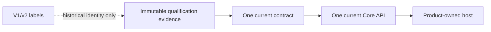

# Current contract

This document is the navigation and implementation guide for the current
pre-1.0 contract. It does not replace an accepted ADR or mutate immutable
qualification artifacts.

## One active contract

Get Modular has one current contract and one current public API surface. It does
not publish parallel `V1`, `V2`, or `V3` TypeScript APIs while it is pre-1.0.
The intended public names are the unversioned names described by ADR-0009, such
as `compileComposition`, `compileCompositionJson`, `ModuleDeclaration`,
`CompositionProfile`, `CompositionPlan`, `Diagnostic`, `PlanDigest`,
`defineModule`, `required`, `optional`, and `many`.

ADR-0009 and ADR-0010 remain proposed until they pass the repository's governed
acceptance flow. Until then, no public production package may silently choose
between the proposed and accepted naming or dependency policies. Pure
implementation work may use private names and owned primitives, but the first
public barrel must follow one explicitly accepted map.

## What the version labels mean

The repository contains immutable qualification material created before the
public package exists. Its paths and IDs retain historical labels such as
`requirements/module-system-v1`, `contracts/v1`, `compileCompositionV1`, and
`resource-profile-v2`. These labels identify evidence lineage and must not be
interpreted as supported application API generations.

The following are deliberately different concepts:

| Label | Meaning | Public API generation? |
| --- | --- | --- |
| `schemaVersion: 1` | Inert persisted data-format discriminator | No |
| `familyVersion: 1` | Version of the closed capability-compatibility family | No |
| `profileVersion: 2` | Revision of the measured qualification artifact | No |
| `V1` in a path or evidence ID | Immutable historical contract evidence | No |
| `V1` in a future TypeScript export | Forbidden before 1.0 | Yes, and forbidden |

Applications do not select a resource profile by filename or version. The
current implementation uses one effective resource policy. An older profile
remains only as immutable historical evidence and is not a second runtime
option.

## Effective resource policy

The effective profile is the flat profile recorded in
`architecture/qualification/v1/resource-profile-v2.json`, with profile ID
`get-modular/resource-profile/v1-standard`. Its filename and
`profileVersion: 2` are retained because ADR-0007 and its qualification ledger
are immutable. They do not create a negotiable profile version.

The older
`architecture/contracts/v1/resource-profile.json` is historical base evidence.
Implementations must not merge both files, choose one based on chronology, or
expose both as configuration. The effective limits are read as one closed set,
including separate declaration and profile raw-byte limits and
`jsonValueOccurrences`.

The complete repository gate runs the effective resource qualification through
the unversioned command `pnpm qualification:resource-profile`. The test and
evidence filenames retain their historical names for custody and traceability.

## Implementation boundary

The semantic core owns inert declarations, complete profiles, graph semantics,
bounded diagnostics, immutable plans, and digests. Product hosts own
authorization, executable loading, readiness, generations, routing, drain,
recovery, and reconciliation. Extension Foundation owns artifact trust,
admission, signatures, isolation, updates, and plugin state.

No historical evidence label grants a second authority, runtime discovery,
container, lifecycle, plugin, or authorization behavior.

## Required closure before corresponding implementation

These are small contract gates, not a reason to redesign the architecture:

1. Accept ADR-0009 with an exhaustive public export map and TypeScript authoring
   fixtures before creating the public unversioned barrel.
2. Accept ADR-0010 before admitting any selected production dependency adapter.
   Until then, keep external canonicalization and scanner packages behind
   development-only qualification and use the same private ports.
3. Add a successor diagnostic refinement for duplicate binding records, because
   the existing `binding.duplicate` coordinate describes a duplicate provider
   but not two records for one `(implementationId, slotId)`.
4. Add a successor raw-input refinement for the accepted byte-carrier domain
   and synchronous snapshot behavior, including detached, shared, resizable,
   offset, and subclass cases.

The first graph slice must not invent semantics for items 3 and 4. The first
object-based internal checkpoint may proceed after the authority and package
admission steps, while raw decoding and public adapter choices remain gated by
their own refinements.

## Historical evidence rule

Never rename or edit accepted evidence solely to remove a historical version
label. A change to current semantics requires a successor decision, a new
ledger, and new executable evidence. The current public API remains one
unversioned surface until a concrete requirement proves that concurrent public
generations are necessary.
