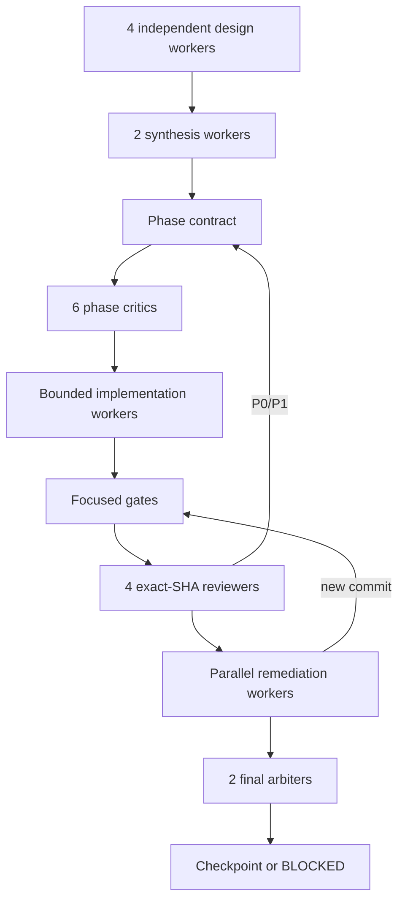

# MVP implementation roadmap

This document is the implementation roadmap, not a replacement for an
accepted ADR. It deliberately describes the order and evidence required to
build the first reusable Core. It does not accept new public API, change an
accepted decision, or claim that a qualification fixture is production code.
ADR-0009, ADR-0010 and ADR-0011 are proposed inputs on the selected base unless
their acceptance is independently present in that exact base; this roadmap does
not promote them by reference.

The MVP goal is:

```mermaid
flowchart LR
    Contract["One current contract"] --> Declarations["Inert declarations"]
    Declarations --> Compiler["Pure deterministic compiler"]
    Compiler --> Plan["Immutable plan + digest"]
    Plan --> Conformance["Independent conformance"]
    Conformance --> Consumer["One real product adapter"]
    Consumer --> Second["Second consumer verdict"]
```

Get Modular owns composition semantics. Product Hosts still own authorization,
executable loading, readiness, generations, routing, drain, recovery and
reconciliation. Extension Foundation owns artifact trust, signatures,
distribution, isolation and plugin state. No phase may create a second owner
for those concerns.

## MVP boundary

| Required for the first Core | Reserved, but not required for Core MVP |
| --- | --- |
| One public `@get-modular/core` package after the naming authority gate | Dynamic runtime plugin installation |
| Inert module declarations and complete profiles | Hot unload and live replacement |
| `required`, `optional`, bounded ordered `many` | Cordis as a Host resource adapter |
| Normalization, graph validation and immutable plan | Process/WASM plugin hosts |
| Bounded deterministic diagnostics and digest | Frontend Module Federation loader |
| Public development-only `@get-modular/conformance` identity after its own surface gate | Managed catalog and registry service |
| One real product-owned composition adapter | Runtime readiness and generation engine |

Public names remain unversioned before 1.0. Historical `v1`/`v2` paths,
schema discriminators and evidence IDs are lineage only and are never exposed
as parallel public API generations. This rule is not itself an authority for
package exports: until ADR-0009 (or a successor) is accepted on the exact
implementation base, no unversioned public barrel or published package may be
materialized. Existing `v1` names remain qualification lineage and are not
published as compatibility aliases.

## Common phase protocol

Every phase follows this protocol. A phase cannot enter implementation only
because a plan sounds plausible.

### Worker rules

1. Worker roles, independence and evidence custody are normative. Exact
   provider, model, effort, tier and capacity belong to the campaign execution
   manifest and may change without changing product architecture. The active
   campaign follows the operator's hosted-runtime policy and records those
   identities in each phase report.
2. The four design workers have different roles: algorithm/correctness,
   security/adversarial input, real-world TypeScript DX, and Clean
   Architecture/DDD/evolution. They return alternatives, evidence, costs,
   failure modes and reversal conditions.
3. The two synthesis workers produce an evidence matrix, not a vote count. A
   disagreement becomes an explicit decision or a blocker in the phase
   contract.
4. The phase contract states inputs, outputs, owners, non-goals, invariants,
   files, tests, limits, acceptance and stop criteria. It is reviewed by six
   critics before coding starts. Confirmed P0-P2 findings are split into
   independent remediation lanes and fixed in parallel where ownership allows.
5. Each coding worker has a separate workspace and file ownership. Research
   fixtures, production-like code and generated evidence never share an
   unmarked directory. Read-only workers do not commit.
6. Every exact-SHA reviewer checks the same published head. Any new commit
   invalidates prior reviews and requires the focused gate plus reviews for the
   affected area again.
7. A checkpoint is allowed only with no unresolved P0/P1, a clean workspace,
   reproducible evidence and green required CI. Merge is never automatic.
8. If the hosted runtime stops at provider startup, the job is `unattested`.
   Preserve its workspace, reconcile by exact SHA or bundle, and do not report
   intent as evidence or retry indefinitely.

### Required phase report

Each phase leaves a report containing:

- exact base and head SHA, worker IDs and ownership map;
- alternatives, evidence sources and rejected patterns;
- changed LOC split into production-like, test and disposable evidence;
- commands, platform matrix, test output and packed-consumer result;
- P0-P3 findings, remediation history and reviewer verdicts;
- explicit `GO`, `CONDITIONAL` or `BLOCKED` result and reversal conditions.

## Phase 0: contract and evidence preflight

**Purpose:** make the starting point unambiguous before creating Core source.

### Inputs

- exact selected PR/base SHA;
- accepted ADRs and current requirements;
- canonical schema, resource profile, diagnostic catalog and vectors;
- accepted authority and qualification ledgers already present in the selected
  source;
- open ADR-0009/0010/0011 blockers, clearly separated from accepted authority.

### Phase 0 implementation

1. Verify the selected base and accepted-decision precedence. Do not use a
   stale PR head or treat a proposed ADR as authority. The unversioned public
   naming map is conditional on acceptance of ADR-0009.
2. Create the derived, non-authoritative
   `architecture/qualification/core-preflight-report.json` and its fail-closed
   `architecture/checks/core-preflight.mjs` verifier. The closed report records
   `kind`, schema version, exact base SHA, accepted-ledger digests, existing
   evidence/check paths and open decision blockers. The verifier recomputes all
   referenced identities; the report never replaces accepted ledgers or imports
   proposed ADR-0011 obligations as current requirements.
3. Close accepted-contract preflight gaps before public Core work: accepted
   authority pins, one raw-byte boundary, duplicate-key policy, raw-carrier
   rules, total diagnostic ordering and canonicalization evidence. A composition
   profile root may use a closed `ProfileId`/root-selection coordinate; runtime
   activation, generation, readiness and routing identities remain Product Host
   concerns and never enter Core plans or diagnostics.
4. Keep `not-claimed`, `source-admitted`, `structural-conformant`,
   `runtime-conformant` and `release-ready` as distinct states. Qualification
   folders are not a runtime registry.
5. Map every currently accepted normative claim to its accepted ledger entry,
   existing evidence or named implementation gate. Proposed-decision work stays
   an open blocker, not a manufactured obligation row. Existing synthetic
   artifacts are not silently promoted.
6. Close a raw-carrier matrix before admitting the mandatory raw entrypoint. It
   must state
   accepted/rejected carriers, view offsets, snapshot timing, aliasing,
   transfer/detachment, shared/resizable backing stores, cross-realm values and
   exact failure classification.
7. Demonstrate source custody and rollback in a fresh disposable checkout.
   Record the selected SHA and retained content identities, run the same
   preflight, discard that checkout and recreate it at the selected SHA. Never
   use `reset --hard` or `clean` against a contributor checkout as evidence.
8. Extend the complete governance gate with positive and negative fixtures for
   every open implementation decision: ADR-0009 blocks an unversioned public
   barrel, ADR-0010 blocks production primitive selection, and ADR-0011 blocks
   release-custody claims. A proposed ADR cannot pass through roadmap wording.
9. Verify that the existing `qualification:resource-profile` executable
   generator/oracle proof remains wired into the complete repository gate. A
   declared but orphaned script is not Phase 0 evidence, and its historical
   filename does not create a versioned public command.

### Phase 0 exit criteria

- the derived preflight report and checker exist, are digest-bound to accepted
  ledgers and contain no unresolved accepted-contract P0/P1;
- exact source custody and ADR precedence are recorded;
- no production package or public barrel exists yet;
- accepted-claim mapping and the raw-carrier matrix are checked;
- open-decision blockers and their mutation fixtures execute in the complete
  governance gate;
- a clean rollback to the selected SHA is demonstrated in a disposable
  checkout;
- ADR-0009 is either accepted with a checked naming map or the public package
   remains not created and Phase 1 is blocked.

### Non-goals

No compiler, plugin host, lifecycle engine, Cordis adoption or product API
changes are implemented here.

## Phase 1: package topology and public boundary

**Purpose:** establish the package boundary at the same substantive checkpoint
as the first Core behavior. A package shell or declaration-only facade is not
an implementation deliverable.

Phases 1-4 are one atomic first-Core checkpoint, not four independently
mergeable releases. Phase 1 may prepare private package/source boundaries;
Phase 2 supplies inert authoring data, Phase 3 the private semantic compiler and
Phase 4 the complete public result plus digest. Only then does Phase 1 freeze
exports and pack the archive. This dependency order prevents an empty public
shell while allowing bounded implementation lanes.

### Phase 1 implementation

1. Do not materialize a production package or public barrel until ADR-0009 (or
   its accepted successor) supplies naming authority. When materialized, create
   `@get-modular/core` with a curated public barrel and feature-owned internal
   folders. Keep domain semantics independent from Foundation, Docs Protocol,
   DI containers and plugin runtime types.
2. Preserve ADR-0003's public development-only
   `@get-modular/conformance` identity without creating an empty package. Its
   substantive vectors, fixtures and packed-consumer tooling may be published
   after their surface gate; runner, subject, report and attestation contracts
   remain private until a separate compatibility decision accepts them.
3. Freeze one export map only after the first substantive compiler behavior is
   present. `ModuleDeclaration`, `CompositionProfile`, `CompositionPlan`,
   `Diagnostic`, `PlanDigest`, `defineModule`, `required`, `optional`, `many`
   and the accepted compiler entrypoints must have their accepted semantics.
   Compiler entrypoints cannot be throwing, pass-through, no-op or
   declaration-only placeholders; authoring helpers retain the deliberately
   pass-through behavior accepted by ADR-0007. Both trusted-object and
   untrusted-byte entrypoints are mandatory; the raw entrypoint materializes
   only after Phase 0 proves its carrier boundary and otherwise blocks exit.
4. Promote the first production package atomically to `source-admitted`: add
   the pinned `architecture/foundation/source-dependencies.yaml`, enable the
   Engineering Foundation source-dependency capability, add positive and
   negative structural fixtures, and wire the real Foundation check into
   `check:fast` and `check`. Structural and runtime conformance remain separate
   promotion states.
5. Pack one hash-identified archive and fan that same archive out to disposable
   consumers. Add default-deny export/deep-import tests, tarball allowlist and
   declaration-leakage audits, and inert import smoke tests. Do not repack in
   platform matrix jobs.
6. Do not infer an ESM/CommonJS policy from this roadmap. Freeze and test package
   type, export conditions and supported resolution modes only after an accepted
   packaging decision supplies that authority.
7. Before freezing the public TypeScript surface, run the exact archive through
   NodeNext, Bundler, JavaScript and `checkJs` consumers at 100, 500 and 1000
   declarations with recorded compiler identity, timing, peak memory and
   inference/error assertions.

### Phase 1 exit criteria

After Phases 2-4 provide the complete substantive compiler, two disposable
TypeScript consumers compile through the public barrel only and the exact
archive passes the named resolver/type-scale gates. No Core API
exposes a container, resolver, registry, Context/Fiber, filesystem path,
executable factory, transport DTO or versioned name. A package shell without
substantive behavior cannot pass this phase.

### Stop criteria

Stop if package topology needs a second public authority, a framework-specific
type, or a package split that cannot be explained by independent dependency or
lifecycle ownership.

## Phase 2: declarations, profiles and capability slots

**Purpose:** make module authoring local, typed and navigable at hundreds of
modules.

### Phase 2 implementation

1. A module co-locates its serializable branded ID and plain-data declaration.
   Product/repository admission allocates and authorizes the namespace; the ID
   is not authentication, an import path or an executable lookup key. There is
   no global ID list and no repeated untyped string literals in consumer code.
2. Feature-local contracts and adapters stay beside their feature. A shared
   contract is extracted only after a second real consumer proves the same
   boundary.
3. `required`, `optional` and `many` express cardinality. `many` has explicit
   `min`, `max` and `order`; registration order is never semantic.
4. A Core declaration is inert plain data only. A feature may co-locate a
   separate product-owned typed factory and port, but Core compilation never
   receives, imports, discovers or invokes that factory.
5. A profile is a complete compilation snapshot produced by a Product Host
   adapter from host-authorized desired state. Core has no disabled flag,
   rollout state or impact authority; removal and replacement are expressed by
   compiling a new complete profile. ADR-0008's closed own profile is instead a
   private build-owned input. Neither case lets the compiler derive, merge or
   authorize profiles, and there is no hidden fallback.
6. Pure DI uses consumer-owned capability ports and explicit factory arguments
   outside Core's declaration/compiler boundary. No generic `resolve()`,
   service locator, global mutable container, dependency bag, inherited-property
   lookup or thenable assimilation.
7. Authoring helpers are pass-through constructors, not validators: they retain
   explicit keys and values, while the compiler alone validates cardinality,
   compatibility and closed profile rules.

### Phase 2 exit criteria

Synthetic provider, consumer, optional provider and ordered-contribution modules
compile in the authoring fixtures. An author can find module owner, binding and
composition root without editing a central registry. Missing, duplicate,
incompatible and not-selected dependencies are explicit and graph-inert. A
100/500/1000-declaration authoring gate records owner/binding/root navigation,
edit loci, complete-profile construction and change workflows, and typecheck
budgets without executing declarations.

## Phase 3: normalization and deterministic graph compiler

**Purpose:** implement the private semantic compiler seam:
`declarations + complete profile -> normalized plan | bounded diagnostics`.
The public successful compiler result does not exist until Phase 4 attaches the
qualified canonical bytes and digest required by the accepted contract.

### Required semantics

- closed validation of declarations, profiles, IDs, owner syntax, exact
  compatibility, selections, bindings and cardinality;
- resource preflight before unbounded allocation or traversal;
- root closure following consumer-to-provider edges, with provider-to-consumer
  dependency order that carries no activation or lifecycle meaning;
- stable SCC cycle members and stable order independent of input enumeration;
- deterministic unknown, missing-selection, duplicate, not-selected,
  incompatible, cardinality, cycle and unreachable diagnostics defined by the
  accepted catalog for the complete input profile;
- no first-row/last-row winner, fallback provider or registration-order
  meaning;
- bounded paths, redacted hostile values, top-K diagnostics and saturating
  omission count.

Phase 3 accepts, stores, returns and invokes no factory, callback, function,
loader, executable handle or product code. Product-owned literal factory tables
remain outside Core and may be used only after a complete successful public
compile result exists. Core-owned enable/disable, scope, priority, generic
ambiguity or impact semantics require a successor contract and are not inferred
from the current schema.

The canonical detail-byte comparator used by diagnostic ordering is qualified
behind its private boundary in this phase. Selecting a production primitive is
blocked until ADR-0010, or an accepted successor, supplies authority; the
semantic compiler cannot inherit ordering or error behavior from a candidate
library.

The first substantive compiler slice also introduces the owner-local
declarations, ports and factories plus ADR-0008's minimal direct stage0 root.
The finite emitter and generated stage1 remain Phase 4 work.

### Phase 3 exit criteria

One named subject gate invokes the actual internal compiler seam through every
admitted object/raw entrypoint and compares complete results with independent
expectations. Static vector/oracle validation is a prerequisite and cannot
satisfy this gate. The gate covers:

- required-one, optional-zero/one and bounded-many at zero/min/interior/max;
- missing, duplicate, unknown, not-selected, incompatible, cardinality,
  no-fallback, cycle, multi-root and unreachable cases;
- every accepted at-limit and plus-one resource case, maximum-depth, dense-edge,
  giant-cycle and diagnostic-storm fixtures;
- correctness-only P100/P500/P1000 sparse and dense worlds, iterative traversal,
  stack safety, retained-diagnostic bounds and structural operation counters;
- exhaustive equivalent permutations for bounded tiny graphs and pinned,
  reproducible independent/joint shuffles at P100/P500/P1000. Ordered-many
  provider arrays are semantic and are never shuffled as an equivalence; a
  changed provider order must change the later plan and digest.

Every diagnostic result excludes a plan and digest. No Core input/output type or
packed dependency accepts executable values. The private normalized seam is not
exported as a temporary public API.

## Phase 4: immutable plan, canonical bytes and self-composition

**Purpose:** make the plan reproducible and prove that Core can construct its
own finite internal components without a runtime bootstrap loop.

### Phase 4 implementation

1. Use the accepted canonicalization boundary and qualified adapter. Do not call
   a local helper RFC 8785/JCS without independent vectors proving the exact
   required subset. Production primitive selection remains blocked until
   ADR-0010, or an accepted successor, supplies authority.
2. Encode only normalized semantic plan data, selected implementations,
   bindings, order, profile and compatibility data. Exclude source ordinals,
   executable closures and host custody state.
3. Hash exact canonical bytes with domain-separated SHA-256 only after encoding
   is qualified. Equivalent permutations retain the same bytes/digest; a valid
   semantic change succeeds with new bytes/digest; invalid input returns only
   diagnostics. A stale or tampered plan/digest pair is rejected only by the
   named private evidence/custody verifier, never by an invented public Core
   authorization API.
4. Prove deep runtime immutability: plain JSON-compatible records/arrays,
   iterative deep freeze, no accessors or class instances, no retained aliases
   to caller input, strict-mode mutation rejection, and stable canonical
   bytes/digest after a process or structured-clone round trip.
5. Stop at ADR-0008 checkpoint A before building the emitter. Compile at least
   two natural dependency edges, prove one behavior-changing replacement,
   measure three representative changes and their authoritative edit loci, and
   report production, qualification and generated LOC separately. Continue only
   after explicit owner GO; stop if the natural graph or complexity budget does
   not justify self-composition.
6. After checkpoint A GO, implement ADR-0008's bounded self-composition:
   handwritten stage0 uses the real graph semantics, emits finite private
   stage1 wiring, and stage1 wires the same implementations. This is build-time
   composition, not recursive compiler self-hosting and not a public generator.
7. Use clean, isolated and poisoned stage/cache/output roots. Prove exact
   P0/P1 plan-and-digest equality, exact W0/W1 equality, independently observed
   construction witnesses, a binding replacement that changes public behavior,
   no hidden concrete-import fallback, and zero own-profile compilation,
   emitter calls or component assembly on caller requests. Only pack-once
   stage1 is distributable; stage0, own profile and emitter stay outside the
   runtime closure.
8. Treat completion as two states. `qualification-only` may use accepted
   ADR-0008 evidence. `release-eligible` additionally requires accepted
   ADR-0011 (or a successor) and its source snapshot, toolchain, pack-once,
   splice/archive-swap rejection and cold rollback gates. Governance records the
   blocker while that authority is proposed.
9. Record non-SLO P100/P500/P1000 sparse/dense canonical byte size, digest time,
   peak memory and concurrent-call observations. Phase 5 owns portable
   performance budgets and release-scale qualification.

### Phase 4 qualification exit

One named subject gate proves semantic/digest invariants and deep immutability
against the packed Core subject. Reordered equivalent graphs produce identical
canonical bytes/digest; valid semantic changes produce different valid bytes/
digest; invalid inputs produce diagnostics only; and nested mutation, alias and
cross-process tests prove a plain immutable plan. This gate does not require or
invent ADR-0011 custody records.

The accepted ADR-0008 finite-construction gate proves clean bootstrap with
stage1 absent, isolated/poisoned roots, P0/P1 and W0/W1 equality, behavioral
replacement, independent construction witnesses, caller-time no-bootstrap and
stage1-only runtime closure. Passing it yields `qualification-only` and cannot
imply publication readiness.

### Phase 4 release-eligible exit

Release eligibility additionally requires accepted ADR-0010/0011 authorities
or accepted successors. Their governed gates select the production primitives
and independently reject tampered evidence bindings, source/evidence splicing,
archive swaps and failed cold rollback while preserving one pack-once stage1
archive. Until both decisions and gates exist, governance reports the release
checkpoint as `BLOCKED`, not as a failed qualification result.

## Phase 5: conformance and scale proof

**Purpose:** make correctness reusable for every future consumer.

### Phase 5 implementation

1. Put implementation-independent vectors and fixtures in the separate
   development-only conformance package. Accepted contracts, ledgers and
   independently owned vectors are the authority; packed Core is only the
   subject under test. The runner/subject/report protocol remains private and
   cannot support a runtime-conformance claim until a separate compatibility
   decision accepts it.
2. Cover positive, negative, mutation, permutation, malformed input, resource
   limits, omitted modules, cycles, compatibility and diagnostic redaction.
3. Execute the same content-addressed packed subject and exact vectors in all
   six accepted cases: Node 24 on Linux/macOS/Windows, pinned Chromium window
   and dedicated worker, and the pinned Electron main/renderer smoke. A skipped
   or unavailable mandatory case blocks the conformance claim; it is never
   success evidence.
4. Define reproducible scale worlds instead of using module count alone. Cover
   sparse, dense, maximum-depth/cycle, diagnostic-storm and maximum-identity
   shapes at 10/100/500/1000 modules and the accepted declaration limit. Pin the
   generator seed, runtime/toolchain, machine class, warmup, sample count and
   statistic. Record parse/normalize/compile/digest time, structural operation
   counters, peak live memory, input/output byte size and retained diagnostics;
   set reviewed regression budgets before a scale GO. Packed archive size is
   measured once for the retained archive, not once per profile.
5. Run the mandatory packed TypeScript consumers: NodeNext, Bundler, JavaScript,
   `checkJs`, helper runtime/handoff and the 1000-declaration typecheck case.
6. Differentially compare object and raw adapters only over their admitted
   equivalence domain. Include snapshot-before-await, caller mutation,
   `ArrayBufferView` offsets, transfer/detachment, shared/resizable storage and
   cross-realm carriers from the Phase 0 matrix. Divergence cannot be hidden by
   fallback.
7. Exercise concurrent and repeated calls, immediate input mutation and
   request-state isolation through both entrypoints. Compiler measurements do
   not create Product Host activation, readiness or recovery SLOs. Any retained
   alias, cross-request contamination or non-deterministic result fails the
   subject gate rather than becoming an observation.
8. Keep focused gates small for ordinary changes. Run the closed six-case,
   packed-consumer and scale matrix only for promotion/release evidence, while
   preserving one exact pack-once subject across the distribution.

### Phase 5 exit criteria

Every applicable Core obligation maps to an executed vector against the exact
packed subject; a future gate cannot satisfy Phase 5 exit. The closed six-case
matrix, raw-carrier matrix, TypeScript consumers and reviewed scale budgets pass
without mandatory skips. The private conformance runner is deterministic and
cannot install modules, scan files, derive expected results from Core or
authorize execution.

## Phase 6: first product dogfooding

**Purpose:** prove that the public contract reduces real wiring without
rewriting product domain APIs.

### Phase 6 implementation

1. Admit a consumer seam only through a repository-resolvable record containing
   the exact consumer source SHA, owning product decision/API, approved feature
   boundary, Product Host owner and exact packed Core archive digest. Agent
   Runtime capability composition is the first candidate, not authority by
   roadmap text; it enters only when its exact source proves the seam.
2. A product anti-corruption adapter maps authorized product configuration into
   inert declarations and one complete profile, then calls Core. It never
   creates, edits, reorders or substitutes a plan. Credentials, executable
   handles and product state do not enter Core inputs.
3. After successful compilation, the Product Host authorizes materialization
   and maps selected implementation IDs through a closed literal factory table.
   No metadata becomes a grant; no dynamic import, filesystem scan, fallback or
   unselected executable lookup is allowed. A controlled binding replacement
   must change the observed injected implementation and behavior.
4. Keep direct Pure DI as an independent test/reference path while proving
   parity. It is not a live fallback or second runtime wiring authority. After
   cutover, exactly one path controls materialization for the admitted slice.
5. Translate Core diagnostics through a total, bounded and deterministic
   anti-corruption map that preserves code, safe coordinates, ordering,
   redaction, path bounds and omission count. Unknown codes fail closed and the
   original safe machine-readable diagnostic remains available for support.
6. Measure direct and compiled paths with a named adoption gate: wiring and
   generic-glue LOC, authoritative edit loci, owner/root navigation, add/remove/
   replace/cardinality/path-move operations, typecheck cost, missing-dependency
   remediation, deterministic outcomes and deletion cost. Generic glue over 30%
   or ordinary changes exceeding four authoritative loci block extraction
   unless a measured safety invariant justifies them.
7. Run the real admitted slice plus product-shaped 100/500/1000 authoring and
   compile fixtures from the exact packed Core. These fixtures exercise scale;
   they do not invent product features or replace the real behavior proof.
8. Prove Product Host authority with negative cases: unauthorized desired state
   cannot reach the literal table, no factory runs on diagnostics, stale plan/
   generation input cannot cut over, and readiness/cleanup/recovery/provider
   launch remain outside Core.
9. Evaluate a second existing product seam independently. Use Orchestrator only
   if its exact source and owner admit one; otherwise record
   `second-consumer-not-admitted` and do not invent a feature.

### Phase 6 exit criteria

One admitted real vertical slice works without a product API rewrite, its
digest-bound gate proves compiled-plan control and single wiring authority, and
the quantitative budgets pass. This is enough for a `0.x` product integration.
A proven second independent consumer permits a cross-consumer extraction claim;
`second-consumer-not-admitted` is an honest `CONDITIONAL` outcome that blocks a
stable or cross-consumer claim rather than pretending two-consumer evidence.

## Phase 7: extension/plugin reservation

**Purpose:** reserve the extension boundary without making plugin distribution
or dynamic runtime replacement a dependency of the first Core release.

### Phase 7 implementation

This phase is a design and qualification boundary, not a production plugin
runtime.

Because no real extension consumer is admitted yet, this phase uses only design
review plus one bounded disposable qualification model. It does not start a
production coding wave, add a package dependency or implement a registry,
loader, lifecycle engine or update service. A real consumer and separate phase
contract are required before that scope begins.

- A runtime Module is a composition/lifecycle unit. A Plugin Artifact is a
  distribution, trust and update envelope. One artifact may provide multiple
  module contributions.
- Extension Foundation verifies and decodes artifact identity, publisher,
  signature/revocation, bounded contributions and permission requests. Product
  Host separately admits namespaces, issues grants and translates accepted
  contributions into the same inert declarations. Verification and requested
  permission are never activation authority.
- Product extensions may call only explicitly granted narrow product ports.
  Those ports retain authorization and aggregate invariants; extension code
  never mutates product storage or aggregates directly and cannot bypass policy.
- Registry, artifact, signature and update tools remain replaceable Extension
  Foundation adapter candidates; this reservation phase selects none of them.
  Core sees admitted inert declarations, not registry or signature APIs.
- Because Core intentionally omits artifact lineage, Product Host owns an
  external correlation record binding publisher/artifact digest, artifact and
  contribution generation, module/implementation IDs, authorized literal
  factory identity, grants, PlanDigest and Host generation. Stale or swapped
  executable code fails before activation even when declarations are equal.
- Record the reproduced Cordis version `4.0.2` disposer-ownership defect as a
  version-pinned `NO-GO` before considering Cordis. A later qualification requires
  an admitted local report with reproducer/digest and a newer exact candidate
  passing cleanup, leak, cancellation and compatibility spikes. Cordis can at
  most provide scoped resource ownership; process/tenant security isolation,
  graph semantics, readiness, generations and recovery remain elsewhere.
- Model future enable/disable as two coordinated, recoverable transactions.
  Extension Foundation prepares verified artifact state; Product Host validates
  admission/grants, compiles a new complete profile, plans impact, drains,
  generation-fences cutover, records activation and retires old resources. Use
  idempotent receipts, deadlines and rollback for crash/timeout/partial failure.
  Disable removes contributions from desired state; artifact retirement and
  uninstall occur only after no live generation references them, and uninstall
  never deletes user data implicitly. Hot unload is not promised by Core MVP.
- Keep artifact/module/publisher/installation/contribution/Host-generation
  identities separate. Atomicity for an artifact contributing several modules
  is a named future decision, not an accidental registration-order behavior.

Phase 7 creates
`architecture/qualification/extension-boundary-reservation.json`, a checked,
non-authoritative inventory with one row per deferred capability: owner,
input/output identity, prerequisite decision, evidence path/digest, current
status and forbidden Core dependency. The fail-closed
`architecture/checks/extension-boundary-reservation.mjs` command is wired as
`qualification:extension-boundary` into the complete gate. Its one disposable
test model runs handoff/mutation cases for verified-not-authorized,
permission-not-grant, stale generation, swapped factory, revocation race,
failed cutover, rollback and retirement ordering. It measures bounded manifest,
permission and contribution expansion at 100/500/1000 modules before Core input;
composition scale evidence alone does not prove extension admission.

### Phase 7 exit criteria

The checked reservation inventory and synthetic boundary gate make the split
between Core declarations, Product Host authority/lifecycle and Extension
Foundation trust/custody executable. No plugin loader, registry, signature
verifier, hot-unload path or runtime replacement enters Core MVP. Every deferred
capability has a named owner, identity handoff, prerequisite decision and
evidence gate; the current Cordis result remains fail-closed `NO-GO`. Exit ends
the reservation task and does not authorize production extension work.

## Phase 8: release checkpoint

**Purpose:** prove that the implemented checkpoint is reviewable, reproducible
and reversible before publication or merge.

### Bounded PR merge checkpoint

1. Run local check, typecheck, lint, docs protocol, source custody and focused
   tests/mutants for the changed invariant. Run broader gates only when the PR
   changes their subject or authority.
2. Run four final exact-SHA reviews after the last commit, then two independent
   arbiters over those findings. Any changed SHA invalidates the affected
   reviews and arbitration.
3. Keep PRs near 2,000 changed LOC when the invariant boundary permits. Do not
   split one invariant merely to satisfy a number.
4. Merge only with explicit owner approval, a clean exact-head check and a
   narrow revert path. A bounded merge does not imply publication or conformance
   promotion.

### Publication promotion checkpoint

1. Create one machine-checked promotion manifest owned by the accepted release
   custody decision. It binds exact source head, accepted authority digests,
   toolchain/runtime identities, pack-once archive SHA-256, every command/result
   identity, reviewer/arbitration records and terminal promotion status.
2. Reuse that exact retained archive and execute complete conformance, mutation,
   packed-consumer, all six named runtime cases, TypeScript and reviewed scale
   gates. Do not rebuild between qualification, platform jobs and publication;
   no mandatory case may skip.
3. Execute the cold offline recovery drill from the retained source/toolchain
   capsule, regenerate the same stage1 archive, prove stage0 is absent and reject
   archive/evidence substitution. A written rollback procedure alone cannot
   satisfy promotion.
4. Verify all release-required decision blockers, registry namespace ownership
   and reviewed scale regression disposition against the same manifest.
5. Publish the API map, architecture map, evidence ledger, known limitations,
   rollback procedure and upgrade notes.
6. The product owner approves the public surface and promotion; the release
   publisher executes the accepted custody protocol. Registry read-back must
   reproduce the exact published archive digest. A missing second consumer
   limits the release to `0.x`; it cannot support a stable or cross-consumer
   claim.

### Phase 8 exit criteria

The exact reviewed head has reproducible evidence appropriate to the selected
merge or publication state, a documented rollback path, no unresolved P0/P1,
and an explicit owner decision. Every decision blocker required by that state
is mechanically closed. A failed gate leaves only that checkpoint blocked
rather than silently promoting partial evidence or rerunning unrelated work.

## Global stop conditions

Return `BLOCKED` instead of guessing when:

- a P0/P1 or authority conflict remains;
- a second lifecycle authority, service locator, filesystem scan or framework
  type enters Core contracts;
- raw/object semantics diverge without a decision;
- canonical bytes are claimed without independent vectors;
- a worker uses a stale base, edits another lane or loses dirty state;
- generic glue exceeds 30% of a production-like consumer slice without a
  demonstrated safety benefit;
- a public API is stabilized from one synthetic consumer only;
- hosted workers repeatedly fail without verifiable output.

The first stable checkpoint is a small Core compiler plus conformance evidence
and one real adapter. It is not the completion of the full plugin ecosystem.
