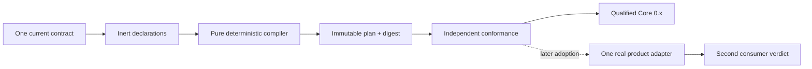
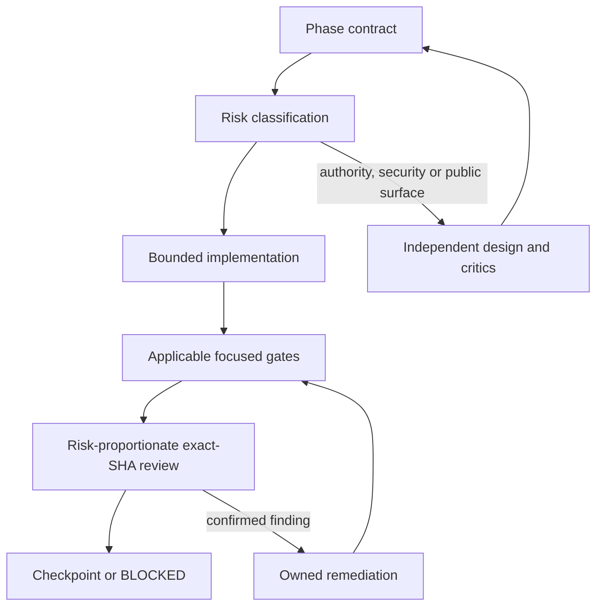

# MVP implementation roadmap

This document is the implementation roadmap, not a replacement for an
accepted ADR. It deliberately describes the order and evidence required to
build the first reusable Core. It does not accept new public API, change an
accepted decision, or claim that a qualification fixture is production code.
ADR-0009 to ADR-0015 are proposed decisions on the selected base unless their
accepted successors are present. They do not enter accepted authority, the
open-decision blocker catalog or executable governance until accepted through
the repository decision flow.

The MVP goal is:



Get Modular owns composition semantics. Product Hosts still own authorization,
executable loading, readiness, generations, routing, drain, recovery and
reconciliation. Extension Foundation owns artifact trust, signatures,
distribution, isolation and plugin state. No phase may create a second owner
for those concerns.

## MVP boundary

| Required for qualified Core 0.x | Later checkpoint or reserved capability |
| --- | --- |
| One public `@get-modular/core` package after the naming authority gate | Dynamic runtime plugin installation |
| Inert module declarations and complete profiles | Hot unload and live replacement |
| `required`, `optional`, bounded ordered `many` | Cordis as a Host resource adapter |
| Normalization, graph validation and immutable plan | Process/WASM plugin hosts |
| Bounded deterministic diagnostics and digest | Frontend Module Federation loader |
| Public development-only `@get-modular/conformance` identity after its own surface gate | Managed catalog and registry service |
| Pack-once Core subject and independent conformance | First product-owned composition adapter; runtime readiness and generation engine |

The target public names are unversioned before 1.0. Historical `v1`/`v2` paths,
schema discriminators and evidence IDs are lineage only and do not by
themselves require parallel public API generations. This roadmap is not naming
authority: until ADR-0009 (or a successor) is accepted on the exact
implementation base, no unversioned public barrel or published package may be
materialized. Existing accepted names remain contract authority in the
meantime; historical names are not automatically published as compatibility
aliases.

### Critical path of proposed decisions

The milestones below name the proposed decisions each one depends on. A
milestone that lists no proposed decision may proceed on accepted authority
alone.

| Milestone | Proposed decisions required | Blocked without them |
| --- | --- | --- |
| M1 `direct-semantics-qualified` through the private normalized seam | ADR-0015 or another accepted successor to ADR-0003 | Private package source and the first executable subject |
| M2 raw entrypoint and carriers | ADR-0013 and ADR-0014 together as one diagnostic generation 2 transaction: successor schema enum, catalog rank, diagnostic contract, snapshots, checker and ledger, because ADR-0007 keeps the base enum and code rank byte-identical | Raw decoding exposure, carrier admission and duplicate binding-record behavior |
| M3 public barrel and package carrier | ADR-0009 and ADR-0012 | Public names, export map and any packed publication candidate |
| M3 emitter and generated stage1 | ADR-0011 or a narrower successor that closes only the dependency-record seam | `self-composed-qualified` and every release custody claim |

Publication of a `0.x` archive as `not-claimed` does not require the six
runtime cases; the first conformance claim does (ADR-0007, sections on
publication and runtime coverage). The bootstrap sequence is therefore: accept
ADR-0015 or another narrow successor, materialize private `packages/core`, reach
M1 on Node, prepare the diagnostic generation 2 transaction in parallel with
M1, then proceed to M2 and M3 in that order.

### Roadmap qualification language

The labels below are phase-report outcomes, not new Feature Module Standard
qualification states, public API, or lifecycle authority. They do not collapse
`source-admitted`, `structural-conformant`, `runtime-conformant`, publication,
or product adoption:

| Outcome | Evidence established | Evidence not established |
| --- | --- | --- |
| `direct-semantics-qualified` | A temporary, hash-identified direct subject passes the independent public-boundary semantics, diagnostic, plan/digest and immutability gates. | Generated construction, release custody, publication, or product adoption. |
| `self-composed-qualified` | In addition to direct qualification, ADR-0008's finite stage0-to-profile-to-emitter-to-stage1 path controls construction, direct/generated parity and witnesses pass, and generated stage1 passes the same public-boundary gates. | Release custody, publication, Feature Module Standard promotion, or product adoption. |
| `release-eligible` | The retained self-composed stage1 archive also satisfies every accepted decision, conformance, support-envelope, custody and promotion gate applicable to the requested release state. | Actual publication, registry read-back, stable 1.0, or a product-adoption claim. |

`direct-semantics-qualified` is useful prerequisite evidence, but accepted
ADR-0008 does not permit it to replace self-composition for the first released
Core. `release-eligible` means that the exact retained archive may enter the
publication checkpoint; it is not a synonym for published or conformant. While
required custody authority remains proposed, release eligibility remains
`CONDITIONAL` even when the two earlier outcomes pass.

## Common phase protocol

Every phase uses evidence and review proportional to the changed risk. A phase
cannot enter implementation only because a plan sounds plausible, but ordinary
bounded work does not require a full research campaign.



### Evidence proportionality

Each phase contract names its authority, inputs, outputs, owner, non-goals,
invariants, applicable checks and stop conditions. Its checkpoint records the
exact source and subject identities, commands and results, unresolved blockers,
owner, and narrow reversal path. Missing subjects are `not-applicable`, not
synthetically satisfied.

Ordinary bounded work uses focused checks and one independent exact-head review.
Public-surface, authority, security and publication changes require the stronger
review and owner approval appropriate to their actual risk. Reviewer count,
provider, model, runtime tier, campaign staffing and LOC accounting belong to an
execution manifest, not to product architecture. A new commit invalidates only
the evidence and review affected by that change.

## Phase 0: contract and evidence preflight

**Purpose:** make the starting point unambiguous before creating Core source.

### Inputs

- exact selected PR/base SHA;
- accepted ADRs and current requirements;
- canonical schema, resource profile, diagnostic catalog and vectors;
- accepted authority and qualification ledgers already present in the selected
  source;
- proposed ADR-0009 to ADR-0015 candidates, clearly separated from accepted
  authority and active open-decision blockers;
- the governed open decisions OD-004, OD-005 and OD-006 for package
  carrier/resolution, raw-input carrier semantics and duplicate binding-record
  diagnostics, with proposed ADR-0012, ADR-0013 and ADR-0014 as their candidate
  resolutions.

### Phase 0 implementation

1. Verify the selected base and accepted-decision precedence. Do not use a
   stale PR head or treat a proposed ADR as authority. The unversioned public
   naming map is conditional on acceptance of ADR-0009.
2. Produce the required non-authoritative Phase 0 report as a PR/CI artifact
   after the exact head exists. Reuse the existing Foundation, governance,
   contract and qualification gates; the report records exact base/head SHA,
   accepted-ledger identities, executed commands and active open-decision
   blockers. Do not add a committed checksum snapshot of checkers, tests,
   proposals or package scripts, a second validator for accepted authority, or
   another Phase 0 report command in `check:fast`. General environment and
   repository gates remain applicable. Git identifies the source tree and the
   accepted ledgers identify authority and evidence.
3. Close accepted-contract preflight gaps before public Core work: accepted
   authority pins, the accepted raw-byte boundary, duplicate-key policy, total
   diagnostic ordering and canonicalization evidence. `profileId` identifies a
   complete profile and its roots remain selected `moduleId` values; no separate
   root-selection diagnostic coordinate is introduced. Runtime activation,
   generation, readiness and routing identities remain Product Host concerns.
4. Keep `not-claimed`, `source-admitted`, `structural-conformant` and
   `runtime-conformant` as distinct qualification states. Release eligibility
   is a phase-report result until an accepted custody decision defines a
   machine-readable release state. Qualification folders are not a runtime
   registry.
5. Map every currently accepted normative claim to its accepted ledger entry,
   existing evidence or named implementation gate. Proposed-decision work stays
   conditional roadmap work, not a manufactured obligation row or active
   blocker. Only active open-decision records discovered from the governed
   catalog enter the blocker set. Existing synthetic artifacts are not silently
   promoted.
6. Verify `OD-005-raw-input-carrier-semantics` and maintain a carrier research
   matrix that derives only behavior already fixed
   by accepted ADR-0006/0007. Mark every unresolved view-offset, aliasing,
   transfer/detachment, shared/resizable storage, cross-realm or exact failure
   disposition as undecided. The matrix covers the invocation wrapper and
   declaration collection as well as individual values and byte views. Resolve
   the decision through an accepted successor ADR before either production
   carrier adapter is admitted. Proposed ADR-0013 is the current candidate.
7. Verify `OD-006-duplicate-binding-record-diagnostics`. Do not assign a
   diagnostic code, coordinates or suppression behavior to repeated records for
   one `(implementationId, slotId)`. Resolve it through an accepted successor
   ADR and executable ledger evidence before that case enters the compiler.
   Proposed ADR-0014 is the current candidate.
8. Record the selected SHA and retained content identities, then run the same
   preflight in one fresh disposable checkout. Defer cold regeneration and
   rollback rehearsal until stage0 or a retained release artifact exists in
   Phase 4 or Phase 8. Never use `reset --hard` or `clean` against a contributor
   checkout as evidence.
9. Verify `OD-004-package-carrier-and-resolution-policy` before freezing package
   type, export conditions, supported resolver modes or install-time script
   behavior. Proposed ADR-0012 is the current candidate. Governance derives
   blockers only from the active open-decision catalog, not from this roadmap's
   identifiers. Keep ADR-0009 through ADR-0015 as conditional roadmap choices
   until accepted; only accepted decisions may add decision-specific mutation
   fixtures or checkpoint requirements.
10. Verify that the existing `qualification:resource-profile` executable
    generator/oracle proof remains wired into the complete repository gate. A
    declared but orphaned script is not Phase 0 evidence, and its historical
    filename does not create a versioned public command.

### Phase 0 exit criteria

- the exact-head Phase 0 PR/CI report identifies the accepted ledgers, executed
  gates and active blockers and contains no unresolved accepted-contract P0/P1;
- exact source custody and ADR precedence are recorded;
- no production package or public barrel exists yet;
- accepted-claim mapping and the evidence-only raw-carrier matrix are checked;
- the complete governance gate derives and validates the current active blocker
  set without requiring unaccepted decision-specific mutation fixtures;
- the existing complete gate succeeds in a fresh disposable checkout at the
  reported exact head; cold artifact recovery remains a later phase gate;
- OD-004 is resolved by an accepted ADR or successor decision before package
  carrier/export freeze, and OD-005 is resolved the same way before unresolved
  raw-carrier behavior enters the public entrypoint;
- OD-006 is resolved by an accepted ADR or successor decision before duplicate
  binding-record behavior enters the compiler;
- the target unversioned surface requires accepted ADR-0009 or a successor.
  Until then the accepted contract remains authority and the target public
  milestone is `CONDITIONAL`, not a manufactured governance blocker.

### Non-goals

No compiler, plugin host, lifecycle engine, Cordis adoption or product API
changes are implemented here.

## Phase 1: package topology and public boundary

**Purpose:** establish the package boundary at the same substantive checkpoint
as the first Core behavior. A package shell or declaration-only facade is not
an implementation deliverable.

Phases 1-4 are one atomic first-Core checkpoint, not four independently
mergeable releases. Their acyclic construction order is:

```text
Phase 1 private package/source setup
  -> Phase 2 inert declarations
  -> Phase 3 private semantic compiler
  -> Phase 4 stage1 plan/digest implementation
  -> Phase 1 export freeze and two hash-identified qualification subjects
  -> Phase 4 direct/generated packed qualification
  -> joint Phase 1-4 checkpoint
```

This order prevents an empty public shell and prevents packed qualification from
depending on a Phase 4 exit that already assumes the archive exists.

Atomic applies to release qualification and promotion, not to review size.
Implement Phases 1-4 as dependency-safe, private vertical PRs that normally
change no more than roughly 2,000 LOC each, including the focused tests and
evidence needed for that slice. Each PR must deliver testable behavior and a
narrow revert path, but it remains unpublished and cannot claim an independent
phase release or partial Core qualification. Keep one invariant together when a
smaller split would make it unverifiable.

### Phase 1 implementation

1. Do not materialize production package source while accepted ADR-0003's
   implementation blockers remain active. A successor may permit private,
   manifest-bound source while continuing to block publication, but the roadmap
   cannot select that policy. Proposed ADR-0015 is the current candidate. After
   authority closes, keep domain semantics independent from Foundation, Docs
   Protocol, DI containers and plugin runtime types.
2. Preserve ADR-0003's public development-only
   `@get-modular/conformance` identity without creating an empty package. Its
   substantive vectors, fixtures and packed-consumer tooling may be published
   after their surface gate; runner, subject, report and attestation contracts
   remain private until a separate compatibility decision accepts them.
3. Freeze one export map only after the first substantive compiler behavior is
   present. `ModuleDeclaration`, `CompositionProfile`, `CompositionPlan`,
   `Diagnostic`, `PlanDigest`, `defineModule`, `required`, `optional`, `many`
   and the accepted compiler entrypoints must have their accepted semantics.
   Compiler entrypoints cannot be throwing, pass-through, no-op or
   declaration-only placeholders; authoring helpers retain the deliberately
   pass-through behavior accepted by ADR-0007. Stop before export freeze or
   subject packing until accepted authority supplies the exhaustive public name
   map, package carrier and both JavaScript carrier boundaries.
4. Promote the first production package atomically to `source-admitted`: add
   the pinned `architecture/foundation/source-dependencies.yaml`, enable the
   Engineering Foundation source-dependency capability, add positive and
   negative structural fixtures, and wire the real Foundation check into
   `check:fast` and `check`. Structural and runtime conformance remain separate
   promotion states.
5. Pack two temporary, separately hash-identified qualification subjects with
   the same public compiler boundary: direct stage0 assembly and generated
   stage1 assembly. Run default-deny export/deep-import tests, tarball allowlist,
   declaration-leakage audits and inert import smoke tests against both. Only
   generated stage1 is retained as the pack-once distribution candidate; never
   repack either subject inside a platform job.
6. Resolve OD-004 before freezing package type, export conditions and supported
   resolution modes. Do not infer an ESM/CommonJS policy from this roadmap.
7. Before freezing the public TypeScript surface, run both exact qualification
   subjects through the four TypeScript consumer modes required by ADR-0007 and
   one deterministic 1000-declaration typecheck fixture. Portable performance
   measurements belong to Phase 5.

### Phase 1 exit criteria

After Phases 2-4 provide the complete substantive compiler, two disposable
TypeScript consumers compile through the public barrel only and both exact
qualification archives pass the named resolver/type-scale gates. No Core API
exposes a container, resolver, registry, Context/Fiber, filesystem path,
executable factory, transport DTO or versioned name. A package shell without
substantive behavior cannot pass this phase.

### Stop criteria

Stop if package topology needs a second public authority, a framework-specific
type, or a package split that cannot be explained by independent dependency or
lifecycle ownership.

## Phase 2: declarations, profiles and capability slots

**Purpose:** make module authoring local and typed without introducing runtime
discovery or a second identity authority.

### Phase 2 implementation

1. A module co-locates its serializable wire-format ID and plain-data
   declaration. Branding follows successful compiler validation.
   Product/repository admission allocates and authorizes the namespace; the ID
   is not authentication, an import path or an executable lookup key. There is
   no handwritten or authoritative global ID registry. A deterministic derived
   inventory may support navigation but is never runtime discovery or identity
   authority.
2. Feature-local contracts and adapters stay beside their feature. A shared
   contract is extracted only after a second real consumer proves the same
   boundary.
3. `required`, `optional` and `many` express cardinality. `many` has explicit
   `min`, `max` and `order`; registration order is never semantic.
4. A Core declaration is inert plain data only. A feature may co-locate a
   separate product-owned typed factory and port, but Core compilation never
   receives, imports, discovers or invokes that factory.
5. A profile is a complete compilation snapshot produced by a Product Host
   adapter from host-authorized desired state. Core has no disabled flag,
   rollout state or impact authority; removal and replacement are expressed by
   compiling a new complete profile. ADR-0008's closed own profile is instead a
   private build-owned input. Neither case lets the compiler derive, merge or
   authorize profiles, and there is no hidden fallback.
6. Pure DI uses consumer-owned capability ports and explicit factory arguments
   outside Core's declaration/compiler boundary. No generic `resolve()`,
   service locator, global mutable container, dependency bag, inherited-property
   lookup or thenable assimilation.
7. Authoring helpers implement exactly the non-validating construction contract
   accepted by ADR-0007. The compiler alone validates cardinality,
   compatibility and closed profile rules.

### Phase 2 exit criteria

Synthetic provider, consumer, optional provider and ordered-contribution
declarations typecheck without executing declarations. Fixtures include explicit
empty binding rows for legal optional absence and `many(min: 0)`, and duplicate
provider IDs within one binding record. Repeated binding records remain excluded
until OD-006 is resolved. Real product navigation and edit-locus measurements
belong only to an admitted Phase 6 consumer.

## Phase 3: normalization and deterministic graph compiler

**Purpose:** implement the private semantic compiler seam:
`declarations + complete profile -> normalized plan | bounded diagnostics`.
The public successful compiler result does not exist until Phase 4 attaches the
immutable plan and digest required by the accepted contract. Canonical bytes
remain a private intermediate and evidence input.

### Required semantics

- closed validation of declarations, profiles, IDs, owner syntax, exact
  compatibility, selections, bindings and cardinality;
- resource preflight before allocating or traversing structures proportional to
  a rejected dimension;
- root closure following consumer-to-provider edges, with provider-to-consumer
  dependency order that carries no activation or lifecycle meaning;
- stable SCC cycle members and stable order independent of input enumeration;
- deterministic unknown, missing-selection, duplicate-provider, not-selected,
  incompatible, cardinality, cycle and unreachable diagnostics defined by the
  accepted catalog for the complete input profile;
- no first-row/last-row winner, fallback provider or registration-order
  meaning;
- bounded paths, redacted hostile values, top-K diagnostics and saturating
  omission count.

Repeated binding records for one `(implementationId, slotId)` remain outside
the admitted semantic domain until OD-006 and its accepted successor define the
exact diagnostic and suppression behavior. Fixtures may demonstrate candidate
behavior but cannot make it compiler authority.

Phase 3 accepts, stores, returns and invokes no factory, callback, function,
loader, executable handle or product code. Product-owned literal factory tables
remain outside Core and may be used only after a complete successful public
compile result exists. Core-owned enable/disable, scope, priority, generic
ambiguity or impact semantics require a successor contract and are not inferred
from the current schema.

The canonical detail-byte comparator used by diagnostic ordering is qualified
behind its private boundary in this phase. An owned private implementation may
proceed behind the port; selecting an external production adapter or dependency
requires accepted ADR-0010 or a successor. The semantic compiler cannot inherit
ordering or error behavior from a candidate library.

The first substantive compiler slice also introduces the owner-local
declarations, ports and factories plus ADR-0008's minimal direct stage0 root.
The finite emitter and generated stage1 remain Phase 4 work.

### Phase 3 exit criteria

One named subject gate invokes the actual private normalized-value compiler seam
and compares complete results with independent expectations. It is not either
public JavaScript carrier and returns no temporary public result. Static
vector/oracle validation is a prerequisite and cannot satisfy this gate. The
gate covers:

- required-one, optional-zero/one and bounded-many at zero/min/interior/max;
- missing, duplicate, unknown, not-selected, incompatible, cardinality,
  no-fallback, cycle, multi-root and unreachable cases;
- every accepted at-limit and plus-one resource case and accepted overlap,
  prerequisite, suppression, maximum-depth, dense-edge, giant-cycle and
  diagnostic-storm fixture;
- the accepted closed P500 generator, iterative traversal, stack safety,
  retained-diagnostic bounds and structural operation counters;
- exhaustive equivalent permutations for bounded tiny graphs. Ordered-many
   provider arrays are semantic and are never shuffled as an equivalence; a
   changed provider order must change the later plan and digest.

Every diagnostic result excludes a plan and digest. No input or output accepts
executable values. The private normalized seam is not exported as a temporary
public API and cannot enter production package source while ADR-0003's blockers
remain active. A separately governed non-publishable qualification subject may
implement candidate carriers only to produce evidence for OD-005.

## Phase 4: immutable plan, canonical bytes and self-composition

**Purpose:** make the plan reproducible and prove that Core can construct its
own finite internal components without a runtime bootstrap loop.

Canonical bytes are a private compiler intermediate used to derive the accepted
public digest and private evidence used to compare exact results. The public
compile result remains the accepted immutable plan plus digest; it does not
return canonical bytes, require a consumer to retain them, or create a public
byte-verification API. Qualification and custody tooling may retain and compare
those bytes privately when binding the exact subject and evidence.

### Phase 4 implementation

1. Use the accepted canonicalization boundary and a qualified private adapter.
   Do not call a local helper RFC 8785/JCS without independent vectors proving
   the exact required subset. An owned primitive may implement the port; an
   external production dependency requires accepted ADR-0010 or a successor.
2. Encode only normalized semantic plan data, selected implementations,
   bindings, order, profile and compatibility data. Exclude source ordinals,
   executable closures and host custody state.
3. Hash exact canonical bytes with domain-separated SHA-256 only after encoding
   is qualified. Equivalent permutations retain the same bytes/digest; a valid
   semantic change succeeds with new bytes/digest; invalid input returns only
   diagnostics. A stale or tampered plan/digest pair is rejected only by the
   named private evidence/custody verifier, never by an invented public Core
   authorization API.
4. Prove deep runtime immutability: plain JSON-compatible records/arrays,
   iterative deep freeze, no accessors or class instances, no retained aliases
   to caller input, and strict-mode mutation rejection. Process and
   structured-clone round trips preserve semantic values and recomputed
   canonical bytes/digest; they do not preserve frozen property descriptors.
5. At accepted ADR-0008 checkpoint A, compile the real closed own profile as
   soon as the first useful dependency edge exists and report production,
   qualification and generated LOC separately. Prove one controlled
   behavior-changing binding replacement before release. The stronger two-edge,
   three-change and explicit owner `GO` checkpoint applies only after ADR-0011
   or a successor is accepted; until then it is candidate evidence, not an
   emitter veto.
6. Stop before any stage0/stage1 construction claim until an accepted successor
   reconciles ADR-0008's closed dependency record with its prohibition on using
   hostile valid identities as property-lookup keys. The roadmap does not select
   a representation.
7. After item 6 is resolved, implement ADR-0008's bounded self-composition in
   its accepted delivery order: handwritten stage0 uses the real graph
   semantics, emits finite private stage1 wiring, and stage1 wires the same
   implementations. This is build-time composition, not recursive compiler
   self-hosting and not a public generator. An explicit owner `GO` before this
   step is required only if accepted authority adds that condition.
8. Use clean, isolated and poisoned stage/cache/output roots. Prove exact
   P0/P1 plan-and-digest equality, exact W0/W1 equality, independently observed
   construction witnesses, a binding replacement that changes public behavior,
   no hidden concrete-import fallback, and zero own-profile compilation,
   emitter calls or component assembly on caller requests. Only pack-once
   stage1 is distributable; stage0, own profile and emitter stay outside the
   runtime closure. Also prove immediate caller mutation before the first await,
   private canonicalizer/hash failure rejection without a reserved diagnostic,
   and a reversed ordered-`many` companion that changes plan order and digest.
9. Treat completion as distinct phase-report outcomes. A direct subject may
   become `direct-semantics-qualified` using accepted plan/digest evidence
   without a construction claim. `self-composed-qualified` additionally
   requires the accepted item 6 refinement and the complete ADR-0008 finite
   construction proof. Release custody is separate again; while ADR-0011
   remains proposed, its broader protocol creates neither a governance blocker
   nor a custody claim.

### Phase 4 qualification exit

One named gate proves semantic/digest invariants and deep immutability against
the direct subject before a construction claim and against both temporary
hash-identified subjects after item 6 is accepted. Both use the same public
   compiler boundary only after both carrier boundaries are accepted; before then,
   the private normalized-value seam is the only admitted checkpoint. Reordered
   equivalent graphs produce identical canonical bytes/digest; valid semantic
   changes produce different valid bytes/digest;
invalid inputs produce diagnostics only; and nested mutation, alias and
cross-process tests prove a plain immutable plan. This gate does not require or
invent release-custody records.

After the item 6 authority closes the dependency-record seam, the accepted
ADR-0008 finite-construction gate proves clean bootstrap with
stage1 absent, isolated/poisoned roots, P0/P1 and W0/W1 equality, behavioral
replacement, independent construction witnesses, caller-time no-bootstrap and
stage1-only runtime closure. Direct and generated packed subjects pass the same
independent vectors and public-API checks; only generated stage1 may be retained
for distribution. Passing the direct gate yields
`direct-semantics-qualified`; passing the construction and parity gate yields
`self-composed-qualified`. Neither can imply publication readiness.

### Phase 4 release-custody prerequisites

Release-custody work starts only after an accepted decision defines its records,
ownership and promotion transaction. ADR-0010 or a successor is additionally
required only when an external production dependency is selected. Until then,
Phase 4 may retain hash-bound reviewed evidence but cannot claim release
eligibility or invent report and attestation schemas.

## Phase 5: conformance and scale proof

**Purpose:** make accepted Core behavior reusable as independent evidence without
inventing a public runner or release protocol.

### Phase 5 implementation

1. Keep implementation-independent vectors and fixtures in the development-only
   conformance package. Accepted contracts, ledgers and independently owned
   vectors are authority; packed Core is only the subject under test. Runner,
   report, attestation and promotion surfaces remain private and unclaimed until
   an accepted compatibility and custody decision defines them.
2. Execute the same positive, negative, mutation, permutation, malformed-input,
   resource, graph and redaction evidence against the separately hash-identified
   direct and generated subjects where ADR-0008 requires parity.
3. Execute the retained generated stage1 subject in every accepted mandatory
   runtime case before a runtime-conformance claim. A skipped mandatory case is
   a blocker, never success evidence.
4. Retain the accepted closed P500 and boundary/plus-one resource worlds and the
   required 1000-declaration TypeScript fixture. Prove the accepted asymptotic
   bound with structural operation/allocation counters. Timing, memory and extra
   scale shapes are optional sizing observations, not compatibility thresholds.
5. Compare object and raw adapters only after their common carrier domain is
   accepted. Include immediate mutation and object/object, raw/raw, object/raw
   and raw/object concurrent start orders. No fallback may hide divergence.
6. Bind each result to exact subject, source, authority, vector and runtime
   identities. Reuse and promotion are disabled until an accepted custody
   decision defines their complete key and ownership. A runner cannot promote
   its own result.

### Phase 5 exit criteria

Every applicable accepted Core obligation maps to executed exact-subject
evidence. Accepted at-limit behavior and bounded plus-one rejection remain inside
the supported correctness contract; elapsed time and memory remain non-SLO.
Before custody authority exists, Phase 5 exits only with hash-bound reviewed
evidence and `not-claimed` promotion status. It creates no support-envelope,
generated operator guide, report schema or release attestation.

## Phase 6: first product dogfooding

**Purpose:** prove that the retained generated stage1 Core reduces real product
wiring without rewriting product domain APIs. This optional checkpoint follows
Core qualification and is not a publication prerequisite.

### Phase 6 implementation

1. The consumer repository owns an adoption decision binding its exact source,
   feature boundary, Product Host owner and retained generated stage1 archive.
2. A product anti-corruption adapter maps authorized desired state into inert
   declarations and one complete profile. Credentials, executable handles and
   product state never enter Core.
3. Before materialization, the consumer decision defines missing-factory,
   factory-exception, partial-construction, readiness, fencing, cutover and
   rollback behavior. Get Modular does not define these Product Host semantics.
4. After a successful compile, the Host may use an authorized literal factory
   table. No metadata becomes a grant; no dynamic import, filesystem scan,
   fallback or unselected lookup is allowed.
5. Keep direct Pure DI as a test/reference path for parity, not a live fallback.
   After cutover, one path controls materialization for the admitted slice.
6. Translate diagnostics through a total bounded anti-corruption map. Unknown
   codes fail closed and the safe machine-readable diagnostic remains available.
7. Measure wiring/glue LOC, edit loci, navigation, typecheck, remediation and
   deletion cost. The consumer defines any threshold and its numerator,
   denominator and counting rules; this roadmap supplies no universal percentage.
8. Evaluate a second existing product seam independently. If none is admitted,
   record `second-consumer-not-admitted` instead of inventing a feature.

### Phase 6 exit criteria

One real slice works from the retained stage1 subject with one wiring authority
and no product API rewrite. A second independent consumer permits a
cross-consumer extraction claim; its absence blocks only that claim.

## Reserved Phase 7: extension/plugin boundary

This is not an implementation phase or release gate. Core receives only
already-admitted inert declarations, owns no artifact trust or lifecycle
behavior, and adds no loader, registry, plugin runtime or Extension Foundation
dependency. Concrete translation, identity, lifecycle, retirement and atomicity
rules wait for a real consumer and accepted decisions from their owners.

## Phase 8: publication checkpoint

**Purpose:** prove the retained generated stage1 archive is reproducible and
reversible before publication. Phase 6 remains optional and Phase 7 has no gate.

Publication is blocked until an accepted custody decision defines the evidence
record, reuse key, support representation, verifier and promotion transaction.
Once that authority exists:

1. Bind the exact source, retained pack-once stage1 archive, accepted authorities,
   toolchain/runtime identities, executed evidence and every custody category
   required by ADR-0008. Do not replace that list with an abbreviated copy.
2. Reuse only evidence matching the complete accepted key. Rerun invalidated
   cases and never rebuild between qualification, platform jobs and publication.
3. Inject a failing source or build state, restore the exact known-good source
   and toolchain, cold-regenerate stage1 and repeat qualification. Recovery output
   proves equality; it does not replace the retained publication subject.
4. Verify all release blockers, namespace ownership, structural/runtime promotion
   state and known limitations against the same subject.
5. Require explicit owner approval and registry read-back of the exact archive
   digest. Zero or one production adapter permits only a pre-1.0 claim, not a
   stable cross-consumer claim.

### Phase 8 exit criteria

Publication has one accepted promotion authority, no unresolved release blocker,
an executed rollback/recovery proof and byte-identical registry read-back. A
failed gate blocks only this checkpoint and cannot silently promote partial
evidence.

## Global stop conditions

Return `BLOCKED` instead of guessing when:

- a P0/P1 or authority conflict remains;
- a second lifecycle authority, service locator, filesystem scan or framework
  type enters Core contracts;
- raw/object semantics diverge without a decision;
- canonical bytes are claimed without independent vectors;
- a worker uses a stale base, edits another lane or loses dirty state;
- a stable or cross-consumer API claim is made without two independent
  production adapters;
- hosted workers repeatedly fail without verifiable output.

The first complete `0.x` Core checkpoint is a bounded compiler, the ADR-0008
self-composition evidence and conformance evidence. The first product-adoption
checkpoint adds one real adapter. Neither
is completion of the plugin ecosystem or evidence for a stable 1.0 claim.
