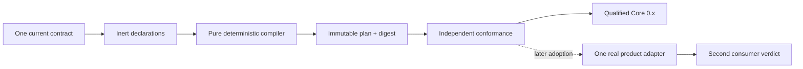
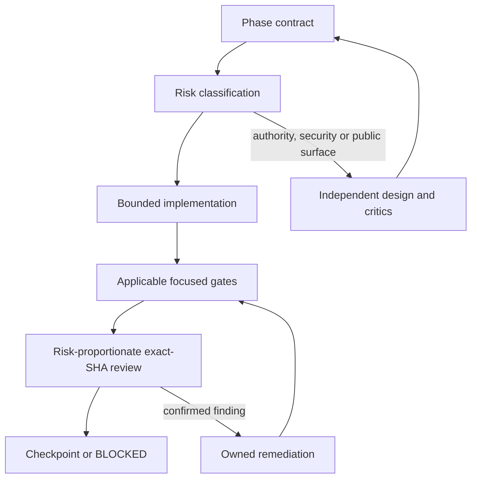

# MVP implementation roadmap

This document is the implementation roadmap, not a replacement for an
accepted ADR. It deliberately describes the order and evidence required to
build the first reusable Core. It does not accept new public API, change an
accepted decision, or claim that a qualification fixture is production code.
ADR-0009, ADR-0010 and ADR-0011 are conditional candidate decisions on the
selected base unless their accepted successors are present. They do not enter
accepted authority, the open-decision blocker catalog or executable governance
until accepted through the repository decision flow.

The MVP goal is:



Get Modular owns composition semantics. Product Hosts still own authorization,
executable loading, readiness, generations, routing, drain, recovery and
reconciliation. Extension Foundation owns artifact trust, signatures,
distribution, isolation and plugin state. No phase may create a second owner
for those concerns.

## MVP boundary

| Required for qualified Core 0.x | Later checkpoint or reserved capability |
| --- | --- |
| One public `@get-modular/core` package after the naming authority gate | Dynamic runtime plugin installation |
| Inert module declarations and complete profiles | Hot unload and live replacement |
| `required`, `optional`, bounded ordered `many` | Cordis as a Host resource adapter |
| Normalization, graph validation and immutable plan | Process/WASM plugin hosts |
| Bounded deterministic diagnostics and digest | Frontend Module Federation loader |
| Public development-only `@get-modular/conformance` identity after its own surface gate | Managed catalog and registry service |
| Pack-once Core subject and independent conformance | First product-owned composition adapter; runtime readiness and generation engine |

The target public names are unversioned before 1.0. Historical `v1`/`v2` paths,
schema discriminators and evidence IDs are lineage only and do not by
themselves require parallel public API generations. This roadmap is not naming
authority: until ADR-0009 (or a successor) is accepted on the exact
implementation base, no unversioned public barrel or published package may be
materialized. Existing accepted names remain contract authority in the
meantime; historical names are not automatically published as compatibility
aliases.

### Roadmap qualification language

The labels below are phase-report outcomes, not new Feature Module Standard
qualification states, public API, or lifecycle authority. They do not collapse
`source-admitted`, `structural-conformant`, `runtime-conformant`, publication,
or product adoption:

| Outcome | Evidence established | Evidence not established |
| --- | --- | --- |
| `direct-semantics-qualified` | A temporary, hash-identified direct subject passes the independent public-boundary semantics, diagnostic, plan/digest and immutability gates. | Generated construction, release custody, publication, or product adoption. |
| `self-composed-qualified` | In addition to direct qualification, ADR-0008's finite stage0-to-profile-to-emitter-to-stage1 path controls construction, direct/generated parity and witnesses pass, and generated stage1 passes the same public-boundary gates. | Release custody, publication, Feature Module Standard promotion, or product adoption. |
| `release-eligible` | The retained self-composed stage1 archive also satisfies every accepted decision, conformance, support-envelope, custody and promotion gate applicable to the requested release state. | Actual publication, registry read-back, stable 1.0, or a product-adoption claim. |

`direct-semantics-qualified` is useful prerequisite evidence, but accepted
ADR-0008 does not permit it to replace self-composition for the first released
Core. `release-eligible` means that the exact retained archive may enter the
publication checkpoint; it is not a synonym for published or conformant. While
required custody authority remains proposed, release eligibility remains
`CONDITIONAL` even when the two earlier outcomes pass.

## Common phase protocol

Every phase uses evidence and review proportional to the changed risk. A phase
cannot enter implementation only because a plan sounds plausible, but ordinary
bounded work does not require a full research campaign.



### Worker rules

1. Worker roles, independence and evidence custody are normative. Exact
   provider, model, effort, tier and capacity belong to the campaign execution
   manifest and may change without changing product architecture. The active
   campaign follows the operator's hosted-runtime policy and records those
   identities in each phase report.
2. A phase contract states inputs, outputs, owners, non-goals, invariants,
   files, tests, limits, acceptance and stop criteria. It assigns one of three
   risk classes: ordinary bounded change, cross-boundary change, or
   authority/security/public-surface change.
3. Independent design roles cover algorithm/correctness, security/adversarial
   input, real-world TypeScript DX, and Clean Architecture/DDD/evolution when
   the risk class requires them. Synthesis produces an evidence matrix, not a
   vote count; disagreement becomes an explicit decision or blocker.
4. The `4 design -> 2 synthesis -> 6 critics -> 4 exact-SHA reviews -> 2
   arbiters` fan-out used to qualify this roadmap is a campaign profile for
   high-risk authority work, not a mandatory staffing rule for every future
   implementation PR. Ordinary work uses focused checks and at least one
   independent exact-head review. A bounded public-surface change uses two
   independent perspectives plus owner approval; authority decisions, security
   boundaries and publication use the full independent profile.
5. Each coding worker has a separate workspace and file ownership. Research
   fixtures, production-like code and generated evidence never share an
   unmarked directory. Read-only workers do not commit.
6. Every exact-SHA reviewer checks the same published head. Any new commit
   invalidates prior reviews and requires the focused gate plus reviews for the
   affected area again.
7. A checkpoint is allowed only with no unresolved P0/P1, a clean workspace,
   reproducible evidence and green required CI. Merge is never automatic.
8. If the hosted runtime stops at provider startup, the job is `unattested`.
   Preserve its workspace, reconcile by exact SHA or bundle, and do not report
   intent as evidence or retry indefinitely.

### Required phase report

Each phase leaves a report containing the applicable items below. A field whose
subject does not exist yet is recorded as `not-applicable` with a reason rather
than satisfied by synthetic output.

- exact base and head SHA, worker IDs and ownership map;
- alternatives, evidence sources and rejected patterns;
- changed LOC split into production-like, test and disposable evidence;
- commands, applicable platform matrix, test output and packed-consumer result;
- P0-P3 findings, remediation history and reviewer verdicts;
- explicit `GO`, `CONDITIONAL` or `BLOCKED` result and reversal conditions.

## Phase 0: contract and evidence preflight

**Purpose:** make the starting point unambiguous before creating Core source.

### Inputs

- exact selected PR/base SHA;
- accepted ADRs and current requirements;
- canonical schema, resource profile, diagnostic catalog and vectors;
- accepted authority and qualification ledgers already present in the selected
  source;
- conditional ADR-0009/0010/0011 candidates, clearly separated from accepted
  authority and active open-decision blockers;
- planned governed decisions for package carrier/resolution and unresolved
  raw-input carrier and duplicate-binding semantics.

### Phase 0 implementation

1. Verify the selected base and accepted-decision precedence. Do not use a
   stale PR head or treat a proposed ADR as authority. The unversioned public
   naming map is conditional on acceptance of ADR-0009.
2. Create the derived, non-authoritative
   `architecture/qualification/core-preflight-report.json` and its fail-closed
   `architecture/checks/core-preflight.mjs` verifier. The closed report records
   `kind`, schema version, exact base SHA, accepted-ledger digests, existing
   evidence/check paths and open decision blockers. The verifier recomputes all
   referenced identities; the report never replaces accepted ledgers, turns a
   proposed ADR into an active blocker or imports proposed ADR-0011 obligations
   as current requirements.
3. Close accepted-contract preflight gaps before public Core work: accepted
   authority pins, the accepted raw-byte boundary, duplicate-key policy, total
   diagnostic ordering and canonicalization evidence. A composition profile
   root may use a closed `ProfileId`/root-selection coordinate; runtime
   activation, generation, readiness and routing identities remain Product Host
   concerns and never enter Core plans or diagnostics.
4. Keep `not-claimed`, `source-admitted`, `structural-conformant` and
   `runtime-conformant` as distinct qualification states. Release eligibility
   is a phase-report result until an accepted custody decision defines a
   machine-readable release state. Qualification folders are not a runtime
   registry.
5. Map every currently accepted normative claim to its accepted ledger entry,
   existing evidence or named implementation gate. Proposed-decision work stays
   conditional roadmap work, not a manufactured obligation row or active
   blocker. Only active open-decision records discovered from the governed
   catalog enter the blocker set. Existing synthetic artifacts are not silently
   promoted.
6. Build a raw-carrier research matrix that derives only behavior already fixed
   by accepted ADR-0006/0007. Mark every unresolved view-offset, aliasing,
   transfer/detachment, shared/resizable storage, cross-realm or exact failure
   disposition as undecided. Before such a cell can gate the mandatory raw
   entrypoint, create `OD-005-raw-input-carrier-semantics` and resolve it
   through an accepted successor ADR plus executable ledger evidence.
7. Create `OD-006-duplicate-binding-record-diagnostics` before assigning a
   diagnostic code, coordinates or suppression behavior to repeated records for
   one `(implementationId, slotId)`. Resolve it through an accepted successor
   ADR and executable ledger evidence before that case enters the compiler.
8. Record the selected SHA and retained content identities, then run the same
   preflight in one fresh disposable checkout. Defer cold regeneration and
   rollback rehearsal until stage0 or a retained release artifact exists in
   Phase 4 or Phase 8. Never use `reset --hard` or `clean` against a contributor
   checkout as evidence.
9. Create `OD-004-package-carrier-and-resolution-policy` before freezing
   package type, export conditions or supported resolver modes. Governance
   derives blockers only from the active open-decision catalog, not from this
   roadmap's planned identifiers. After OD-004/OD-005/OD-006 records exist, they
   enter that normal catalog-driven path. Keep ADR-0009/0010/0011 as conditional
   roadmap choices until accepted; only their accepted decisions may add
   mutation fixtures or checkpoint requirements.
10. Verify that the existing `qualification:resource-profile` executable
    generator/oracle proof remains wired into the complete repository gate. A
    declared but orphaned script is not Phase 0 evidence, and its historical
    filename does not create a versioned public command.

### Phase 0 exit criteria

- the derived preflight report and checker exist, are digest-bound to accepted
  ledgers and contain no unresolved accepted-contract P0/P1;
- exact source custody and ADR precedence are recorded;
- no production package or public barrel exists yet;
- accepted-claim mapping and the evidence-only raw-carrier matrix are checked;
- every actual open-decision blocker and its mutation fixtures execute in the
  complete governance gate;
- the same preflight succeeds in a fresh disposable checkout at the recorded
  SHA; cold artifact recovery remains a later phase gate;
- OD-004 is resolved by an accepted ADR or successor decision before package
  carrier/export freeze, and OD-005 is resolved the same way before unresolved
  raw-carrier behavior enters the public entrypoint;
- OD-006 is resolved by an accepted ADR or successor decision before duplicate
  binding-record behavior enters the compiler;
- the target unversioned surface requires accepted ADR-0009 or a successor.
  Until then the accepted contract remains authority and the target public
  milestone is `CONDITIONAL`, not a manufactured governance blocker.

### Non-goals

No compiler, plugin host, lifecycle engine, Cordis adoption or product API
changes are implemented here.

## Phase 1: package topology and public boundary

**Purpose:** establish the package boundary at the same substantive checkpoint
as the first Core behavior. A package shell or declaration-only facade is not
an implementation deliverable.

Phases 1-4 are one atomic first-Core checkpoint, not four independently
mergeable releases. Their acyclic construction order is:

```text
Phase 1 private package/source setup
  -> Phase 2 inert declarations
  -> Phase 3 private semantic compiler
  -> Phase 4 stage1 plan/digest implementation
  -> Phase 1 export freeze and two hash-identified qualification subjects
  -> Phase 4 direct/generated packed qualification
  -> joint Phase 1-4 checkpoint
```

This order prevents an empty public shell and prevents packed qualification from
depending on a Phase 4 exit that already assumes the archive exists.

Atomic applies to release qualification and promotion, not to review size.
Implement Phases 1-4 as dependency-safe, private vertical PRs that normally
change no more than roughly 2,000 LOC each, including the focused tests and
evidence needed for that slice. Each PR must deliver testable behavior and a
narrow revert path, but it remains unpublished and cannot claim an independent
phase release or partial Core qualification. Keep one invariant together when a
smaller split would make it unverifiable.

### Phase 1 implementation

1. Materialize the private Core package/source boundary under the accepted
   topology, but do not freeze the target unversioned public barrel until
   ADR-0009 or a successor is accepted. If it remains proposed, accepted API
   authority continues to govern and the target release stays `CONDITIONAL`;
   private implementation work is not blocked. Keep domain semantics independent
   from Foundation, Docs Protocol, DI containers and plugin runtime types.
2. Preserve ADR-0003's public development-only
   `@get-modular/conformance` identity without creating an empty package. Its
   substantive vectors, fixtures and packed-consumer tooling may be published
   after their surface gate; runner, subject, report and attestation contracts
   remain private until a separate compatibility decision accepts them.
3. Freeze one export map only after the first substantive compiler behavior is
   present. `ModuleDeclaration`, `CompositionProfile`, `CompositionPlan`,
   `Diagnostic`, `PlanDigest`, `defineModule`, `required`, `optional`, `many`
   and the accepted compiler entrypoints must have their accepted semantics.
   Compiler entrypoints cannot be throwing, pass-through, no-op or
   declaration-only placeholders; authoring helpers retain the deliberately
   pass-through behavior accepted by ADR-0007. Both trusted-object and
   untrusted-byte entrypoints are mandatory; the raw entrypoint materializes
   only after OD-005 and its accepted successor close every unresolved carrier
   behavior required by that public boundary.
4. Promote the first production package atomically to `source-admitted`: add
   the pinned `architecture/foundation/source-dependencies.yaml`, enable the
   Engineering Foundation source-dependency capability, add positive and
   negative structural fixtures, and wire the real Foundation check into
   `check:fast` and `check`. Structural and runtime conformance remain separate
   promotion states.
5. Pack two temporary, separately hash-identified qualification subjects with
   the same public compiler boundary: direct stage0 assembly and generated
   stage1 assembly. Run default-deny export/deep-import tests, tarball allowlist,
   declaration-leakage audits and inert import smoke tests against both. Only
   generated stage1 is retained as the pack-once distribution candidate; never
   repack either subject inside a platform job.
6. Resolve OD-004 before freezing package type, export conditions and supported
   resolution modes. Do not infer an ESM/CommonJS policy from this roadmap.
7. Before freezing the public TypeScript surface, run both exact qualification
   subjects through NodeNext, Bundler, JavaScript and `checkJs` consumers at 100,
   500 and 1000 declarations with recorded compiler identity, timing, peak
   memory and inference/error assertions.

### Phase 1 exit criteria

After Phases 2-4 provide the complete substantive compiler, two disposable
TypeScript consumers compile through the public barrel only and both exact
qualification archives pass the named resolver/type-scale gates. No Core API
exposes a container, resolver, registry, Context/Fiber, filesystem path,
executable factory, transport DTO or versioned name. A package shell without
substantive behavior cannot pass this phase.

### Stop criteria

Stop if package topology needs a second public authority, a framework-specific
type, or a package split that cannot be explained by independent dependency or
lifecycle ownership.

## Phase 2: declarations, profiles and capability slots

**Purpose:** make module authoring local and typed at hundreds of modules, and
rehearse navigation workflows that a real product must later prove in Phase 6.

### Phase 2 implementation

1. A module co-locates its serializable branded ID and plain-data declaration.
   Product/repository admission allocates and authorizes the namespace; the ID
   is not authentication, an import path or an executable lookup key. There is
   no global ID list and no repeated untyped string literals in consumer code.
2. Feature-local contracts and adapters stay beside their feature. A shared
   contract is extracted only after a second real consumer proves the same
   boundary.
3. `required`, `optional` and `many` express cardinality. `many` has explicit
   `min`, `max` and `order`; registration order is never semantic.
4. A Core declaration is inert plain data only. A feature may co-locate a
   separate product-owned typed factory and port, but Core compilation never
   receives, imports, discovers or invokes that factory.
5. A profile is a complete compilation snapshot produced by a Product Host
   adapter from host-authorized desired state. Core has no disabled flag,
   rollout state or impact authority; removal and replacement are expressed by
   compiling a new complete profile. ADR-0008's closed own profile is instead a
   private build-owned input. Neither case lets the compiler derive, merge or
   authorize profiles, and there is no hidden fallback.
6. Pure DI uses consumer-owned capability ports and explicit factory arguments
   outside Core's declaration/compiler boundary. No generic `resolve()`,
   service locator, global mutable container, dependency bag, inherited-property
   lookup or thenable assimilation.
7. Authoring helpers are pass-through constructors, not validators: they retain
   explicit keys and values, while the compiler alone validates cardinality,
   compatibility and closed profile rules.

### Phase 2 exit criteria

Synthetic provider, consumer, optional provider and ordered-contribution modules
compile in the authoring fixtures. Missing, duplicate, incompatible and
not-selected dependencies are explicit and graph-inert. A 100/500/1000-
declaration authoring gate records fixture-local owner/binding/root lookup
steps, edited paths, complete-profile construction, change workflows and
typecheck budgets without executing declarations. This synthetic record proves
only that the API and measurement method can exercise those workflows. It
cannot claim real product owner/root navigation, authoritative edit loci, or a
product change-workflow budget; the phase report marks those product claims
`not-applicable` until the admitted real slice proves them in Phase 6.

## Phase 3: normalization and deterministic graph compiler

**Purpose:** implement the private semantic compiler seam:
`declarations + complete profile -> normalized plan | bounded diagnostics`.
The public successful compiler result does not exist until Phase 4 attaches the
immutable plan and digest required by the accepted contract. Canonical bytes
remain a private intermediate and evidence input.

### Required semantics

- closed validation of declarations, profiles, IDs, owner syntax, exact
  compatibility, selections, bindings and cardinality;
- resource preflight before unbounded allocation or traversal;
- root closure following consumer-to-provider edges, with provider-to-consumer
  dependency order that carries no activation or lifecycle meaning;
- stable SCC cycle members and stable order independent of input enumeration;
- deterministic unknown, missing-selection, duplicate, not-selected,
  incompatible, cardinality, cycle and unreachable diagnostics defined by the
  accepted catalog for the complete input profile;
- no first-row/last-row winner, fallback provider or registration-order
  meaning;
- bounded paths, redacted hostile values, top-K diagnostics and saturating
  omission count.

Repeated binding records for one `(implementationId, slotId)` remain outside
the admitted semantic domain until OD-006 and its accepted successor define the
exact diagnostic and suppression behavior. Fixtures may demonstrate candidate
behavior but cannot make it compiler authority.

Phase 3 accepts, stores, returns and invokes no factory, callback, function,
loader, executable handle or product code. Product-owned literal factory tables
remain outside Core and may be used only after a complete successful public
compile result exists. Core-owned enable/disable, scope, priority, generic
ambiguity or impact semantics require a successor contract and are not inferred
from the current schema.

The canonical detail-byte comparator used by diagnostic ordering is qualified
behind its private boundary in this phase. An owned private implementation may
proceed behind the port; selecting an external production adapter or dependency
requires accepted ADR-0010 or a successor. The semantic compiler cannot inherit
ordering or error behavior from a candidate library.

The first substantive compiler slice also introduces the owner-local
declarations, ports and factories plus ADR-0008's minimal direct stage0 root.
The finite emitter and generated stage1 remain Phase 4 work.

### Phase 3 exit criteria

One named subject gate invokes the actual internal compiler seam through every
admitted object/raw entrypoint and compares complete results with independent
expectations. Static vector/oracle validation is a prerequisite and cannot
satisfy this gate. The gate covers:

- required-one, optional-zero/one and bounded-many at zero/min/interior/max;
- missing, duplicate, unknown, not-selected, incompatible, cardinality,
  no-fallback, cycle, multi-root and unreachable cases;
- every accepted at-limit and plus-one resource case, maximum-depth, dense-edge,
  giant-cycle and diagnostic-storm fixtures;
- correctness-only P100/P500/P1000 sparse and dense worlds, iterative traversal,
  stack safety, retained-diagnostic bounds and structural operation counters;
- exhaustive equivalent permutations for bounded tiny graphs and pinned,
  reproducible independent/joint shuffles at P100/P500/P1000. Ordered-many
  provider arrays are semantic and are never shuffled as an equivalence; a
  changed provider order must change the later plan and digest.

Every diagnostic result excludes a plan and digest. No Core input/output type or
packed dependency accepts executable values. The private normalized seam is not
exported as a temporary public API.

## Phase 4: immutable plan, canonical bytes and self-composition

**Purpose:** make the plan reproducible and prove that Core can construct its
own finite internal components without a runtime bootstrap loop.

Canonical bytes are a private compiler intermediate used to derive the accepted
public digest and private evidence used to compare exact results. The public
compile result remains the accepted immutable plan plus digest; it does not
return canonical bytes, require a consumer to retain them, or create a public
byte-verification API. Qualification and custody tooling may retain and compare
those bytes privately when binding the exact subject and evidence.

### Phase 4 implementation

1. Use the accepted canonicalization boundary and a qualified private adapter.
   Do not call a local helper RFC 8785/JCS without independent vectors proving
   the exact required subset. An owned primitive may implement the port; an
   external production dependency requires accepted ADR-0010 or a successor.
2. Encode only normalized semantic plan data, selected implementations,
   bindings, order, profile and compatibility data. Exclude source ordinals,
   executable closures and host custody state.
3. Hash exact canonical bytes with domain-separated SHA-256 only after encoding
   is qualified. Equivalent permutations retain the same bytes/digest; a valid
   semantic change succeeds with new bytes/digest; invalid input returns only
   diagnostics. A stale or tampered plan/digest pair is rejected only by the
   named private evidence/custody verifier, never by an invented public Core
   authorization API.
4. Prove deep runtime immutability: plain JSON-compatible records/arrays,
   iterative deep freeze, no accessors or class instances, no retained aliases
   to caller input, strict-mode mutation rejection, and stable canonical
   bytes/digest after a process or structured-clone round trip.
5. At accepted ADR-0008 checkpoint A, compile the real closed own profile as
   soon as the first useful dependency edge exists and report production,
   qualification and generated LOC separately. Prove one controlled
   behavior-changing binding replacement before release. The stronger two-edge,
   three-change and explicit owner `GO` checkpoint applies only after ADR-0011
   or a successor is accepted; until then it is candidate evidence, not an
   emitter veto.
6. Resolve the closed dependency-record representation before any stage0/stage1
   construction claim. Accepted ADR-0008 forbids hostile identities as property
   lookup keys but requires factory keys to match slots; ADR-0011 proposes the
   null-prototype own-key refinement. Construction qualification therefore
   requires accepted ADR-0011 or a successor that closes this exact seam. No
   ordinary object, inherited lookup or thenable assimilation is permitted.
7. After item 6 is resolved, implement ADR-0008's bounded self-composition in
   its accepted delivery order: handwritten stage0 uses the real graph
   semantics, emits finite private stage1 wiring, and stage1 wires the same
   implementations. This is build-time composition, not recursive compiler
   self-hosting and not a public generator. An explicit owner `GO` before this
   step is required only if accepted authority adds that condition.
8. Use clean, isolated and poisoned stage/cache/output roots. Prove exact
   P0/P1 plan-and-digest equality, exact W0/W1 equality, independently observed
   construction witnesses, a binding replacement that changes public behavior,
   no hidden concrete-import fallback, and zero own-profile compilation,
   emitter calls or component assembly on caller requests. Only pack-once
   stage1 is distributable; stage0, own profile and emitter stay outside the
   runtime closure.
9. Treat completion as distinct phase-report outcomes. A direct subject may
   become `direct-semantics-qualified` using accepted plan/digest evidence
   without a construction claim. `self-composed-qualified` additionally
   requires the accepted item 6 refinement and the complete ADR-0008 finite
   construction proof. Release custody is separate again; while ADR-0011
   remains proposed, its broader protocol creates neither a governance blocker
   nor a custody claim.
10. Record non-SLO P100/P500/P1000 sparse/dense canonical byte size, digest time,
   peak memory and concurrent-call observations. Phase 5 owns portable sizing
   evidence and release-scale qualification, not new performance thresholds.

### Phase 4 qualification exit

One named gate proves semantic/digest invariants and deep immutability against
the direct subject before a construction claim and against both temporary
hash-identified subjects after item 6 is accepted. Both use the same public
compiler boundary. Reordered equivalent graphs produce identical canonical
bytes/digest; valid semantic changes produce different valid bytes/digest;
invalid inputs produce diagnostics only; and nested mutation, alias and
cross-process tests prove a plain immutable plan. This gate does not require or
invent release-custody records.

After the item 6 authority closes the dependency-record seam, the accepted
ADR-0008 finite-construction gate proves clean bootstrap with
stage1 absent, isolated/poisoned roots, P0/P1 and W0/W1 equality, behavioral
replacement, independent construction witnesses, caller-time no-bootstrap and
stage1-only runtime closure. Direct and generated packed subjects pass the same
independent vectors and public-API checks; only generated stage1 may be retained
for distribution. Passing the direct gate yields
`direct-semantics-qualified`; passing the construction and parity gate yields
`self-composed-qualified`. Neither can imply publication readiness.

### Phase 4 release-eligible exit

The target external-adapter and release-custody path becomes eligible only after
ADR-0010/0011 or accepted successors supply authority. Their governed gates may
then select production dependencies and reject tampered evidence bindings,
source/evidence splicing, archive swaps and failed cold rollback while
preserving one pack-once stage1 archive. Before acceptance the target path is a
roadmap-level `CONDITIONAL` outcome, not a synthesized governance blocker and
not a failed qualification result.

## Phase 5: conformance and scale proof

**Purpose:** make correctness reusable for every future consumer.

### Phase 5 entry gates

Before creating structural or runtime conformance evidence, pin a Docs Protocol
and Engineering Foundation authoring toolchain whose declared identity strategy
can create the accepted `QUAL-*` records. Prove both `docs:new --dry-run` and
apply paths with positive and mutation fixtures. If no released pinned version
supports that identity, Phase 5 is blocked on a bounded Engineering Foundation
capability; Phases 1-4 may still build and qualify Core while conformance remains
`not-claimed`. Manual files and relaxed identities are not substitutes.

The Engineering Foundation repository owns that authoring capability and ships
it through a separately reviewed package release. Its acceptance evidence is an
exact package version and digest plus successful Get Modular dry-run, apply and
mutation fixtures. Get Modular does not add a local writer or private identity
fallback. Until that release is published and pinned, qualified Core `0.x` and
its publication checkpoint are explicitly `CONDITIONAL`; the private Phases 1-4
Core checkpoint remains implementable.

Declare the qualification document type/template/index in the adopted profile
and make the repository profile checker transition-aware. It must require
`not-claimed` until governed qualification and reciprocal promotion records
exist, then accept only their ordered same-subject states. A runner cannot
promote its own output.

Evidence reuse is disabled unless an accepted custody decision owns one closed
reuse key. The key binds the exact subject/archive and source/authority ledgers;
entrypoint, vectors and closed matrix case ID; evidence schema, generator,
runner/verifier and command; toolchain and runtime; OS version and build,
architecture and realm; browser release/build; Electron release plus its embedded
Node and Chromium identities; matrix configuration and accepted freshness
policy. Changing any component invalidates the case. Before such a decision
exists, rerun rather than infer equivalence from a partial key.

### Scale support envelope and operator guidance

Phase 5 publishes an explicit Core `0.x` support envelope with the retained
archive. The correctness envelope is closed over:

- the object and admitted raw-byte entrypoints, accepted carrier cells, and
  accepted resource limits;
- sparse, dense, maximum-depth/cycle, diagnostic-storm and maximum-identity
  worlds at 10/100/500/1000 modules and the accepted declaration limit;
- the six required Node, Chromium and Electron cases, including the recorded
  runtime, operating-system, architecture and realm identities; and
- concurrent/repeated-call isolation, bounded diagnostics, canonical plan and
  digest correctness, and packed-consumer/typecheck cases.

Inputs above accepted resource limits, unresolved raw-carrier cells, skipped
runtime cases, and Product Host lifecycle behavior are outside that envelope.
Within it, accepted resource limits and correctness are supported; recorded
time, memory, archive size and structural counters remain sizing observations,
not portable latency, throughput or memory promises.

Phase 5 also updates the governed operator/adapter section of
`docs/architecture/current-contract.md`. It explains identity and namespace
ownership, complete-profile construction, ordered-many bindings, entrypoint and
carrier selection, diagnostic and omission handling, supported scale shapes,
evidence identities, and when invalidated cases must be rerun. It shows that a
Product Host may consult its authorized literal factory table only after
successful compilation and must not edit a plan or infer authorization,
readiness, activation, retry, routing or recovery from Core output. It includes
support-data capture and escalation guidance for cases outside the envelope
without turning Get Modular into an operational authority. This reuses the
existing governed architecture document and does not invent a new Docs Protocol
record type.

### Phase 5 implementation

1. Put implementation-independent vectors and fixtures in the separate
   development-only conformance package. Accepted contracts, ledgers and
   independently owned vectors are the authority; packed Core is only the
   subject under test. The runner/subject/report protocol remains private and
   cannot support a runtime-conformance claim until a separate compatibility
   decision accepts it.
2. Cover positive, negative, mutation, permutation, malformed input, resource
   limits, omitted modules, cycles, compatibility and diagnostic redaction.
3. Execute the same independent vector and packed public-API suite against the
   separately hash-identified direct and generated qualification subjects.
   Execute the retained generated stage1 subject and exact vectors in all six
   accepted cases: Node 24 on Linux/macOS/Windows, pinned Chromium window and
   dedicated worker, and the pinned Electron main/renderer smoke. A skipped or
   unavailable mandatory case blocks the conformance claim; it is never success
   evidence.
4. Define reproducible scale worlds instead of using module count alone. Cover
   sparse, dense, maximum-depth/cycle, diagnostic-storm and maximum-identity
   shapes at 10/100/500/1000 modules and the accepted declaration limit. Pin the
   generator seed, runtime/toolchain, machine class, warmup, sample count and
   statistic. Record parse/normalize/compile/digest time, structural operation
   counters, peak live memory, input/output byte size and retained diagnostics.
   Enforce accepted resource limits. Structural counters, time and memory remain
   observational sizing evidence until a successor decision defines an
   independent counter taxonomy and finite thresholds. Packed archive size is
   measured once for the retained archive, not once per profile.
5. Bind and reuse the Phase 1 packed-consumer evidence only through the complete
   Phase 5 reuse key. Run the helper runtime/handoff case and any mandatory
   consumer or 1000-declaration typecheck case not already proved there; rerun
   every invalidated case.
6. Differentially compare object and raw adapters only over their admitted
   equivalence domain. Include snapshot-before-await, caller mutation,
   `ArrayBufferView` offsets, transfer/detachment, shared/resizable storage and
   cross-realm carriers from the Phase 0 matrix. Divergence cannot be hidden by
   fallback.
7. Exercise concurrent and repeated calls, immediate input mutation and
   request-state isolation through both entrypoints. Compiler measurements do
   not create Product Host activation, readiness or recovery SLOs. Any retained
   alias, cross-request contamination or non-deterministic result fails the
   subject gate rather than becoming an observation.
8. Keep focused gates small for ordinary changes. Run the closed six-case,
   packed-consumer and scale matrix only for promotion/release evidence, while
   preserving one exact pack-once subject across the distribution.
9. Bind source admission, structural evidence and packed runtime evidence to the
   same package subject. Structural and runtime qualification records remain
   `reviewed` evidence until separate accepted reciprocal promotion decisions
   anchor their exact bytes in the order required by the Feature Module
   Standard. A runner result cannot promote itself.
10. Generate the closed support envelope from the same retained archive and
    evidence identities, then update the operator/adapter section of
    `docs/architecture/current-contract.md` with its supported and unsupported
    cases explicit. A measurement observation cannot silently expand the
    envelope or become a compatibility threshold.

### Phase 5 exit criteria

Every applicable Core obligation maps to an executed vector against both exact
packed qualification subjects where ADR-0008 requires parity and against the
retained generated stage1 subject for the release-only matrix; a future gate
cannot satisfy Phase 5 exit. The closed six-case matrix, accepted raw-carrier
vectors, dual-subject public-API checks, TypeScript consumers and reviewed scale
evidence pass without mandatory skips. Accepted resource limits pass;
structural counters, timing and memory observations are recorded without
becoming compatibility thresholds. Unresolved raw-carrier research cells do not
enter conformance. The private conformance runner is deterministic and cannot
install modules, scan files, derive expected results from Core, authorize
execution or promote its own qualification records. The closed support envelope
and the operator/adapter section of `docs/architecture/current-contract.md`
identify the exact retained archive, agree with the executed matrix, and state
every unsupported case without claiming Product Host operations.

## Phase 6: first product dogfooding

**Purpose:** prove that the public contract reduces real wiring without
rewriting product domain APIs. This product-adoption checkpoint may follow a
qualified Core `0.x` publication; it is not a prerequisite for that publication.

### Phase 6 implementation

1. Before coding, the consumer repository accepts its own adoption contract and
   evidence location. That contract binds the exact consumer source SHA, owning
   product decision/API, approved feature boundary, Product Host owner and exact
   packed Core archive digest. Get Modular retains only a content-addressed
   reference to that consumer-owned record; this roadmap does not invent a
   universal adoption schema. Agent Runtime capability composition is the first
   candidate, not authority by roadmap text.
2. A product anti-corruption adapter maps authorized product configuration into
   inert declarations and one complete profile, then calls Core. It never
   creates, edits, reorders or substitutes a plan. Credentials, executable
   handles and product state do not enter Core inputs.
3. After successful compilation, the Product Host authorizes materialization
   and maps selected implementation IDs through a closed literal factory table.
   No metadata becomes a grant; no dynamic import, filesystem scan, fallback or
   unselected executable lookup is allowed. A controlled binding replacement
   must change the observed injected implementation and behavior.
4. Keep direct Pure DI as an independent test/reference path while proving
   parity. It is not a live fallback or second runtime wiring authority. After
   cutover, exactly one path controls materialization for the admitted slice.
5. Translate Core diagnostics through a total, bounded and deterministic
   anti-corruption map that preserves code, safe coordinates, ordering,
   redaction, path bounds and omission count. Unknown codes fail closed and the
   original safe machine-readable diagnostic remains available for support.
6. Measure direct and compiled paths with a named adoption gate: wiring and
   generic-glue LOC, authoritative edit loci, owner/root navigation, add/remove/
   replace/cardinality/path-move operations, typecheck cost, missing-dependency
   remediation, deterministic outcomes and deletion cost. Generic glue over 30%
   or ordinary changes exceeding four authoritative loci block extraction
   unless a measured safety invariant justifies them. This is the first gate
   that may convert Phase 2's synthetic navigation and edit-locus rehearsal into
   a real product claim; it reruns the measurements against the admitted slice's
   actual owners, roots, files and composition adapter.
7. Run the real admitted slice plus product-shaped 100/500/1000 authoring and
   compile fixtures from the exact packed Core. These fixtures exercise scale;
   they do not invent product features or replace the real behavior proof.
8. Prove Product Host authority with negative cases: unauthorized desired state
   cannot reach the literal table, no factory runs on diagnostics, stale plan/
   generation input cannot cut over, and readiness/cleanup/recovery/provider
   launch remain outside Core.
9. Evaluate a second existing product seam independently. Use Orchestrator only
   if its exact source and owner admit one; otherwise record
   `second-consumer-not-admitted` and do not invent a feature.

### Phase 6 exit criteria

One admitted real vertical slice works without a product API rewrite, its
digest-bound gate proves compiled-plan control and single wiring authority, and
the quantitative budgets pass. This is enough for a `0.x` product integration.
A proven second independent consumer permits a cross-consumer extraction claim;
`second-consumer-not-admitted` is an honest `CONDITIONAL` outcome that blocks a
stable or cross-consumer claim rather than pretending two-consumer evidence.

## Reserved Phase 7: extension/plugin boundary

**Purpose:** reserve the extension boundary without making plugin distribution
or dynamic runtime replacement a dependency of the first Core release.

This reserved slot is not a current implementation phase, deliverable or exit
gate. It does not block the Core `0.x` release checkpoint.

Because no real extension consumer is admitted yet, the roadmap records only
negative Core-boundary invariants. It does not create an owner-handoff artifact,
start a production coding wave, add a package dependency, add a Get Modular
qualification gate or implement a registry, loader, lifecycle engine or update
service. The accepted system boundary remains the ownership authority. A real
consumer and accepted owner decisions are required before a consumer-owned
handoff record or implementation phase exists.

- A runtime Module is a composition/lifecycle unit. A Plugin Artifact is a
  distribution, trust and update envelope. One artifact may provide multiple
  module contributions.
- Extension Foundation verifies and decodes artifact identity, publisher,
  signature/revocation, bounded contributions and permission requests. Product
  Host separately admits namespaces, issues grants and translates accepted
  contributions into the same inert declarations. Verification and requested
  permission are never activation authority.
- Product extensions may call only explicitly granted narrow product ports.
  Those ports retain authorization and aggregate invariants; extension code
  never mutates product storage or aggregates directly and cannot bypass policy.
- Registry, artifact, signature and update tools remain replaceable Extension
  Foundation adapter candidates; this reservation phase selects none of them.
  Core sees admitted inert declarations, not registry or signature APIs.
- Product Host owns executable correlation, grants, generation fencing,
  cutover, rollback and retirement. Extension Foundation owns artifact trust,
  installation and update custody. Their exact records and transactions require
  accepted owner decisions; this roadmap does not define them.
- Proposed ADR-0010 records a not-yet-admitted Cordis `4.0.2` defect report. Until
  an owning Host repository retains a local reproducer and an accepted decision
  classifies an exact candidate, Cordis is `unselected`, not a Get Modular
  `NO-GO`. Any later Cordis adapter may own scoped resources only; it cannot
  own Core semantics or provide process/tenant isolation.
- Dynamic enable/disable, drain, generation cutover, crash recovery, uninstall
  and user-data retention stay deferred to Product Host and Extension Foundation
  decisions. Hot unload is not promised by Core MVP.
- Keep artifact/module/publisher/installation/contribution/Host-generation
  identities separate. Atomicity for an artifact contributing several modules
  is a named future decision, not an accidental registration-order behavior.

Future Extension Foundation and Product Host qualification may reference Core
declarations, but Get Modular does not mirror their lifecycle or security gates.
No plugin loader, registry, signature verifier, hot-unload path or runtime
replacement enters Core MVP.

## Phase 8: release checkpoint

**Purpose:** prove that the implemented checkpoint is reviewable, reproducible
and reversible before publication or merge.

Core `0.x` may enter this checkpoint after Phases 1-5. Phase 6 has its own later
product-adoption checkpoint; the reserved Phase 7 slot has no gate. Two
independent production adapters remain required only for a stable
cross-consumer claim.

### Bounded PR merge checkpoint

1. Run local check, typecheck, lint, docs protocol, source custody and focused
   tests/mutants for the changed invariant. Run broader gates only when the PR
   changes their subject or authority.
2. Select exact-head review by risk: at least one independent reviewer for an
   ordinary bounded change; two perspectives plus owner approval for a bounded
   public-surface or cross-boundary change; and four reviewers plus two
   independent arbiters for authority decisions, security boundaries or actual
   publication. Any changed SHA invalidates every prior exact-SHA review and its
   associated arbitration; focused re-review is permitted for the affected
   scope, but it must review the new exact head.
3. Keep PRs near 2,000 changed LOC when the invariant boundary permits. Do not
   split one invariant merely to satisfy a number.
4. Merge only with explicit owner approval, a clean exact-head check and a
   narrow revert path. A bounded merge does not imply publication or conformance
   promotion.

### Publication promotion checkpoint

1. Create one machine-checked promotion manifest owned by the accepted release
   custody decision. It binds exact source head, accepted authority digests,
   toolchain/runtime identities, pack-once archive SHA-256, every command/result
   identity, reviewer/arbitration records and terminal promotion status.
2. Reuse that exact retained archive and bind the already executed Phase 5
   conformance, mutation, packed-consumer, six-runtime-case, TypeScript and scale
   evidence through the same complete reuse key. Rerun every invalidated case.
   Do not rebuild between qualification, platform jobs and publication; no
   mandatory case may skip or be replaced by stale evidence.
3. Inject a failing source or build state, restore the exact known-good source
   and toolchain snapshot, then cold-regenerate stage1 and repeat qualification.
   Prove stage0 is absent, reject archive/evidence substitution and confirm that
   the original retained pack-once archive remains the publication subject; the
   recovery output is equality evidence, not a replacement. A clean rebuild or
   written rollback procedure alone cannot satisfy promotion.
4. Verify all release-required decision blockers, registry namespace ownership
   and reviewed scale evidence disposition against the same manifest. A
   conformance claim additionally requires same-subject source admission plus
   accepted structural and runtime reciprocal promotion decisions; otherwise
   publication must remain explicitly non-conformant and cannot advertise Core
   conformance.
5. Publish the API map, architecture map, evidence ledger, known limitations,
   rollback procedure and upgrade notes.
6. The product owner approves the public surface and promotion; the release
   publisher executes the accepted custody protocol. Registry read-back must
   reproduce the exact published archive digest. Zero or one production adapter
   limits the release to `0.x`; it cannot support a stable or cross-consumer
   claim.

### Phase 8 exit criteria

The exact reviewed head has reproducible evidence appropriate to the selected
merge or publication state, no unresolved P0/P1 and an explicit owner decision.
A merge-only checkpoint has a documented narrow revert path. Publication has an
executed injected-failure rollback and repeated cold qualification against the
retained pack-once subject. Every decision blocker required by that state is
mechanically closed. A failed gate leaves only that checkpoint blocked rather than silently
promoting partial evidence or rerunning unrelated work.

## Global stop conditions

Return `BLOCKED` instead of guessing when:

- a P0/P1 or authority conflict remains;
- a second lifecycle authority, service locator, filesystem scan or framework
  type enters Core contracts;
- raw/object semantics diverge without a decision;
- canonical bytes are claimed without independent vectors;
- a worker uses a stale base, edits another lane or loses dirty state;
- generic glue exceeds 30% of a production-like consumer slice without a
  demonstrated safety benefit;
- a stable or cross-consumer API claim is made without two independent
  production adapters;
- hosted workers repeatedly fail without verifiable output.

The first complete `0.x` Core checkpoint is a small compiler plus conformance
evidence. The first product-adoption checkpoint adds one real adapter. Neither
is completion of the plugin ecosystem or evidence for a stable 1.0 claim.
