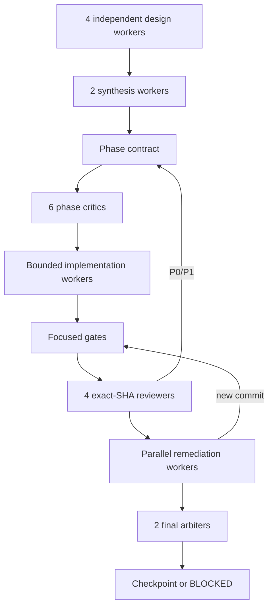

# MVP implementation roadmap

This document is the implementation roadmap, not a replacement for an
accepted ADR. It deliberately describes the order and evidence required to
build the first reusable Core. It does not accept new public API, change an
accepted decision, or claim that a qualification fixture is production code.
ADR-0010 and ADR-0011 are proposed inputs on the selected base unless their
acceptance is independently present in that exact base; this roadmap does not
promote them by reference.

The MVP goal is:

Get Modular owns composition semantics. Product Hosts still own authorization,
executable loading, readiness, generations, routing, drain, recovery and
reconciliation. Extension Foundation owns artifact trust, signatures,
distribution, isolation and plugin state. No phase may create a second owner
for those concerns.

## MVP boundary

| Required for the first Core | Reserved, but not required for Core MVP |
| --- | --- |
| One public `@get-modular/core` package after the naming authority gate | Dynamic runtime plugin installation |
| Inert module declarations and complete profiles | Hot unload and live replacement |
| `required`, `optional`, bounded ordered `many` | Cordis as a Host resource adapter |
| Normalization, graph validation and immutable plan | Process/WASM plugin hosts |
| Bounded deterministic diagnostics and digest | Frontend Module Federation loader |
| Separate private/test-only `@get-modular/conformance` evidence package | Managed catalog and registry service |
| One real product-owned composition adapter | Runtime readiness and generation engine |

Public names remain unversioned before 1.0. Historical `v1`/`v2` paths,
schema discriminators and evidence IDs are lineage only and are never exposed
as parallel public API generations. This rule is not itself an authority for
package exports: until ADR-0009 (or a successor) is accepted on the exact
implementation base, no unversioned public barrel or published package may be
materialized. Existing `v1` names remain qualification lineage and are not
published as compatibility aliases.

## Common phase protocol

Every phase follows this protocol. A phase cannot enter implementation only
because a plan sounds plausible.

### Worker rules

1. Research, planning and review workers use hosted subscription runtime with
   `gpt-5.6-sol`, `xhigh`, fast tier. Coding workers use the same model with
   `medium`, fast tier. At most 16 workers run concurrently. This reasoning
   split is mandatory: implementation workers remain `medium`, while
   architecture and review workers use `xhigh`.
2. The four design workers have different roles: algorithm/correctness,
   security/adversarial input, real-world TypeScript DX, and Clean
   Architecture/DDD/evolution. They return alternatives, evidence, costs,
   failure modes and reversal conditions.
3. The two synthesis workers produce an evidence matrix, not a vote count. A
   disagreement becomes an explicit decision or a blocker in the phase
   contract.
4. The phase contract states inputs, outputs, owners, non-goals, invariants,
   files, tests, limits, acceptance and stop criteria. It is reviewed by six
   critics before coding starts. Confirmed P0-P2 findings are split into
   independent remediation lanes and fixed in parallel where ownership allows.
5. Each coding worker has a separate workspace and file ownership. Research
   fixtures, production-like code and generated evidence never share an
   unmarked directory. Read-only workers do not commit.
6. Every exact-SHA reviewer checks the same published head. Any new commit
   invalidates prior reviews and requires the focused gate plus reviews for the
   affected area again.
7. A checkpoint is allowed only with no unresolved P0/P1, a clean workspace,
   reproducible evidence and green required CI. Merge is never automatic.
8. If the hosted runtime stops at provider startup, the job is `unattested`.
   Preserve its workspace, reconcile by exact SHA or bundle, and do not report
   intent as evidence or retry indefinitely.

### Required phase report

Each phase leaves a report containing:

- exact base and head SHA, worker IDs and ownership map;
- alternatives, evidence sources and rejected patterns;
- changed LOC split into production-like, test and disposable evidence;
- commands, platform matrix, test output and packed-consumer result;
- P0-P3 findings, remediation history and reviewer verdicts;
- explicit `GO`, `CONDITIONAL` or `BLOCKED` result and reversal conditions.

## Phase 0: contract and evidence preflight

**Purpose:** make the starting point unambiguous before creating Core source.

### Inputs

- exact selected PR/base SHA;
- accepted ADRs and current requirements;
- canonical schema, resource profile, diagnostic catalog and vectors;
- a repository-resolvable H0 evidence ledger, with stable ID, path, digest,
  owner and status vocabulary; if it is absent, Phase 0 is blocked;
- ADR-0008 obligations and proposed ADR-0011 obligations, clearly marked as
  proposed until accepted on this exact base.

### Phase 0 implementation

1. Verify the selected base and accepted-decision precedence. Do not use a
   stale PR head or treat a proposed ADR as authority. The unversioned public
   naming map is conditional on acceptance of ADR-0009.
2. Close the H0 gaps before public Core work: accepted authority pins, one
   raw-byte boundary, duplicate-key policy, raw-carrier rules, total
   diagnostic ordering and canonicalization evidence. A composition profile
   root may use a closed `ProfileId`/root-selection coordinate; runtime
   activation, generation, readiness and routing identities remain Product
   Host concerns and never enter Core plans or diagnostics.
3. Keep `not-claimed`, `source-admitted`, `structural-conformant`,
   `runtime-conformant` and `release-ready` as distinct states. Qualification
   folders are not a runtime registry.
4. Confirm that every normative claim has one row in a machine-checked atomic
   obligation ledger. Each row names an exact vector/checker and subject, or a
   future gate with owner and phase. Existing synthetic artifacts are not
   silently promoted.
5. Close a raw-carrier matrix before admitting a raw entrypoint. It must state
   accepted/rejected carriers, view offsets, snapshot timing, aliasing,
   transfer/detachment, shared/resizable backing stores, cross-realm values and
   exact failure classification.
6. Demonstrate source custody and rollback in a fresh disposable checkout.
   Record the selected SHA and retained content identities, run the same
   preflight, discard that checkout and recreate it at the selected SHA. Never
  use `reset --hard` or `clean` against a contributor checkout as evidence.

### Phase 0 exit criteria

- no unresolved H0 P0/P1 blocks the next phase;
- the H0 ledger is present, digest-bound and has no unresolved P0/P1;
- exact source custody and ADR precedence are recorded;
- no production package or public barrel exists yet;
- the atomic obligation ledger and raw-carrier matrix are checked;
- a clean rollback to the selected SHA is demonstrated in a disposable
  checkout;
- ADR-0009 is either accepted with a checked naming map or the public package
remains not created and Phase 1 is blocked.

### Non-goals

No compiler, plugin host, lifecycle engine, Cordis adoption or product API
changes are implemented here.

## Phase 1: package topology and public boundary

**Purpose:** establish the package boundary at the same substantive checkpoint
as the first Core behavior. A package shell or declaration-only facade is not
an implementation deliverable.

### Phase 1 implementation

1. Do not materialize a production package or public barrel until ADR-0009 (or
   its accepted successor) supplies naming authority. When materialized, create
   `@get-modular/core` with a curated public barrel and feature-owned internal
   folders. Keep domain semantics independent from Foundation, Docs Protocol,
   DI containers and plugin runtime types.
2. Keep `@get-modular/conformance` private/test-only: vectors, fixtures and
   mutation helpers are allowed, but no public runner, subject interface,
   report schema or attestation protocol is exported before its separate
   accepted decision and a real packed subject.
3. Freeze one export map only after the first substantive compiler behavior is
   present. `ModuleDeclaration`, `CompositionProfile`, `CompositionPlan`,
   `Diagnostic`, `PlanDigest`, `defineModule`, `required`, `optional`, `many`
   and `compileComposition` must be executable, not throwing, passthrough,
   no-op or declaration-only placeholders. Add raw entrypoints only when Phase
   0 proves their carrier boundary.
4. Promote the first production package atomically to `source-admitted`: add
   the pinned `architecture/foundation/source-dependencies.yaml`, enable the
   Engineering Foundation source-dependency capability, add positive and
   negative structural fixtures, and wire the real Foundation check into
   `check:fast` and `check`. Structural and runtime conformance remain separate
   promotion states.
5. Pack one hash-identified archive and fan that same archive out to disposable
   consumers. Add default-deny export/deep-import tests, tarball allowlist and
   declaration-leakage audits, and inert import smoke tests. Do not repack in
   platform matrix jobs.
6. Make the initial carrier policy explicit: the first public artifact is
   ESM-only unless a separate accepted decision introduces a dual-package
   contract. Tooling must not imply CommonJS support.
7. Before freezing the public TypeScript surface, run the exact archive through
   NodeNext, Bundler, JavaScript and `checkJs` consumers at 100, 500 and 1000
   declarations with recorded compiler identity, timing, peak memory and
   inference/error assertions.

### Phase 1 exit criteria

Two disposable TypeScript consumers compile through the public barrel only and
the exact archive passes the named resolver/type-scale gates. No Core API
exposes a container, resolver, registry, Context/Fiber, filesystem path,
executable factory, transport DTO or versioned name. A package shell without
substantive behavior cannot pass this phase.

### Stop criteria

Stop if package topology needs a second public authority, a framework-specific
type, or a package split that cannot be explained by independent dependency or
lifecycle ownership.

## Phase 2: declarations, profiles and capability slots

**Purpose:** make module authoring local, typed and navigable at hundreds of
modules.

### Phase 2 implementation

1. A module co-locates its serializable branded ID and plain-data declaration.
   Product/repository admission allocates and authorizes the namespace; the ID
   is not authentication, an import path or an executable lookup key. There is
   no global ID list and no repeated untyped string literals in consumer code.
2. Feature-local contracts and adapters stay beside their feature. A shared
   contract is extracted only after a second real consumer proves the same
   boundary.
3. `required`, `optional` and `many` express cardinality. `many` has explicit
   `min`, `max` and `order`; registration order is never semantic.
4. A Core declaration is inert plain data only. A feature may co-locate a
   separate product-owned typed factory and port, but Core compilation never
   receives, imports, discovers or invokes that factory.
5. A profile is a complete compilation snapshot produced by a Product Host
   adapter from host-authorized desired state. Core has no disabled flag,
   rollout state or impact authority; removal and replacement are expressed by
   compiling a new complete profile. There is no hidden fallback.
6. Pure DI uses consumer-owned capability ports and explicit factory arguments
   outside Core's declaration/compiler boundary. No generic `resolve()`,
   service locator, global mutable container, dependency bag, inherited-property
   lookup or thenable assimilation.
7. Authoring helpers are pass-through constructors, not validators: they retain
   explicit keys and values, while the compiler alone validates cardinality,
   compatibility and closed profile rules.

### Phase 2 exit criteria

Synthetic provider, consumer, optional provider and ordered-contribution modules
compile in the authoring fixtures. An author can find module owner, binding and
composition root without editing a central registry. Missing, duplicate,
ambiguous and not-selected dependencies are explicit and graph-inert. A
100/500/1000-declaration authoring gate records owner/binding/root navigation,
edit loci and typecheck budgets without executing declarations.

## Phase 3: normalization and deterministic graph compiler

**Purpose:** implement the semantic core:
`declarations + complete profile -> immutable plan | bounded diagnostics`.

### Required semantics

- closed validation of declarations, profiles, IDs, ownership, compatibility,
  scopes and cardinality;
- resource preflight before unbounded allocation or traversal;
- root closure following consumer-to-provider edges, with provider-to-consumer
  execution order;
- stable SCC cycle members and stable order independent of input enumeration;
- deterministic missing, duplicate, ambiguous, incompatible and unreachable
  diagnostics for the complete input profile;
- no first-row/last-row winner, fallback provider or registration-order
  meaning;
- bounded paths, redacted hostile values, top-K diagnostics and saturating
  omission count.

### Phase 3 exit criteria

At least the following vectors execute: zero/one/many providers, missing and
duplicate records, duplicate providers, unknown provider, incompatible family,
cycle, multi-root, unreachable selection, omitted root/provider, optional
absence, ordered contributions, resource limits and all input permutations.

No activation factory is called before complete graph validation. Equivalent
inputs produce the same semantic plan and diagnostics.

## Phase 4: immutable plan, canonical bytes and self-composition

**Purpose:** make the plan reproducible and prove that Core can construct its
own finite internal components without a runtime bootstrap loop.

### Phase 4 implementation

1. Use the accepted canonicalization boundary and qualified adapter. Do not call
   a local helper RFC 8785/JCS without independent vectors proving the exact
   required subset.
2. Encode only normalized semantic plan data, selected implementations,
   bindings, order, profile and compatibility data. Exclude source ordinals,
   executable closures and host custody state.
3. Hash exact canonical bytes with domain-separated SHA-256 only after encoding
   is qualified. A digest mismatch fails closed.
4. Implement ADR-0008's bounded self-composition: handwritten stage0 uses the
   real graph semantics, emits finite private stage1 wiring, and stage1 wires
   the same implementations. This is build-time composition, not recursive
   compiler self-hosting and not a public generator.
5. Bind self-composition evidence to complete inputs, toolchain identity,
   plan/wiring bytes, construction witness, pack-once artifact and rollback
   record when the corresponding custody decision is accepted. Until then,
   keep this as qualification-only evidence and do not claim release custody.

### Phase 4 exit criteria

Reordered equivalent graphs produce identical canonical bytes and digest.
Mutation vectors change the digest and are rejected. Stage0 and stage1 have
isolated outputs, no runtime registry, no hidden fallback and no public
generator. The plan remains serializable across processes.

## Phase 5: conformance and scale proof

**Purpose:** make correctness reusable for every future consumer.

### Phase 5 implementation

1. Put implementation-independent vectors and fixtures in the separate
   conformance package. Keep Core as the only semantic authority; a future
   runner/subject/report protocol remains private until separately accepted.
2. Cover positive, negative, mutation, permutation, malformed input, resource
   limits, omitted modules, cycles, compatibility and diagnostic redaction.
3. Measure profiles with 10, 100, 500 and 1000 modules: parse/normalize/
   compile/digest time, allocations, bounded diagnostics and packed size.
4. Run Node/browser and Linux/macOS/Windows matrices. Unsupported carrier or
   runtime features must be explicit skips, never implicit proof.
5. Differentially compare object and raw adapters only after both are proven;
   divergence cannot be hidden by fallback.

### Phase 5 exit criteria

Every normative claim maps to an executable vector or a named future gate.
The conformance runner is test-only, deterministic and cannot install modules,
scan files or authorize execution.

## Phase 6: first product dogfooding

**Purpose:** prove that the public contract reduces real wiring without
rewriting product domain APIs.

### Phase 6 implementation

1. First consumer: Agent Runtime capability composition. Map existing
   product-owned ports and `FeatureModuleFactory`/Pure DI seams to Core
   declarations without copying domain logic.
2. Second consumer: use an existing Orchestrator composition seam only if the
   exact source contains one. If not, record
   `second-consumer-not-admitted`; do not invent a feature.
3. Product adapters translate declarations into plans and Core diagnostics into
   product-owned errors. Domain/application code does not import graph,
   container, registry or plugin-artifact types.
4. Compare direct Pure DI with the compiled path: wiring LOC, number of binding
   loci, owner navigation, missing-dependency quality, deterministic output,
   removal cost and framework leakage.
5. Keep readiness, cleanup, generations, recovery and provider launch inside
   the Product Host. Core only returns an immutable composition result.

### Phase 6 exit criteria

One useful real vertical slice works without a product API rewrite. The second
consumer is proven or honestly blocked, and the measurements justify keeping
the shared layer.

## Phase 7: extension/plugin reservation

**Purpose:** reserve the extension boundary without making plugin distribution
or dynamic runtime replacement a dependency of the first Core release.

### Phase 7 implementation

This phase is a design and qualification boundary, not a production plugin
runtime.

- A runtime Module is a composition/lifecycle unit. A Plugin Artifact is a
  distribution, trust and update envelope. One artifact may provide multiple
  module contributions.
- Verified contributions become the same inert declarations. A manifest
  permission is not an authorization grant and a plugin cannot mutate product
  aggregates or bypass policy.
- OCI/ORAS/Cosign/TUF stay behind Extension Foundation adapters. Core sees
  verified declarations, not registry or signature APIs.
- Cordis may be qualified as a replaceable Host resource adapter only if it
  proves cleanup, isolation and compatibility. It cannot own graph semantics,
  readiness, generations or recovery.
- Dynamic enable/disable is future desired-profile transaction handling with
  impact analysis, drain, generation cutover, rollback and cleanup. Hot unload
  is not promised by Core MVP.

### Phase 7 exit criteria

The boundary between Core declarations, Product Host lifecycle and Extension
Foundation trust is explicit. No plugin loader, registry, signature verifier,
hot-unload path or runtime replacement enters Core MVP, and every deferred
capability has a named owner and prerequisite evidence.

## Phase 8: release checkpoint

**Purpose:** prove that the implemented checkpoint is reviewable, reproducible
and reversible before publication or merge.

### Phase 8 implementation

Before publication or merge of a bounded PR:

1. Run local check, typecheck, lint, docs protocol, source custody,
   conformance, mutation, packed-consumer and cross-platform gates.
2. Run two final exact-SHA reviews after the last commit. Any changed SHA
   invalidates earlier reviews.
3. Publish the API map, architecture map, evidence ledger, known limitations,
   rollback/revert procedure and upgrade notes.
4. Keep PRs near 2,000 changed LOC when the invariant boundary permits. Do not
   split one invariant merely to satisfy a number.
5. Merge only with explicit owner approval and a clean exact-head check.

### Phase 8 exit criteria

The exact reviewed head has reproducible local and required CI evidence, a
documented rollback path, no unresolved P0/P1, and an explicit owner decision
to publish or merge. A failed gate leaves the checkpoint blocked rather than
silently promoting partial evidence.

## Global stop conditions

Return `BLOCKED` instead of guessing when:

- a P0/P1 or authority conflict remains;
- a second lifecycle authority, service locator, filesystem scan or framework
  type enters Core contracts;
- raw/object semantics diverge without a decision;
- canonical bytes are claimed without independent vectors;
- a worker uses a stale base, edits another lane or loses dirty state;
- generic glue exceeds 30% of a production-like consumer slice without a
  demonstrated safety benefit;
- a public API is stabilized from one synthetic consumer only;
- hosted workers repeatedly fail without verifiable output.

The first stable checkpoint is a small Core compiler plus conformance evidence
and one real adapter. It is not the completion of the full plugin ecosystem.
