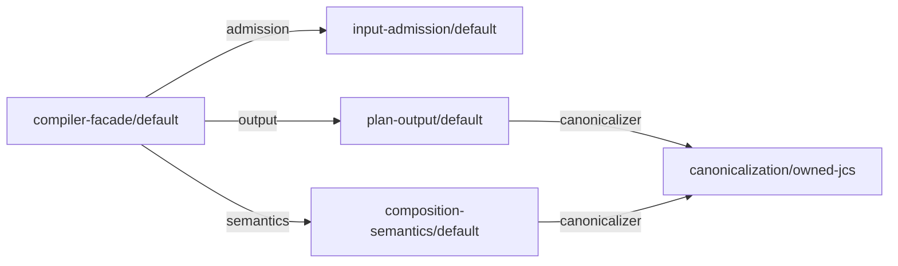

# Self-composition implementation guide

## Purpose and status

This document is the implementation guide for accepted ADR-0008. It names the
own feature graph of the Core, the TypeScript skeleton of one feature, the
composition roots and build topology, the finite emitter, the construction
witness, and checkpoint A precisely enough that the first
`packages/core` can be written without inventing structure.

This document owns the implementation mapping for ADR-0008; it adds no
normative requirement beyond ADR-0008, accepted ADR-0016, accepted ADR-0009,
accepted ADR-0012, accepted ADR-0017, the accepted contract, and the Feature
Module Standard profile. Every rule
below is derived from one of those sources and names it. Identifiers, file names, and directory names in this guide
are implementation details in the sense of ADR-0008 and may change through an
ordinary pull request as long as the invariants they carry survive.

Accepted ADR-0018 additionally governs residual depth, emittable diagnostic
types, the trusted carrier envelope and the post-M3 publication row. A
generated `0.x not-claimed` archive needs the complete M3 construction/parity
proof and packed Node/TypeScript gates; passing only the latter is insufficient.
Full runtime conformance and release custody remain separate claims.

### Carrier-boundary precedence

ADR-0015 admits the semantic source, and ADR-0017 admits publishing it as
`not-claimed` while OD-005 and OD-006 stay open. M1 therefore exposes exactly
the M1 row of the roadmap's callable matrix: `compileComposition`, the
accepted object entry point of ADR-0006 and ADR-0007, together with the
authoring helpers and object-contract types named by ADR-0009. It does not
expose `compileCompositionJson`, raw input, the OD-006 duplicate-record
semantics or any `runtime-conformant` claim; cases that depend on the OD-005
or OD-006 successors remain candidate evidence, and accepted object rules are
not replaced by proposed ADR-0013. The ADR-0008 requirement that direct and
generated subjects share the same public compiler boundary applies to that
object entry point from M1 onward; the raw entry point joins the shared
boundary only after the M2 decisions admit it.

## Own feature inventory

ADR-0008 names five cohesive responsibilities and leaves their identities to the
first implementation. This guide fixes them so that declarations, the own
profile, the composition root, and the emitter allowlist agree from the first
commit.

All identities follow the accepted grammar in
`architecture/contracts/v1/composition.schema.json`: a portable identity has at
least two lowercase segments separated by `/`, a local token is one lowercase
segment, and an owner has one `authority` token and a logical `path`.

- The owner authority for every own declaration is `get-modular`.
- The owner path is the logical feature route, one segment per feature, for
  example `["input-admission"]`. It is not a filesystem path.
- Compatibility uses the accepted `exact` family, version `1`, with a token of
  the form `<capabilityId>/v1`.

### Modules and implementations

| Feature | `moduleId` | `implementationId` | Provides (`capabilityId`) | Slots |
| --- | --- | --- | --- | --- |
| Compiler facade | `get-modular/compiler-facade` | `get-modular/compiler-facade/default` | none | `admission`, `semantics`, `output` |
| Input admission | `get-modular/input-admission` | `get-modular/input-admission/default` | `get-modular/admitted-input` | none in M1; `scanner` in M2 |
| Composition semantics | `get-modular/composition-semantics` | `get-modular/composition-semantics/default` | `get-modular/semantic-analysis` | `canonicalizer` |
| Plan output | `get-modular/plan-output` | `get-modular/plan-output/default` | `get-modular/plan-emission` | `canonicalizer` |
| Canonicalization | `get-modular/canonicalization` | `get-modular/canonicalization/owned-jcs` | `get-modular/canonical-bytes` | none |

Additional implementations of `get-modular/canonicalization`:

- `get-modular/canonicalization/canonicalize-adapter` wraps the external
  `canonicalize` package behind the same port. It exists only after ADR-0010 is
  accepted and its adapter qualification passes; until then the owned JCS
  implementation is the only production provider.
- `get-modular/canonicalization/witness-variant` is qualification-only. It
  produces deterministically different canonical bytes, a fixed prefix before
  the same plan encoding and decisive prefixes for the diagnostic witness
  below, so a plan digest changes observably when it is bound while
  domain separation stays with plan-output. It lives outside `src`, under
  `packages/core/tests/features/canonicalization/witness-variant/`, is built
  only by the qualification variant of a stage0 or stage1 build, and never
  enters the distributed archive.

In M2 the input-admission feature gains the slot `scanner` for the capability
`get-modular/raw-scanner` with the owned iterative scanner as the default
provider and the `jsonc-parser` scanner adapter as a second provider after
ADR-0010 is accepted. That slot is not part of the M1 own graph.

Diagnostics, the comparator, the bounded collector, graph helpers, and resource
metering are feature-owned libraries, not modules. The diagnostic rules have one
owner, the library feature `packages/core/src/features/diagnostics/`: it has no
module declaration and no factory and exposes one curated `internal.ts` of pure
functions and plain types. Diagnostic ordering belongs to composition
semantics: the comparator and the bounded top-K collector in `internal.ts`
take the canonicalization function as a parameter and stay pure, and
composition semantics supplies that function from its own `canonicalizer`
slot, so the canonical detail bytes of diagnostics use the same adapter as plan
content even when the compile result is `ok: false`. Diagnostics of the
decode, schema, and resource phases originate in input admission, which has no
`canonicalizer` slot; they enter the same bounded top-K collection at
collection time, as ADR-0005 requires, because the facade asks the semantics
port to create one collector per compile call and passes that collector as an
ordinary call argument to admission and then to semantics. The collector is a
value handed along a call, not a slot and not an edge of the own graph.
ADR-0008 forbids enlarging the own graph with helpers merely to claim more
self-use; a feature that emits diagnostics imports that library statically
through its owner's `internal.ts` and through nothing else.

The four authoring helpers `defineModule`, `required`, `optional`, and `many`
and the complete public wire-type set named by
[ADR-0009](../decisions/0009-keep-pre-1-0-public-api-unversioned.md), including
`CompileCompositionResult` and the ADR-0018-refined `DiagnosticCode`, belong to a second library
feature, `packages/core/src/features/authoring/`. It has no module declaration
and no factory, because the helpers are the non-validating constructors that
ADR-0007 accepted and the types are inert contracts; its `internal.ts` is the
one place from which `src/index.ts` and the direct subject entry re-export
these helpers and types. Compiler functions come from the selected composition
root, not from authoring: `compileComposition` from M1 and
`compileCompositionJson` from M2, as accepted ADR-0009 names them, never a name
carrying a version suffix. Authoring imports no facade or composition root.

### Own graph

The M1 own graph has five selected implementations and five edges. Every slot
is `required`. `optional`, `many`, cycles, unreachable selections, and missing
bindings never occur in the own graph; the independent vectors cover those
semantics, as ADR-0008 requires.



The accepted plan lists `dependencyOrder` over implementation identities as
the lexicographically smallest valid dependency-before-consumer order: ADR-0006
fixes Kahn's algorithm choosing the smallest ready `implementationId` at every
step. For this graph it is `get-modular/canonicalization/owned-jcs`,
`get-modular/composition-semantics/default`,
`get-modular/input-admission/default`, `get-modular/plan-output/default`,
`get-modular/compiler-facade/default`. The composition root and the emitter
construct in exactly that order.

### Own profile

The own profile is inert data. It selects the default implementation of every
own module and binds the five edges:

```json
{
  "kind": "get-modular.composition-profile",
  "schemaVersion": 1,
  "profileId": "get-modular/own-profile",
  "roots": ["get-modular/compiler-facade"],
  "selections": [
    {
      "moduleId": "get-modular/compiler-facade",
      "implementationId": "get-modular/compiler-facade/default"
    },
    {
      "moduleId": "get-modular/input-admission",
      "implementationId": "get-modular/input-admission/default"
    },
    {
      "moduleId": "get-modular/composition-semantics",
      "implementationId": "get-modular/composition-semantics/default"
    },
    {
      "moduleId": "get-modular/plan-output",
      "implementationId": "get-modular/plan-output/default"
    },
    {
      "moduleId": "get-modular/canonicalization",
      "implementationId": "get-modular/canonicalization/owned-jcs"
    }
  ],
  "bindings": [
    {
      "consumerImplementationId": "get-modular/compiler-facade/default",
      "slotId": "admission",
      "providerImplementationIds": ["get-modular/input-admission/default"]
    },
    {
      "consumerImplementationId": "get-modular/compiler-facade/default",
      "slotId": "semantics",
      "providerImplementationIds": ["get-modular/composition-semantics/default"]
    },
    {
      "consumerImplementationId": "get-modular/compiler-facade/default",
      "slotId": "output",
      "providerImplementationIds": ["get-modular/plan-output/default"]
    },
    {
      "consumerImplementationId": "get-modular/plan-output/default",
      "slotId": "canonicalizer",
      "providerImplementationIds": ["get-modular/canonicalization/owned-jcs"]
    },
    {
      "consumerImplementationId": "get-modular/composition-semantics/default",
      "slotId": "canonicalizer",
      "providerImplementationIds": ["get-modular/canonicalization/owned-jcs"]
    }
  ]
}
```

In the TypeScript source of `self-composition/own-profile.ts`, every
`moduleId` and `implementationId` above is taken from the constants exported by
each feature's `declaration.ts`; the JSON here is the data those constants
produce, and the profile file repeats no identity string.

The qualification variant of this profile, the data in
`self-composition/own-profile.variant.ts`, differs in exactly one selection,
`get-modular/canonicalization` selecting
`get-modular/canonicalization/witness-variant`, and in the two `canonicalizer`
bindings that must name the selected provider. It imports the same declaration
constants plus the witness-variant declaration from `tests/`. That variant is
the controlled binding replacement required by ADR-0008.

### Example declaration

The facade declaration shows the complete accepted shape. Every other own
declaration follows the same form with its own `provides` and `slots`.

```json
{
  "kind": "get-modular.module-declaration",
  "schemaVersion": 1,
  "moduleId": "get-modular/compiler-facade",
  "implementationId": "get-modular/compiler-facade/default",
  "owner": { "authority": "get-modular", "path": ["compiler-facade"] },
  "provides": [],
  "slots": [
    {
      "slotId": "admission",
      "capabilityId": "get-modular/admitted-input",
      "compatibility": {
        "family": "exact",
        "familyVersion": 1,
        "token": "get-modular/admitted-input/v1"
      },
      "cardinality": { "kind": "required" }
    },
    {
      "slotId": "semantics",
      "capabilityId": "get-modular/semantic-analysis",
      "compatibility": {
        "family": "exact",
        "familyVersion": 1,
        "token": "get-modular/semantic-analysis/v1"
      },
      "cardinality": { "kind": "required" }
    },
    {
      "slotId": "output",
      "capabilityId": "get-modular/plan-emission",
      "compatibility": {
        "family": "exact",
        "familyVersion": 1,
        "token": "get-modular/plan-emission/v1"
      },
      "cardinality": { "kind": "required" }
    }
  ]
}
```

The plan-output and composition-semantics declarations each provide their
capability and declare the single slot `canonicalizer` for
`get-modular/canonical-bytes`. The canonicalization declarations provide
`get-modular/canonical-bytes` and declare no slots. The input-admission
declaration provides `get-modular/admitted-input` and declares no slots in M1.

## Feature skeleton in TypeScript

Every own feature lives under `packages/core/src/features/<feature>/` exactly
as the Feature Module Standard profile maps feature-owned slices. A feature
starts with its owner-local ports, its inert declaration, and its pure factory
in the same delivery, never as an ambient singleton wrapped later.

```text
packages/core/src/features/<feature>/
  ports.ts          types only: the provided port and the consumed port types
  declaration.ts    inert declaration constant and typed identity handles
  factory.ts        create<Feature>(deps): pure construction, no module state
  <implementation>.ts and further owned files

packages/core/src/features/<feature>/          feature with several implementations
  ports.ts                                      shared port types
  identity.ts                                   the one owner of moduleId, capabilityId and token constants
  <implementation>/declaration.ts               one inert declaration per implementation
  <implementation>/factory.ts                   one pure factory per implementation

packages/core/src/features/<library>/          library feature, no module declaration
  internal.ts                                   curated pure functions and plain types
```

A feature with one implementation keeps `declaration.ts` and `factory.ts` at
its root. A feature with more than one implementation keeps one shared
`ports.ts`, one `identity.ts` that is the single authority for the `moduleId`,
`capabilityId`, and compatibility token constants, and one directory per
implementation whose `declaration.ts` imports those constants and adds only
its `implementationId`: canonicalization has
`features/canonicalization/owned-jcs/` from M1 and
`features/canonicalization/canonicalize-adapter/` after ADR-0010 is accepted.
The qualification-only witness variant uses the same two files outside `src`,
under `packages/core/tests/features/canonicalization/witness-variant/`, and
imports the same `identity.ts`, so no identity string of the canonicalization
feature is typed a second time inside that feature or under `tests/`. A
consumer names the capability it requires in its own declaration; it takes the
`capabilityId` and compatibility token constants from the provider's
`identity.ts`, the one cross-feature import of constants that the rules below
allow, and never types those strings itself.
The library features `authoring/` and `diagnostics/` consist of `internal.ts`
and the owned files behind it.

Rules:

- `ports.ts` contains only `interface` and `type` declarations. A consumer
  feature declares the port it consumes in its own `ports.ts`, as ADR-0008
  assigns a required driven port to the consuming feature; the provider
  declares the port it provides in its own `ports.ts`, and structural typing
  joins the two. A consumer may import a provider's port types for that
  purpose and, for a library feature such as diagnostics, the owner's curated
  `internal.ts`; it imports nothing else from a neighbor, and two consumers of
  the same capability never import from each other.
- A consumer may import the `capabilityId` and compatibility token constants
  from the provider feature's `identity.ts` (or `declaration.ts` for a
  single-implementation feature) to name the required capability in its own
  declaration. That import carries constants only, never a port type, a
  factory, or an implementation. This value-import exception is an ADR-0008
  implementation detail of this guide, not contract authority; the
  source-dependency policy below must list it as an admitted edge before any
  structural-conformance claim relies on it.
- `internal.ts` exists only in library features. It exports pure functions and
  plain types, never a factory, a declaration, or an implementation. The
  Foundation source-dependency policy records these three cross-feature edges,
  a provider's `ports.ts`, a provider's identity constants, and a library
  owner's `internal.ts`, and rejects every other one.
- `declaration.ts` exports the inert declaration as a frozen constant and the
  typed identity handles used by the composition root and the allowlist. It
  performs no I/O and has no side effects on import.
- `factory.ts` exports one pure `create<Feature>(deps)` function. It receives
  closed typed dependencies, returns the provided port, keeps no module-level
  state, and performs no discovery.
- The facade imports only port types and identity constants of its
  neighbors. It never imports a
  concrete implementation, a barrel, a registry, or a resolver.
- No feature exports a barrel over its whole directory. The module's curated
  public surface is `packages/core/src/index.ts` alone, from M1; the direct
  subject entry `self-composition/stage0-entry.ts` re-exports the same names
  for qualification only.
- No generic `resolve()`, container, service locator, or string-keyed factory
  map exists anywhere in production source.

Illustrative signatures for the plan-output feature:

```ts
// features/plan-output/ports.ts
// consumed port, owned by this consumer; composition-semantics declares its
// own CanonicalBytesPort of the same shape in its ports.ts, and the provider
// declares the provided port in features/canonicalization/ports.ts
export interface CanonicalBytesPort {
  readonly canonicalize: (value: JsonValue) => Uint8Array;
}
// domain separation and digest spelling stay in plan-output, as ADR-0010 keeps
// them owned by the Core rather than by a replaceable adapter
export interface PlanEmissionPort {
  readonly emit: (normalized: NormalizedPlan) => Promise<PlanAndDigest>;
}
```

```ts
// features/plan-output/declaration.ts
export const planOutputDeclaration = Object.freeze({
  kind: "get-modular.module-declaration",
  schemaVersion: 1,
  moduleId: "get-modular/plan-output",
  implementationId: "get-modular/plan-output/default",
  // owner, provides, and slots exactly as in the inventory above
} as const);
export const planOutputImplementation = planOutputDeclaration.implementationId;
```

```ts
// features/plan-output/factory.ts
export interface PlanOutputDeps {
  readonly canonicalizer: CanonicalBytesPort;
}
export function createPlanOutput(deps: PlanOutputDeps): PlanEmissionPort {
  // pure construction; no I/O, no registry, no module state
}
```

### Closed dependency record

As decided by ADR-0016, the closed dependency record that a factory receives
is a typed object literal whose keys are exactly the declared slot identifiers
of that feature. The slot identifiers in the inventory above are chosen from
the identifier-safe subset of the accepted `localToken` grammar, lowercase
letters and digits starting with a letter, and never equal an own property
name of `Object.prototype`, `prototype`, or `then`; TypeScript checks that
every `create<Feature>` call site supplies exactly those keys, and the witness
checker rejects an own declaration whose slot identifier leaves that subset.

The accepted rule of ADR-0008 that identities never become property lookup
keys is preserved because no identity from a caller profile is ever used as a
key: the keys come from the feature's own declaration, and the composition root
or the emitter writes them as literals. Inside the compiler, every lookup keyed
by a module, implementation, capability, or slot identity uses a `Map`; the
form `record[id]` on an ordinary object is forbidden in production source.

ADR-0016 is accepted, so this is the rule, not a candidate. Proposed ADR-0011
must drop its null-prototype record refinement before it can be accepted
alongside ADR-0016; no factory receives an exotic object.

## Composition roots and build topology

### One composition root

`src` contains exactly one composition root at any time, and the public barrel
`packages/core/src/index.ts` exists from M1 because the package is public from
its first checkpoint. Until M3 that root is the handwritten literal file
`packages/core/src/composition/stage0.ts`: it is ADR-0008's stage0, it calls
every `create<Feature>` in `dependencyOrder` and nothing else, and
`src/index.ts` re-exports `compileComposition`, the four authoring helpers and
the public types bound to it. Its qualification counterpart
`self-composition/stage0.variant.ts` is an equally short literal root that
binds the witness variant; only the seed and qualification builds see it. No other
`create<Feature>` call exists outside `tests/`.

This is the "checked internal graph" checkpoint that ADR-0008 allows as an
explicit implementation checkpoint and forbids as a release of the
self-composed core. Reading it as the composition root of a published 0.x
build is a deliberate owner decision with a stated limitation: ADR-0008 says
that before the first core release stage0 is qualification-only and no
handwritten assembly is distributed, so every archive built before M3 MUST be
labeled in its changelog as "direct assembly, not self-composed", MUST NOT
claim `self-composed-qualified` or `release-eligible`, and accepted ADR-0017
narrows that ADR-0008 sentence for pre-M3 `not-claimed` releases only. `direct-semantics-qualified` remains the highest outcome
a pre-M3 archive can carry.

In M3 the generated root `packages/core/src/composition/generated/stage1.ts`,
listed in `.gitignore` and emitted from P0, replaces `stage0.ts` as the import
target of `src/index.ts`. From that delivery `stage0.ts` stays where it is but
becomes qualification-only: the production barrel names its
composition root by explicit path and never imports `stage0.ts` again, the
stage0 and qualification builds keep including it, and `src` still holds
exactly one composition root that the production build compiles. A second
handwritten root never appears.

### Direct subject entry

ADR-0008 requires two temporary, hash-identified qualification subjects "with
the same public compiler boundary: one directly assembled and one generated",
and it forbids a stage0 public export in the distributed package. The direct
subject therefore has its own entry file,
`packages/core/self-composition/stage0-entry.ts`. It imports
`../src/composition/stage0.js` and re-exports exactly the names that
`src/index.ts` exports for the current milestone, bound to the stage0 facade:
`compileComposition`, `defineModule`, `required`, `optional`, `many` and the
public types in M1, plus `compileCompositionJson` from M2, all taken from
`features/authoring/internal.ts` and the facade, and nothing else. Until M3
`src/index.ts` and `stage0-entry.ts` export the same bindings; from M3
`src/index.ts` points at the generated root while `stage0-entry.ts` keeps
pointing at stage0, which is what makes the two subjects comparable. It is
built by `tsconfig.stage0.json`; `tsconfig.qualification.json` also compiles
it because that build includes all of `self-composition/`; the production
`tsconfig.json` never does; it is never packed into the distributed archive,
and it is the module against which the M1 harness, the checkpoint A test, and
the direct half of every dual-subject gate run. The variant direct subject has
the same shape: `self-composition/stage0-entry.variant.ts` imports
`stage0.variant.ts` and re-exports the same names, and only the seed and
qualification builds see it. Both subjects expose the same entry points for the same
milestone, so the same independent vectors and packed public-API checks run
against both, as ADR-0008 requires.

### Build-only directory

Bootstrap, own profile, allowlist, and emitter tooling live beside the core's
build configuration and outside `src`, exactly as ADR-0008 requires and without
creating a third package:

```text
packages/core/
  self-composition/
    stage0-entry.ts            direct subject entry: imports ../src/composition/stage0.js and re-exports the milestone's entry points
    own-profile.ts             imports every feature's declaration constant and defines the own profile as data
    stage0.variant.ts          handwritten literal root bound to the witness variant, qualification only
    stage0-entry.variant.ts    variant direct subject entry, qualification only
    stage1-entry.variant.ts    variant generated subject entry: imports the variant generated root, qualification only
    own-profile.variant.ts     the variant profile as data, qualification only
    allowlist.ts               minimal declaration/factory handles for the M1 stage0 witness; reused by the M3 emitter
    allowlist.variant.ts       qualification allowlist: imports allowlist.ts and adds the witness-variant entry, qualification only
    emit.ts                    the finite emitter and its input manifest, M3
  src/
    features/
      authoring/internal.ts    helpers and inert types; accepted M1 names are public from M1
      diagnostics/internal.ts  diagnostic rules, comparator, collector
      ...
    composition/
      stage0.ts                    handwritten literal assembly: the production root until M3, qualification-only afterwards
      generated/stage1.ts          emitted in M3 by the production build, never committed
      generated/stage1.variant.ts  emitted only by the qualification build, never committed
    index.ts               public barrel from M1: imports stage0.ts until M3, then generated/stage1.ts
  tests/
    features/canonicalization/witness-variant/   qualification-only provider
    ...
  dist/                        production output from M1
  dist-stage0/                 stage0 output: dist-stage0/src/** and dist-stage0/self-composition/**
  dist-qualification/          qualification output of either variant subject
  tsconfig.json                production emit: rootDir src; only src/index.ts is a root
                               file; its imports select stage0 until M3, then stage1
  tsconfig.typecheck.json      noEmit check of all source features, including unselected ones
  tsconfig.stage0.json         stage0 build: rootDir at the package root, outDir
                               dist-stage0; src/features/**, src/composition/stage0.ts and
                               self-composition/** without *.variant.ts; no src/index.ts,
                               no generated sources
  tsconfig.qualification.json  qualification build of either variant subject
                               plus tests/features; rootDir at the package root,
                               outDir dist-qualification
  tsconfig.seed.json           cold variant bootstrap: explicit build-tool entries,
                               no generated entry; outDir dist-seed
```

The first package must list the four output directories and the two
generated files in `.gitignore`; today the root `.gitignore` lists only
`dist/`. None of them is ever committed.

The direct subject and the generated subject differ in the file that
constructs the facade, the entry file that re-exports it, the build
configuration and output directory, the staging manifest written for packing,
and the set of allowlist entries that the plan reaches; both expose the same
entry points for the milestone.

`tsconfig.stage0.json` includes `src/features/**`, `src/composition/stage0.ts`
and `self-composition/**` except the `*.variant.ts` files, and excludes
`src/index.ts` and `src/composition/generated/**`, so stage0 type-checks and
builds from a clean checkout without the emitted file, as ADR-0008 demands.
Because its inputs sit under two roots, its `rootDir` is the package root and
its `outDir` is `dist-stage0/`, which therefore holds `dist-stage0/src/**` and
`dist-stage0/self-composition/**`. Production emit starts from `src/index.ts`
and follows its imports, including declaration dependencies. That barrel
imports exactly one composition root, stage0 until M3 and generated stage1
from M3. A separate `tsconfig.typecheck.json` checks all source features with
`noEmit`, so an unselected implementation is still checked but not emitted
merely because a broad source glob selected it. The production configuration
is:

<!-- build-config: tsconfig.json -->

```json
{
  "extends": "../../tsconfig.base.json",
  "compilerOptions": {
    "rootDir": "src",
    "outDir": "dist",
    "noEmitOnError": true
  },
  "files": ["src/index.ts"],
  "include": []
}
```

An `exclude` list does not prevent transitive imports. Foundation boundaries
and the packed-closure audit reject references to build tools, tests or an
unselected implementation. Before each production emit, remove the previous
`dist/` and its associated incremental state; narrowing root files cannot
remove stale files from an earlier build.

The production M3 cold sequence is **stage0 build -> emit -> production
build**. Build `tsconfig.stage0.json` while `stage1.ts` is absent, then use
its built direct entry to compile the own profile and pass P0 plus the base
allowlist to its built emitter. The emitter writes `stage1.ts`; only then
clean `dist/` and run the production configuration. The stage0 inputs are:

<!-- build-config: tsconfig.stage0.json -->

```json
{
  "extends": "../../tsconfig.base.json",
  "compilerOptions": {
    "rootDir": ".",
    "outDir": "dist-stage0",
    "noEmitOnError": true
  },
  "include": [
    "src/features/**/*.ts",
    "src/composition/stage0.ts",
    "self-composition/**/*.ts"
  ],
  "exclude": ["self-composition/**/*.variant.ts"]
}
```

Stage0 imports neither the public barrel nor any generated entry. The clean
bootstrap check must exercise the production sequence as well as the variant
sequence below; starting a test with a manually present `stage1.ts` proves
neither bootstrap path.

The cold variant sequence is **seed build -> emit -> qualification build**.
Before M3 the direct variant needs only the seed build. From M3 the seed
configuration compiles these explicit entries and their imports:

<!-- build-config: tsconfig.seed.json -->

```json
{
  "extends": "../../tsconfig.base.json",
  "compilerOptions": {
    "rootDir": ".",
    "outDir": "dist-seed",
    "noEmitOnError": true
  },
  "files": [
    "self-composition/stage0-entry.variant.ts",
    "self-composition/own-profile.variant.ts",
    "self-composition/allowlist.variant.ts",
    "self-composition/emit.ts"
  ],
  "include": []
}
```

The emitter entry is added in M3. M1 also builds the variant allowlist for its
independent construction witness; this adds no emitter or generated entry. No seed entry
may import `stage1-entry.variant.ts` or any generated source. The harness
uses the built direct variant, profile and emitter to write
`src/composition/generated/stage1.variant.ts`, and only then runs
`tsconfig.qualification.json`. Both the seed and qualification configurations
may compile the witness variant; neither is a production build. Their output
and incremental state are separate. A clean-bootstrap check starts with both
generated files and every stage output/cache absent, and checks this sequence
without a previously emitted file.

`tsconfig.qualification.json` has `rootDir` at the package root, emits
`dist-qualification/`, and includes `src/features/**`,
`src/composition/stage0.ts`,
`src/composition/generated/stage1.variant.ts` when the emitter has written it,
`self-composition/**` including the `*.variant.ts` files, and
`tests/features/**`. Together with the seed it builds the witness variant. The
emitter writes the variant generated root to
`src/composition/generated/stage1.variant.ts` only during a qualification
build; that file imports the variant factory as
`../../../tests/features/canonicalization/witness-variant/factory.js` relative
to its own file, which resolves under the qualification `rootDir`. The
production `tsconfig.json` never sees it because its barrel imports only its
selected composition root and any stray reference to `tests/` fails
the production build as a fatal error. The qualification build writes only to
`dist-qualification/` and never overwrites `stage1.ts` or `dist/`, so the
production root and output are isolated from every variant run, as ADR-0008
requires for stage roots. Both variant subjects, the direct one built from
`stage0.variant.ts` through `stage0-entry.variant.ts` and the generated one
built from `stage1.variant.ts` through `self-composition/stage1-entry.variant.ts`,
which imports `../src/composition/generated/stage1.variant.js` and re-exports
the same entry points, come from this one configuration; the layout of
`dist-qualification/` differs from `dist/` and takes no part in the W0/W1
comparison, which compares the canonical wiring tuples that ADR-0016 defines
and the schema below shows, not emitted bytes. The two variant subjects share
that one output root because they are witness subjects, not promotion
subjects; the separate output, cache and incremental roots that ADR-0008
requires for stage0 and stage1 apply to the direct and generated promotion
subjects, which keep `dist-stage0/` and `dist/` isolated.

#### Packing the qualification subjects

With ADR-0012 accepted, `packages/core/package.json` carries the ESM-only
export map with its sibling `default` from the first package, so the
production archive is packed from the package manifest itself under the
pack-once rule of ADR-0012, and the package is public from M1 with the
changelog limitation stated above. From M3 the two hash-identified subjects are
a separately staged direct archive and that exact retained generated production
archive. Generated qualification does not create a second production-equivalent
tarball. Separate staging is for the direct subject and qualification-only
witness variants.
It lives under the repository's root `tests/qualification/` (the harness, the
oracles, the staging tool, and the hash records of packing results live there,
while `packages/core/tests/` holds only feature tests and the witness
variant). The tool copies the built output into a disposable staging directory
created under the operating-system temporary root, outside the repository
tree, and writes there a candidate manifest whose export map is the accepted
ADR-0012 map; the direct candidate manifest points its targets at the
stage0-entry build. The staging must be outside the tree because the
governance gate scans the working tree and rejects any package manifest
outside `packages/`; only the hash records of the packing results come back
under `tests/qualification/`. The direct staging starts from
`dist-stage0/self-composition/stage0-entry.js` and its `.d.ts`, and copies
only their transitive JavaScript and declaration closure, including
`dist-stage0/src/composition/stage0.js` and the referenced feature files.
It does not copy `dist-stage0/src/features/**` wholesale: the stage0 tooling
build also emits unselected implementations. No other `self-composition/`
file belongs in that subject; its manifest points `types` at the entry's
declaration file. The retained generated production archive holds `dist/index.js`,
`dist/index.d.ts`, `dist/composition/generated/stage1.js` and `stage1.d.ts`,
and every `dist/features/**` file they reference; its manifest carries the
ADR-0012 export map with `types` at `./dist/index.d.ts`, so the four
TypeScript consumer modes resolve declarations. Generated-vector execution and
packed-consumer execution bind the same retained archive SHA-256; equal `dist/`
bytes in another tarball cannot substitute for that identity. The production
tarball allowlist includes the emitted
`dist/` output and excludes every source file, `self-composition/`,
`dist-stage0/`, `dist-seed/`, `dist-qualification/`, and tests, so the own profile, the
emitter, and the witness variant cannot enter the archive.

The closure audit follows both JavaScript imports and declaration references
from the packed entry points; it permits required shared library and port
files, but no unselected implementation. A closed export map controls public
resolution, not archive contents. Check the actual pack-once tarball inventory
and bytes: an unselected compatible implementation with a unique sentinel
must be absent, while a type-only dependency required by an emitted `.d.ts`
must resolve. Run the check after changing the selected implementation as
well, so stale output cannot preserve the previous provider in the archive.

Consumer evidence follows the archive that consumers install. The four
TypeScript consumer modes required by ADR-0007 and ADR-0012 and the
1000-declaration typecheck fixture run against the packed production archive of
every publication: the direct-root archive before M3 and the retained generated
stage1 archive from M3. The direct qualification subject additionally passes
the export, deep-import, declaration-leakage and inert-import audits and the
same independent vectors as the generated subject.
Changing the manifest while preserving `dist/` must invalidate that archive's
evidence binding. The future packing harness checks this mutation: results from
a temporary generated staging or witness variant cannot qualify a different
production tarball.

The build-only directory `packages/core/self-composition/` is build tooling
beside the build configuration in the sense of ADR-0008, outside the
`source_root` that the Feature Module Standard profile maps and covered by the
profile's `internal-self-composition` extension rather than by the standard's
abstract layout. It is build-only source inside the package and is
admitted by the governance gate; the Foundation source-dependency policy gives
it its own boundary that may import features and their declarations but that
no feature may import. The same policy records the three allowed
cross-feature edges, a provider's `ports.ts`, a provider's identity constants,
and a library owner's `internal.ts`. The qualification boundary additionally
allows the single edge from `src/composition/generated/stage1.variant.ts` to
`tests/features/**` inside the qualification build only; the production
boundary has no such edge.

### Feature Module Standard classification

The organization standard allows exactly one dependency mechanism per
relationship. Self-composition uses the first two and never the third:

- Every edge of the own graph is the standard's second mechanism: a
  consumer-owned port whose provider is selected by module composition, here
  the own profile. Generated wiring is the form in which composition applies
  that selection, not a separate mechanism, and the emitter that writes it is a
  generator with a reviewable plan and a deterministic apply, which the
  standard recommends for generators. The plan is the accepted composition
  plan; the apply writes one file.
- The first mechanism, a static import and a typed factory or constructor,
  applies to the fixed library imports inside a feature: diagnostics, the
  comparator, the bounded collector, graph helpers and resource metering.
- Mechanism three, an explicit validated graph with an immutable activation
  plan for runtime provider selection, is not used inside the Core. The own
  plan exists at build time only and selects nothing at runtime.

This is a local extension of the standard, recorded in the Feature Module
Standard profile, not a deviation.

## Emitter specification

The emitter is finite and private. Its inputs are:

- the successful `CompileCompositionResult` produced by stage0 from the own
  declarations and own profile: its plan is P0 and its existing digest supplies
  the generated header. Pass this result as one input; the emitter neither
  hashes the plan again nor accepts a separately supplied digest; and
- the allowlist, a build-time `Map` whose keys are the `implementationId`
  constants exported by each feature's `declaration.ts` and whose values are
  typed handles naming the import path, the factory export, the declaration
  export, and the local constant name used for that implementation in the
  emitted file. The local name is an author-chosen identifier in the handle,
  never derived from an identity, so identities never become source fragments.
  The map is not the runtime string-keyed factory map that ADR-0008 forbids,
  it never enters `src`, it never repeats identity strings, and it never
  derives a path from an identity. It may hold entries for implementations
  that the own profile does not select, such as the adapter admitted after
  ADR-0010. The witness-variant entry lives in
  `self-composition/allowlist.variant.ts`, which imports the base allowlist and
  adds the one entry that points into `tests/`; only the qualification build
  and its seed see that file, so neither the stage0 build nor the production build pulls
  `tests/` into its program, and `emit.ts` receives the allowlist as an
  argument instead of importing one.

Its output is one ECMAScript module with these properties:

- UTF-8 with LF line endings, no timestamps, no absolute paths, no
  locale-dependent or target-dependent text;
- one static factory import per selected implementation, in `dependencyOrder`,
  plus the type-only import of the facade's provided port;
- one `const` per selected implementation, in `dependencyOrder`, whose
  initializer is a single factory call receiving an object literal with one
  key per bound slot and the provider constant as the value;
- exactly one `export const root` naming the constructed facade, explicitly
  annotated with its provided port for `isolatedDeclarations`;
- no identity string anywhere in the file; the single leading comment records
  only the plan digest.

Only `required` cardinality is supported. The emitter fails the build with a
stable private error code, without writing output, when it encounters an
unknown implementation identity, a selection without an allowlist entry, a
binding whose provider is not selected, a slot with any other cardinality, or
more than one provider, exactly the unknown IDs, missing bindings, extra
selections, and unsupported shapes that ADR-0008 names. An allowlist entry that
the plan does not reach is not an error; it simply emits nothing.
Emission is never a fallback resolver: it does not choose defaults, inspect a
filesystem, or import dynamically.

Before writing any output, validate the complete generated module binding
namespace: every selected factory import, the facade type import, every selected
handle's `localName`, and the exported `root`. Two bindings with the same name
fail with the stable private code `emitter.binding-name-collision`, even when
each spelling is a valid ECMAScript identifier. Do not classify a collision as
`allowlist.invalid-identifier` or invent an alias from a caller identity. Keep
the accepted whole-allowlist `localName` uniqueness check as a separate check;
an unselected entry emits no binding. Regression cases cover `localName: root`,
a local name equal to a selected factory export or the facade type name, and
two selected factory imports with the same export name. A collision leaves the
output absent; a valid namespace still passes the pinned TypeScript build.

Illustrative output for the M1 own profile:

```ts
// generated by the self-composition emitter from plan digest gm-plan:v1:sha-256:...
import { createOwnedJcs } from "../../features/canonicalization/owned-jcs/factory.js";
import { createCompositionSemantics } from "../../features/composition-semantics/factory.js";
import { createInputAdmission } from "../../features/input-admission/factory.js";
import { createPlanOutput } from "../../features/plan-output/factory.js";
import { createCompilerFacade } from "../../features/compiler-facade/factory.js";
import type { CompilerFacade } from "../../features/compiler-facade/ports.js";

const ownedJcs = createOwnedJcs({});
const compositionSemantics = createCompositionSemantics({ canonicalizer: ownedJcs });
const inputAdmission = createInputAdmission({});
const planOutput = createPlanOutput({ canonicalizer: ownedJcs });
const compilerFacade = createCompilerFacade({
  admission: inputAdmission,
  semantics: compositionSemantics,
  output: planOutput,
});

export const root: CompilerFacade = compilerFacade;
```

The local constant names `ownedJcs`, `compositionSemantics`, and the others
come from the `localName` field of each allowlist handle. The emitted file is
regenerated in a disposable directory during the build and compared byte for
byte against the file used by the build, as ADR-0008 requires. It is never
hand-edited and never committed.

`CompilerFacade` here names the internal provided port declared in the facade's
`ports.ts`; it is not a new public export. Factory return types implement that
port. Compile the generated file with the pinned `isolatedDeclarations`
configuration and audit the packed public `.d.ts` surface: the barrel names
the accepted compiler signatures and cannot infer its public types from a
private factory or expose the internal facade port.

### Allowlist entry schema

ADR-0016 fixes the shape of an allowlist entry. In TypeScript:

```ts
// self-composition/allowlist.ts
export interface AllowlistHandle {
  readonly declaration: ModuleDeclaration; // the statically imported declaration value
  readonly factory: (dependencies: never) => unknown; // the statically imported factory value
  readonly importPath: string; // relative to src/composition/generated/, inside src/features/**, ends in .js
  readonly factoryExport: string; // ECMAScript identifier exported by importPath
  readonly declarationExport: string; // ECMAScript identifier exported by the declaration module
  readonly localName: string; // ECMAScript identifier, unique across the allowlist
}
export const allowlist: ReadonlyMap<ImplementationId, AllowlistHandle> = new Map([
  [ownedJcsImplementation, ownedJcsHandle],
  [compilerFacadeImplementation, compilerFacadeHandle],
  // one entry per implementation the emitter may ever wire
]);
```

`declaration` and `factory` are the values of the static imports themselves,
not paths to them. The emitter reads slot identifiers from `declaration.slots`
of the imported declaration and never from a plan string, and it never loads a
module dynamically. The four string fields describe the same imports so that
the generated file can reproduce them textually.

The same two entries as data, showing only the four string fields because JSON
cannot carry the imported values, and keyed by the identity string only because
JSON has no constants; in `allowlist.ts` the keys are the `implementationId`
constants imported from each `declaration.ts`, the values carry `declaration`
and `factory` alongside the strings, and the file types no identity string
itself:

```json
{
  "get-modular/canonicalization/owned-jcs": {
    "importPath": "../../features/canonicalization/owned-jcs/factory.js",
    "factoryExport": "createOwnedJcs",
    "declarationExport": "ownedJcsDeclaration",
    "localName": "ownedJcs"
  },
  "get-modular/compiler-facade/default": {
    "importPath": "../../features/compiler-facade/factory.js",
    "factoryExport": "createCompilerFacade",
    "declarationExport": "compilerFacadeDeclaration",
    "localName": "compilerFacade"
  }
}
```

The emitter validates every handle before it writes anything and fails the
build with one of the closed codes that ADR-0016 lists:
`allowlist.unknown-implementation` for a selected identity without a
declaration handle, `allowlist.missing-for-selected` for a selected
implementation without an entry, `allowlist.duplicate-local-name` for two
entries with one `localName`, `allowlist.out-of-bound-import` for an
`importPath` that leaves `src/features/**` or lacks the `.js` suffix, and
`allowlist.invalid-identifier` for an export or local name that is not an
ECMAScript identifier. The qualification allowlist in `allowlist.variant.ts`
is the one place where an `importPath` may point into `tests/`, and the
`allowlist.out-of-bound-import` rule is relaxed for it only inside the
qualification build.

Before emission, the independent static witness also checks the correspondence
that ADR-0016 requires between each handle and its static imports. Resolve the
key's imported identity constant and the declaration value to their
feature-owned declaration, verify that the declaration names that same
implementation, and resolve the factory value to the factory beside that
declaration in the documented feature layout. The handle's `importPath`,
`factoryExport` and `declarationExport` must name those exact source exports.
Compare resolved source modules and exported symbols, not merely identifier
spellings or assignable function types. The same verified mapping interprets
the generated imports; the checker derives it from the source import bindings
and feature declarations, not from the emitter's serialized tuples.

This is a finite construction-witness check, not another repository import
policy engine. A correspondence mismatch fails the build before output is
written with the private checker code `witness.allowlist-correspondence`.
Its structured context names the validated own implementation ID, the mismatched
handle field, and the expected/actual relative source module and export;
it contains no arbitrary exception text or absolute paths. This does not add
a public diagnostic or extend ADR-0016's closed emitter error catalog.
Mutation fixtures change one textual export/path, swap
a factory value to a compatible implementation, and swap both the value and
text while retaining the original declaration. All three must fail even if
the generated TypeScript would compile and W0/W1 would agree with each other.

## Construction witness and checkpoint A

The M1 executable checks are in
[construction-witness.test.mjs](../../packages/core/tests/qualification/construction-witness.test.mjs)
and [canonicalizer-replacement.test.mjs](../../packages/core/tests/qualification/canonicalizer-replacement.test.mjs).
Their finite source reader uses the pinned development TypeScript scanner and
the matching freshly built feature namespaces. Source/build custody remains the
invoking gate's responsibility; the reader neither executes a root or allowlist
nor establishes artifact trust. Generated subjects join these checks in M3.

The current finite declaration format requires locally exported identity and
declaration constants in both source and matching build. The identity uses a
string or a single-identifier template; the declaration directly freezes an
object literal. Re-exports, borrowed constant aliases and freezing a borrowed
declaration cannot move its ownership beside another factory. These unsupported
forms fail with `witness.invalid-construction`. Tests compile the mutated feature sources separately
while keeping their changed root and allowlist unexecuted. Import bindings,
construction bindings and handle local names also reject the strict-mode
restricted names `eval` and `arguments`.

As decided by ADR-0016, the construction witness has two parts and neither
instruments production code:

1. A static check reads a composition root and the plan it must realize and
   proves that the set of value factory imports equals the set of selected implementations,
   that every `const` is initialized by exactly one factory call, that the
   object literal keys of each call equal the bound slot identifiers of that
   consumer in the plan, that every value is the constant of the bound
   provider, and that the order of constants equals `dependencyOrder`. The
   same check runs over the emitted `stage1.ts` and over the handwritten
   `stage0.ts` against P0, and over their variant counterparts against the
   variant plan; equality of construction order in the checkpoint A test is a
   consequence of this check, not a substitute for it.
   The separate type-only import must resolve to the provided port of the
   selected facade and annotate only the exported root; it adds no constructed
   implementation or wiring tuple. No other value, side-effect or type imports
   are allowed in this finite root grammar. This distinguishes erased type
   syntax from the implementation imports checked by ADR-0016.
2. A behavioral test compiles a fixed input through the phase-applicable
   qualification boundary of the stage0 subject and of the generated stage1
   subject, once with the own profile and once with the qualification variant that selects
   `get-modular/canonicalization/witness-variant` and binds both
   `canonicalizer` slots to it, whose canonical bytes carry a fixed prefix.
   The variant direct subject is `stage0.variant.ts` through
   `stage0-entry.variant.ts`; the variant generated subject is
   `stage1.variant.ts` emitted from the variant plan and exposed through
   `stage1-entry.variant.ts`. The plan digest MUST
   change between the two profiles in both subjects and MUST be equal across
   subjects for the same profile.

Add a private dependency regression for diagnostic canonicalization alongside
the public digest witness. A uniform prefix preserves relative detail-byte
order. Moreover, ADR-0007 compares `graph.cycle` components directly by their
sorted member arrays, with shorter prefixes first; this SCC exception does
not consult the canonicalizer. Two self-cycles therefore cannot witness use
of returned canonical bytes and must keep their normative order when the
provider is replaced.

Use the two operands of `details-use-rfc8785-key-order-and-utf8-bytes` in the
[accepted diagnostic snapshots](../../architecture/qualification/v1/diagnostic-snapshots.json)
for the private test. They tie on phase, code, coordinate and path and differ
in details. Pass them to the production collector obtained from the actual
composition-semantics factory with its `canonicalizer` dependency bound to
the qualification provider. For these known details, return decisive byte
prefixes in the opposite order to the owned encoding. Finalization must
reverse the two records without changing their values; rebinding the owned
provider must restore the independently specified order. These are comparator
operands, not a claim that one compiler input can emit both resource errors.
Do not inject diagnostic candidates through the public compiler or add a
production test hook. Before semantics exists, the diagnostics-library test
proves only its collector seam; the consumer-factory regression remains pending.

Two private-test mutants must fail: one ignores only
`composition-semantics.canonicalizer`, while plan-output still uses its
injected provider; the other calls the injected provider but discards its
returned bytes and sorts with a hard-coded canonicalizer. A controlled throw
separately checks private failure propagation without a reserved diagnostic,
but does not prove use of returned bytes. Static wiring checks and the public
digest replacement on both subjects remain ADR-0016's construction witness.
The private regression supplements that evidence without claiming a public
failure-input witness, strengthening checkpoint A or adding instrumentation.

ADR-0016 is accepted: this static and behavioral form is the construction
witness. It supersedes the object-identity wording of ADR-0008 in the clauses
that ADR-0016 names, because it needs no inert hook inside packed bytes.

### Wiring tuple schema

ADR-0016 defines the W0/W1 comparison over canonical wiring tuples, one per
selected implementation: the implementation identity, its index in
`dependencyOrder`, and its bound slots as `[slotId, providerImplementationId]`
pairs sorted by `slotId`. For the M1 own profile the tuples are:

```json
[
  ["get-modular/canonicalization/owned-jcs", 0, []],
  ["get-modular/composition-semantics/default", 1, [
    ["canonicalizer", "get-modular/canonicalization/owned-jcs"]
  ]],
  ["get-modular/input-admission/default", 2, []],
  ["get-modular/plan-output/default", 3, [
    ["canonicalizer", "get-modular/canonicalization/owned-jcs"]
  ]],
  ["get-modular/compiler-facade/default", 4, [
    ["admission", "get-modular/input-admission/default"],
    ["output", "get-modular/plan-output/default"],
    ["semantics", "get-modular/composition-semantics/default"]
  ]]
]
```

W0 is the wiring the stage0 build emits from P0 and W1 the wiring the stage1
build emits from P1. One AST reader extracts the tuple list from W0, from W1
and, separately, from the handwritten root `src/composition/stage0.ts`,
resolving each imported constant to the implementation identity of its
declaration handle through the allowlist, then serializes the list with
RFC 8785 and hashes it with SHA-256. W0 equals W1 when their tuple digests are
equal. The handwritten root is not W0: it is checked against P0 by the static
witness on its own, and the variant roots are checked against the variant plan
the same way. Emitted bytes are compared only between the file a build used and
its disposable regeneration, as ADR-0008 requires.

Checkpoint A of ADR-0008 is reached when the first useful dependency edge
exists. That edge is `plan-output.canonicalizer`; it and
`composition-semantics.canonicalizer` share the only capability in the M1
graph with a second, qualification-only provider, and checkpoint A replaces
that provider for both. Checkpoint A is passed when:

- the own declarations and the own profile compile with `ok: true` through the
  entry points re-exported by `self-composition/stage0-entry.ts`;
- the static witness check passes over `src/composition/stage0.ts` against
  P0, which includes a construction order equal to `dependencyOrder`; and
- rebinding both `canonicalizer` slots to the witness variant, through
  `own-profile.variant.ts`, `stage0.variant.ts` and
  `stage0-entry.variant.ts`, changes the digest of a fixed normalized input
  compiled through the private qualification boundary.

A stronger checkpoint applies only if a later accepted decision adds it;
ADR-0016 requires the two-edge and object-identity conditions of proposed
ADR-0011 to be removed before that decision can be accepted alongside it.

## What M1 lays down so that M3 adds the emitter without refactoring

The completed M1 package has these seven properties. Bounded source slices add
the properties applicable to their implemented features; own-profile execution
and the complete root wait for all five real implementations, without stubs.
Each property is required by
ADR-0008, ADR-0016 or the Feature Module Standard. Together they let M3 add the
emitter and its qualification without replacing the feature implementations:

1. Each of the five own module features has `ports.ts`, `declaration.ts`, and
   `factory.ts` in the single- or multiple-implementation layout above, with
   the inventory's identities and no feature barrel. The authoring and
   diagnostics libraries retain their separate `internal.ts` layout without
   module declarations or factories.
2. The facade receives its neighbors through its `deps` record and imports
   only port types.
3. Each subject is built from exactly one composition root:
   `src/composition/stage0.ts` or its variant
   `self-composition/stage0.variant.ts` for a direct subject, and the
   generated `src/composition/generated/stage1.ts` or its variant for a
   generated subject from M3. Every `create<Feature>` call outside tests
   happens in one of those literal or generated roots in `dependencyOrder`;
   `src` compiles the handwritten root only until M3 and never holds a second
   handwritten root.
4. The canonicalization implementations, and in M2 the scanner implementations,
   sit behind consumer-owned ports in per-implementation directories with their
   own declarations and factories and one shared `identity.ts`, so binding
   replacement is a data change and the witness variant stays under `tests/`.
5. **ADR-0016 rule:** The closed dependency record is a typed object
   literal keyed by declared slot identifiers, and every identity-keyed lookup
   inside the compiler uses a `Map`.
6. The own profile exists as data in `self-composition/own-profile.ts` from
   M1; it aggregates the feature-owned declaration constants and repeats no
   identity string, even though only the handwritten stage0 root consumes it.
7. A checked-internal-graph test compiles the own profile through the
   entry points of `self-composition/stage0-entry.ts`, asserts `ok: true`, and
   runs the static witness check over `src/composition/stage0.ts` against
   that plan, which includes the construction order equal to
   `dependencyOrder`.

## Out of scope

This guide does not decide the hermetic build sandbox, content-addressed
custody, release capsule, quarantine, or the `SourceManifest` and
`BuildContext` record formats; those remain proposed in ADR-0011 and are
scheduled by the roadmap's release checkpoint. It does not decide the six
runtime cases, which ADR-0007 reserves for the first conformance claim.
ADR-0016 is accepted; a claim of `self-composed-qualified` still requires the
evidence that ADR-0016 lists and the M3 generated subject.
