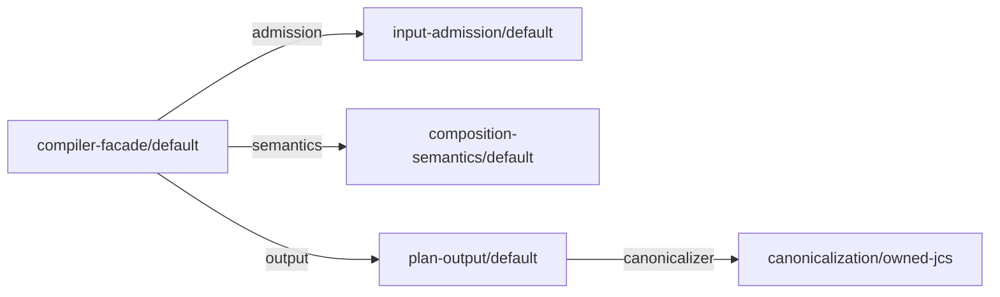

<!-- cspell:words canonicalizer tsbuildinfo -->

# Self-composition implementation guide

## Purpose and status

This document is the implementation guide for accepted ADR-0008. It names the
own feature graph of the Core, the TypeScript skeleton of one feature, the
composition roots and build topology, the finite emitter, the construction
witness, and checkpoint A precisely enough that the first private
`packages/core` can be written without inventing structure.

It is not a new authority. Every rule below is either derived from ADR-0008,
the Feature Module Standard profile, the accepted contract, or is explicitly
marked as proposed by ADR-0016. A rule marked "as proposed by ADR-0016" is a
candidate rule until ADR-0016 is accepted: implement it, do not claim it, and
keep it replaceable. Identifiers, file names, and directory names in this guide
are implementation details in the sense of ADR-0008 and may change through an
ordinary pull request as long as the invariants they carry survive.

## Own feature inventory

ADR-0008 names five cohesive responsibilities and leaves their identities to the
first implementation. This guide fixes them so that declarations, the own
profile, the composition root, and the emitter allowlist agree from the first
commit.

All identities follow the accepted grammar in
`architecture/contracts/v1/composition.schema.json`: a portable identity has at
least two lowercase segments separated by `/`, a local token is one lowercase
segment, and an owner has one `authority` token and a logical `path`.

- The owner authority for every own declaration is `get-modular`.
- The owner path is the logical feature route, one segment per feature, for
  example `["input-admission"]`. It is not a filesystem path.
- Compatibility uses the accepted `exact` family, version `1`, with a token of
  the form `<capabilityId>/v1`.

### Modules and implementations

| Feature | `moduleId` | `implementationId` | Provides (`capabilityId`) | Slots |
| --- | --- | --- | --- | --- |
| Compiler facade | `get-modular/compiler-facade` | `get-modular/compiler-facade/default` | none | `admission`, `semantics`, `output` |
| Input admission | `get-modular/input-admission` | `get-modular/input-admission/default` | `get-modular/admitted-input` | none in M1; `scanner` in M2 |
| Composition semantics | `get-modular/composition-semantics` | `get-modular/composition-semantics/default` | `get-modular/semantic-analysis` | none |
| Plan output | `get-modular/plan-output` | `get-modular/plan-output/default` | `get-modular/plan-emission` | `canonicalizer` |
| Canonicalization | `get-modular/canonicalization` | `get-modular/canonicalization/owned-jcs` | `get-modular/canonical-bytes` | none |

Additional implementations of `get-modular/canonicalization`:

- `get-modular/canonicalization/canonicalize-adapter` wraps the external
  `canonicalize` package behind the same port. It exists only after ADR-0010 is
  accepted and its adapter qualification passes; until then the owned JCS
  implementation is the only production provider.
- `get-modular/canonicalization/witness-variant` is qualification-only. It
  produces the same canonical bytes but a different domain separator, so a plan
  digest changes observably when it is bound. It never enters the distributed
  archive and is excluded by the tarball allowlist.

In M2 the input-admission feature gains the slot `scanner` for the capability
`get-modular/raw-scanner` with the owned iterative scanner as the default
provider and the `jsonc-parser` scanner adapter as a second provider after
ADR-0010 is accepted. That slot is not part of the M1 own graph.

Diagnostics, the comparator, the bounded collector, graph helpers, and resource
metering are feature-owned libraries, not modules. ADR-0008 forbids enlarging
the own graph with helpers merely to claim more self-use; those libraries are
imported statically by the feature that owns them.

### Own graph

The M1 own graph has five selected implementations and four edges. Every slot
is `required`. `optional`, `many`, cycles, unreachable selections, and missing
bindings never occur in the own graph; the independent vectors cover those
semantics, as ADR-0008 requires.



The accepted plan lists `dependencyOrder` over implementation identities as
the lexicographically smallest valid dependency-before-consumer order: ADR-0006
fixes Kahn's algorithm choosing the smallest ready `implementationId` at every
step. For this graph it is `get-modular/canonicalization/owned-jcs`,
`get-modular/composition-semantics/default`,
`get-modular/input-admission/default`, `get-modular/plan-output/default`,
`get-modular/compiler-facade/default`. The composition root and the emitter
construct in exactly that order.

### Own profile

The own profile is inert data. It selects the default implementation of every
own module and binds the four edges:

```json
{
  "kind": "get-modular.composition-profile",
  "schemaVersion": 1,
  "profileId": "get-modular/own-profile",
  "roots": ["get-modular/compiler-facade"],
  "selections": [
    {
      "moduleId": "get-modular/compiler-facade",
      "implementationId": "get-modular/compiler-facade/default"
    },
    {
      "moduleId": "get-modular/input-admission",
      "implementationId": "get-modular/input-admission/default"
    },
    {
      "moduleId": "get-modular/composition-semantics",
      "implementationId": "get-modular/composition-semantics/default"
    },
    {
      "moduleId": "get-modular/plan-output",
      "implementationId": "get-modular/plan-output/default"
    },
    {
      "moduleId": "get-modular/canonicalization",
      "implementationId": "get-modular/canonicalization/owned-jcs"
    }
  ],
  "bindings": [
    {
      "consumerImplementationId": "get-modular/compiler-facade/default",
      "slotId": "admission",
      "providerImplementationIds": ["get-modular/input-admission/default"]
    },
    {
      "consumerImplementationId": "get-modular/compiler-facade/default",
      "slotId": "semantics",
      "providerImplementationIds": ["get-modular/composition-semantics/default"]
    },
    {
      "consumerImplementationId": "get-modular/compiler-facade/default",
      "slotId": "output",
      "providerImplementationIds": ["get-modular/plan-output/default"]
    },
    {
      "consumerImplementationId": "get-modular/plan-output/default",
      "slotId": "canonicalizer",
      "providerImplementationIds": ["get-modular/canonicalization/owned-jcs"]
    }
  ]
}
```

The qualification variant of this profile differs in exactly one binding: the
`canonicalizer` slot is bound to `get-modular/canonicalization/witness-variant`.
That variant is the controlled binding replacement required by ADR-0008.

### Example declaration

The facade declaration shows the complete accepted shape. Every other own
declaration follows the same form with its own `provides` and `slots`.

```json
{
  "kind": "get-modular.module-declaration",
  "schemaVersion": 1,
  "moduleId": "get-modular/compiler-facade",
  "implementationId": "get-modular/compiler-facade/default",
  "owner": { "authority": "get-modular", "path": ["compiler-facade"] },
  "provides": [],
  "slots": [
    {
      "slotId": "admission",
      "capabilityId": "get-modular/admitted-input",
      "compatibility": {
        "family": "exact",
        "familyVersion": 1,
        "token": "get-modular/admitted-input/v1"
      },
      "cardinality": { "kind": "required" }
    },
    {
      "slotId": "semantics",
      "capabilityId": "get-modular/semantic-analysis",
      "compatibility": {
        "family": "exact",
        "familyVersion": 1,
        "token": "get-modular/semantic-analysis/v1"
      },
      "cardinality": { "kind": "required" }
    },
    {
      "slotId": "output",
      "capabilityId": "get-modular/plan-emission",
      "compatibility": {
        "family": "exact",
        "familyVersion": 1,
        "token": "get-modular/plan-emission/v1"
      },
      "cardinality": { "kind": "required" }
    }
  ]
}
```

The plan-output declaration provides `get-modular/plan-emission` and declares
the single slot `canonicalizer` for `get-modular/canonical-bytes`. The
canonicalization declarations provide `get-modular/canonical-bytes` and declare
no slots. The input-admission and composition-semantics declarations provide
their capability and declare no slots in M1.

## Feature skeleton in TypeScript

Every own feature lives under `packages/core/src/features/<feature>/` exactly
as the Feature Module Standard profile maps feature-owned slices. A feature
starts with its owner-local ports, its inert declaration, and its pure factory
in the same delivery, never as an ambient singleton wrapped later.

```text
packages/core/src/features/<feature>/
  ports.ts          types only: the provided port and the consumed port types
  declaration.ts    inert declaration constant and typed identity handles
  factory.ts        create<Feature>(deps): pure construction, no module state
  <implementation>.ts and further owned files
```

Rules:

- `ports.ts` contains only `interface` and `type` declarations. A consumer
  feature imports a neighbor's port type from that file and nothing else.
- `declaration.ts` exports the inert declaration as a frozen constant and the
  typed identity handles used by the composition root and the allowlist. It
  performs no I/O and has no side effects on import.
- `factory.ts` exports one pure `create<Feature>(deps)` function. It receives
  closed typed dependencies, returns the provided port, keeps no module-level
  state, and performs no discovery.
- The facade imports only port types of its neighbors. It never imports a
  concrete implementation, a barrel, a registry, or a resolver.
- No feature exports a barrel over its whole directory. The module's curated
  public surface is `packages/core/src/index.ts` alone.
- No generic `resolve()`, container, service locator, or string-keyed factory
  map exists anywhere in production source.

Illustrative signatures for the plan-output feature:

```ts
// features/plan-output/ports.ts
export interface CanonicalBytesPort {
  readonly canonicalize: (value: JsonValue) => Uint8Array;
  readonly domainSeparator: string;
}
export interface PlanEmissionPort {
  readonly emit: (normalized: NormalizedPlan) => Promise<PlanAndDigest>;
}
```

```ts
// features/plan-output/declaration.ts
export const planOutputDeclaration = Object.freeze({
  kind: "get-modular.module-declaration",
  schemaVersion: 1,
  moduleId: "get-modular/plan-output",
  implementationId: "get-modular/plan-output/default",
  // owner, provides, and slots exactly as in the inventory above
} as const);
export const planOutputImplementation = planOutputDeclaration.implementationId;
```

```ts
// features/plan-output/factory.ts
export interface PlanOutputDeps {
  readonly canonicalizer: CanonicalBytesPort;
}
export function createPlanOutput(deps: PlanOutputDeps): PlanEmissionPort {
  // pure construction; no I/O, no registry, no module state
}
```

### Closed dependency record

As proposed by ADR-0016, the closed dependency record that a factory receives
is a typed object literal whose keys are exactly the declared slot identifiers
of that feature. The slot identifiers in the inventory above are chosen from
the identifier-safe subset of the accepted `localToken` grammar, lowercase
letters and digits starting with a letter, and never equal an own or inherited
property name of `Object.prototype` or the name `then`; TypeScript checks that
every `create<Feature>` call site supplies exactly those keys, and the witness
checker rejects an own declaration whose slot identifier leaves that subset.

The accepted rule of ADR-0008 that identities never become property lookup
keys is preserved because no identity from a caller profile is ever used as a
key: the keys come from the feature's own declaration, and the composition root
or the emitter writes them as literals. Inside the compiler, every lookup keyed
by a module, implementation, capability, or slot identity uses a `Map`; the
form `record[id]` on an ordinary object is forbidden in production source.

Until ADR-0016 is accepted, implement this candidate rule and do not claim it.
If ADR-0011 is accepted instead with its null-prototype record refinement, the
change is confined to the composition root and the emitter output shape;
features and factories do not change.

## Composition roots and build topology

### One composition root

`packages/core/src/composition/` contains exactly one composition root. All
`create<Feature>` calls in production source happen in that file, in
`dependencyOrder`, and nowhere else.

In M1 the root is handwritten `packages/core/src/composition/root.ts`. That is
the "checked internal graph" checkpoint that ADR-0008 allows as an explicit
implementation checkpoint and forbids as a release. It compiles the own
declarations and the own profile through the public entrypoint in a test and
proves that the plan's `dependencyOrder` equals the order of construction in
the file.

In M3 the root becomes generated: `packages/core/src/composition/generated/`
holds the emitted `stage1.ts`, listed in `.gitignore`, and the public barrel
imports it. The handwritten root does not survive as a second production root;
it moves out of `src` and becomes stage0.

### Build-only directory

Bootstrap, own profile, allowlist, and emitter tooling live beside the core's
build configuration and outside `src`, exactly as ADR-0008 requires and without
creating a third package:

```text
packages/core/
  self-composition/
    stage0.ts         handwritten literal assembly of the same feature factories
    own-profile.ts    the own declarations and the own profile as data
    allowlist.ts      typed handles: implementation identity -> import and factory
    emit.ts           the finite emitter and its input manifest
  src/
    features/...
    composition/
      generated/stage1.ts   emitted, never committed
    index.ts               public barrel, imports the generated root
  tsconfig.json            production build: src only, includes generated root
  tsconfig.stage0.json     stage0 build: features plus self-composition, no barrel,
                           no generated sources
  tests/...
```

The two entry files share one facade. The stage0 subject and the generated
stage1 subject differ only in which composition file constructs the facade;
both expose the same public compiler boundary for qualification.

`tsconfig.stage0.json` excludes `src/index.ts` and `src/composition/generated/`
so that stage0 type-checks and builds from a clean checkout without the emitted
file, as ADR-0008 demands. The production `tsconfig.json` excludes
`self-composition/`. The tarball allowlist includes the emitted `dist` output
and excludes `self-composition/`, generated sources, tests, and every
qualification-only implementation such as the witness variant.

The build-only directory is production-like source under a private package and
is admitted by the governance gate; the Foundation source-dependency policy
gives it its own boundary that may import features and their declarations but
that no feature may import.

### Feature Module Standard classification

The organization standard allows exactly one dependency mechanism per
relationship. Self-composition uses the first two and never the third:

- The emitter is a generator with a reviewable plan and a deterministic apply,
  which the standard recommends for generators. The plan is the accepted
  composition plan; the apply writes one file.
- The constructed result is mechanism one, a static import and a typed factory
  call per edge. Generated wiring contains nothing else.
- The replaceable canonicalization and scanner adapters are mechanism two, a
  consumer-owned port selected by module composition.
- Mechanism three, an explicit validated graph with an immutable activation
  plan for runtime provider selection, is not used inside the Core. The own
  plan exists at build time only and selects nothing at runtime.

This is a local extension of the standard, recorded in the Feature Module
Standard profile, not a deviation.

## Emitter specification

The emitter is finite and private. Its inputs are:

- the accepted composition plan produced by stage0 from the own declarations
  and the own profile, called P0; and
- the allowlist, a `Map` from implementation identity to a typed handle that
  names the import path, the factory export, and the declaration export of
  that implementation. Handles are constants imported from each feature's
  `declaration.ts`; the allowlist never repeats identity strings and never
  derives a path from an identity.

Its output is one ECMAScript module with these properties:

- UTF-8 with LF line endings, no timestamps, no absolute paths, no
  locale-dependent or target-dependent text;
- one static import per selected implementation, in `dependencyOrder`;
- one `const` per selected implementation, in `dependencyOrder`, whose
  initializer is a single factory call receiving an object literal with one
  key per bound slot and the provider constant as the value;
- exactly one `export const root` naming the constructed facade;
- no identity string anywhere in the file except inside a leading comment
  that records the plan digest.

Only `required` cardinality is supported. The emitter fails the build with a
stable private error code, without writing output, when it encounters an
unknown implementation identity, a selection without an allowlist entry, a
binding whose provider is not selected, a slot with any other cardinality, more
than one provider, or an allowlist entry that is not reached by the plan.
Emission is never a fallback resolver: it does not choose defaults, inspect a
filesystem, or import dynamically.

Illustrative output for the M1 own profile:

```ts
// generated by the self-composition emitter from plan digest gm-plan:v1:sha-256:...
import { createCanonicalization } from "../../features/canonicalization/factory.js";
import { createCompositionSemantics } from "../../features/composition-semantics/factory.js";
import { createInputAdmission } from "../../features/input-admission/factory.js";
import { createPlanOutput } from "../../features/plan-output/factory.js";
import { createCompilerFacade } from "../../features/compiler-facade/factory.js";

const canonicalization = createCanonicalization({});
const compositionSemantics = createCompositionSemantics({});
const inputAdmission = createInputAdmission({});
const planOutput = createPlanOutput({ canonicalizer: canonicalization });
const compilerFacade = createCompilerFacade({
  admission: inputAdmission,
  semantics: compositionSemantics,
  output: planOutput,
});

export const root = compilerFacade;
```

The emitted file is regenerated in a disposable directory during the build and
compared byte for byte against the file used by the build, as ADR-0008
requires. It is never hand-edited and never committed.

## Construction witness and checkpoint A

As proposed by ADR-0016, the construction witness has two parts and neither
instruments production code:

1. A static check reads the emitted file and P0 and proves that the set of
   imports equals the set of selected implementations, that every `const` is
   initialized by exactly one factory call, that the object literal keys of
   each call equal the bound slot identifiers of that consumer in P0, that
   every value is the constant of the bound provider, and that the order of
   constants equals `dependencyOrder`.
2. A behavioral test compiles a fixed input through the public boundary of the
   stage0 subject and of the generated stage1 subject, once with the own
   profile and once with the qualification variant that binds
   `get-modular/canonicalization/witness-variant`. The plan digest MUST change
   between the two bindings in both subjects and MUST be equal across subjects
   for the same binding.

Until ADR-0016 is accepted, implement this candidate witness and do not claim
it. The accepted text of ADR-0008 describes a witness that records the identity
of constructed objects; ADR-0016 proposes the static and behavioral form above
as its replacement because it needs no inert hook inside packed bytes.

Checkpoint A of ADR-0008 is reached when the first useful dependency edge
exists. That edge is `plan-output.canonicalizer`, the only edge in the M1 graph
with two real providers. Checkpoint A is passed when:

- the own declarations and the own profile compile through the public
  entrypoint with `ok: true`;
- the plan's `dependencyOrder` equals the construction order in
  `src/composition/root.ts`; and
- rebinding `canonicalizer` to the witness variant changes the digest of a
  fixed input compiled through the public boundary.

The stronger two-edge and three-change checkpoint of ADR-0011 applies only
after ADR-0011 or its narrower successor is accepted, as the roadmap records.

## What M1 lays down so that M3 adds the emitter without refactoring

The first private package lands these seven properties. Each is required by
ADR-0008 or the Feature Module Standard, and together they make the emitter a
one-file change later:

1. Every feature has `ports.ts`, `declaration.ts`, and `factory.ts` with the
   identities from the inventory above, and no barrel over the feature.
2. The facade receives its neighbors through its `deps` record and imports
   only port types.
3. Exactly one composition file exists in `src/composition/`, and every
   `create<Feature>` call in production source happens there in
   `dependencyOrder`.
4. The canonicalization adapter, and in M2 the scanner adapter, sit behind
   consumer-owned ports as separate implementations with their own
   declarations, so binding replacement is a data change.
5. The closed dependency record is a typed object literal keyed by declared
   slot identifiers, and every identity-keyed lookup inside the compiler uses a
   `Map`.
6. The own declarations and the own profile exist as data in
   `self-composition/own-profile.ts` from M1, even though only the handwritten
   root consumes them.
7. A checked-internal-graph test compiles the own profile through the public
   entrypoint, asserts `ok: true`, and asserts that `dependencyOrder` equals
   the construction order of the handwritten root.

## Out of scope

This guide does not decide the hermetic build sandbox, content-addressed
custody, release capsule, quarantine, or the `SourceManifest` and
`BuildContext` record formats; those remain proposed in ADR-0011 and are
scheduled by the roadmap's release checkpoint. It does not decide the six
runtime cases, which ADR-0007 reserves for the first conformance claim. It does
not accept ADR-0016; until that decision is accepted, the dependency-record and
witness rules above are candidate rules, and every claim about them remains
`CONDITIONAL`.
