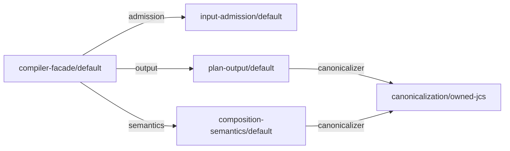

# Self-composition implementation guide

## Purpose and status

This document is the implementation guide for accepted ADR-0008. It names the
own feature graph of the Core, the TypeScript skeleton of one feature, the
composition roots and build topology, the finite emitter, the construction
witness, and checkpoint A precisely enough that the first private
`packages/core` can be written without inventing structure.

This document owns the implementation mapping for ADR-0008; it adds no
normative requirement beyond ADR-0008, the accepted contract, and the Feature
Module Standard profile. Every rule below is either derived from ADR-0008, the
Feature Module Standard profile, the accepted contract, or is explicitly
marked as proposed by ADR-0016. A rule marked "as proposed by ADR-0016" is a
candidate rule until ADR-0016 is accepted: implement it, do not claim it, and
keep it replaceable. Identifiers, file names, and directory names in this guide
are implementation details in the sense of ADR-0008 and may change through an
ordinary pull request as long as the invariants they carry survive.

### Carrier-boundary precedence

ADR-0015 admits private semantic source and explicitly permits private candidate
entrypoints that produce acceptance evidence. M1 requires a normalized-value
seam and may additionally test a trusted-object candidate of
`compileCompositionV1` over the same implementation, as the roadmap's callable
matrix specifies. This does not expose accepted carrier semantics, raw input,
authoring helpers or public package exports. Unresolved cases remain candidate
evidence; accepted object rules are not replaced by proposed ADR-0013. The
ADR-0008 requirement that direct and generated subjects share the same public
compiler boundary applies only after the M2/M3 decisions admit that boundary.
Until then, M1 uses only the private qualification surface selected under that
matrix. An object candidate is not a public or conforming carrier.

## Own feature inventory

ADR-0008 names five cohesive responsibilities and leaves their identities to the
first implementation. This guide fixes them so that declarations, the own
profile, the composition root, and the emitter allowlist agree from the first
commit.

All identities follow the accepted grammar in
`architecture/contracts/v1/composition.schema.json`: a portable identity has at
least two lowercase segments separated by `/`, a local token is one lowercase
segment, and an owner has one `authority` token and a logical `path`.

- The owner authority for every own declaration is `get-modular`.
- The owner path is the logical feature route, one segment per feature, for
  example `["input-admission"]`. It is not a filesystem path.
- Compatibility uses the accepted `exact` family, version `1`, with a token of
  the form `<capabilityId>/v1`.

### Modules and implementations

| Feature | `moduleId` | `implementationId` | Provides (`capabilityId`) | Slots |
| --- | --- | --- | --- | --- |
| Compiler facade | `get-modular/compiler-facade` | `get-modular/compiler-facade/default` | none | `admission`, `semantics`, `output` |
| Input admission | `get-modular/input-admission` | `get-modular/input-admission/default` | `get-modular/admitted-input` | none in M1; `scanner` in M2 |
| Composition semantics | `get-modular/composition-semantics` | `get-modular/composition-semantics/default` | `get-modular/semantic-analysis` | `canonicalizer` |
| Plan output | `get-modular/plan-output` | `get-modular/plan-output/default` | `get-modular/plan-emission` | `canonicalizer` |
| Canonicalization | `get-modular/canonicalization` | `get-modular/canonicalization/owned-jcs` | `get-modular/canonical-bytes` | none |

Additional implementations of `get-modular/canonicalization`:

- `get-modular/canonicalization/canonicalize-adapter` wraps the external
  `canonicalize` package behind the same port. It exists only after ADR-0010 is
  accepted and its adapter qualification passes; until then the owned JCS
  implementation is the only production provider.
- `get-modular/canonicalization/witness-variant` is qualification-only. It
  produces deterministically different canonical bytes, a fixed prefix before
  the same encoding, so a plan digest changes observably when it is bound while
  domain separation stays with plan-output. It lives outside `src`, under
  `packages/core/tests/features/canonicalization/witness-variant/`, is built
  only by the qualification variant of a stage0 or stage1 build, and never
  enters the distributed archive.

In M2 the input-admission feature gains the slot `scanner` for the capability
`get-modular/raw-scanner` with the owned iterative scanner as the default
provider and the `jsonc-parser` scanner adapter as a second provider after
ADR-0010 is accepted. That slot is not part of the M1 own graph.

Diagnostics, the comparator, the bounded collector, graph helpers, and resource
metering are feature-owned libraries, not modules. The diagnostic rules have one
owner, the library feature `packages/core/src/features/diagnostics/`: it has no
module declaration and no factory and exposes one curated `internal.ts` of pure
functions and plain types. Diagnostic ordering belongs to composition
semantics: the comparator and the bounded top-K collector in `internal.ts`
take the canonicalization function as a parameter and stay pure, and
composition semantics supplies that function from its own `canonicalizer`
slot, so the canonical detail bytes of diagnostics use the same adapter as plan
content even when the compile result is `ok: false`. Diagnostics of the
decode, schema, and resource phases originate in input admission, which has no
`canonicalizer` slot; they enter the same bounded top-K collection at
collection time, as ADR-0005 requires, because the facade asks the semantics
port to create one collector per compile call and passes that collector as an
ordinary call argument to admission and then to semantics. The collector is a
value handed along a call, not a slot and not an edge of the own graph.
ADR-0008 forbids enlarging the own graph with helpers merely to claim more
self-use; a feature that emits diagnostics imports that library statically
through its owner's `internal.ts` and through nothing else.

The four authoring helpers `defineModule`, `required`, `optional`, and `many`
and the public wire types `ModuleDeclaration`, `CompositionProfile`,
`CompositionPlan`, `Diagnostic`, and `PlanDigest` belong to a second library
feature, `packages/core/src/features/authoring/`. It has no module declaration
and no factory, because the helpers are the non-validating constructors that
ADR-0007 accepted and the types are inert contracts; its `internal.ts` is the
one feature-local source for the later M2/M3 carrier and public entries. M1
imports the internal types needed by its selected qualification surface and
does not publish these helpers or contracts. Its optional object candidate
reuses that source; M2 admits carrier claims only after the relevant decisions.

### Own graph

The M1 own graph has five selected implementations and five edges. Every slot
is `required`. `optional`, `many`, cycles, unreachable selections, and missing
bindings never occur in the own graph; the independent vectors cover those
semantics, as ADR-0008 requires.



The accepted plan lists `dependencyOrder` over implementation identities as
the lexicographically smallest valid dependency-before-consumer order: ADR-0006
fixes Kahn's algorithm choosing the smallest ready `implementationId` at every
step. For this graph it is `get-modular/canonicalization/owned-jcs`,
`get-modular/composition-semantics/default`,
`get-modular/input-admission/default`, `get-modular/plan-output/default`,
`get-modular/compiler-facade/default`. The composition root and the emitter
construct in exactly that order.

### Own profile

The own profile is inert data. It selects the default implementation of every
own module and binds the five edges:

```json
{
  "kind": "get-modular.composition-profile",
  "schemaVersion": 1,
  "profileId": "get-modular/own-profile",
  "roots": ["get-modular/compiler-facade"],
  "selections": [
    {
      "moduleId": "get-modular/compiler-facade",
      "implementationId": "get-modular/compiler-facade/default"
    },
    {
      "moduleId": "get-modular/input-admission",
      "implementationId": "get-modular/input-admission/default"
    },
    {
      "moduleId": "get-modular/composition-semantics",
      "implementationId": "get-modular/composition-semantics/default"
    },
    {
      "moduleId": "get-modular/plan-output",
      "implementationId": "get-modular/plan-output/default"
    },
    {
      "moduleId": "get-modular/canonicalization",
      "implementationId": "get-modular/canonicalization/owned-jcs"
    }
  ],
  "bindings": [
    {
      "consumerImplementationId": "get-modular/compiler-facade/default",
      "slotId": "admission",
      "providerImplementationIds": ["get-modular/input-admission/default"]
    },
    {
      "consumerImplementationId": "get-modular/compiler-facade/default",
      "slotId": "semantics",
      "providerImplementationIds": ["get-modular/composition-semantics/default"]
    },
    {
      "consumerImplementationId": "get-modular/compiler-facade/default",
      "slotId": "output",
      "providerImplementationIds": ["get-modular/plan-output/default"]
    },
    {
      "consumerImplementationId": "get-modular/plan-output/default",
      "slotId": "canonicalizer",
      "providerImplementationIds": ["get-modular/canonicalization/owned-jcs"]
    },
    {
      "consumerImplementationId": "get-modular/composition-semantics/default",
      "slotId": "canonicalizer",
      "providerImplementationIds": ["get-modular/canonicalization/owned-jcs"]
    }
  ]
}
```

In the TypeScript source of `self-composition/own-profile.ts`, every
`moduleId` and `implementationId` above is taken from the constants exported by
each feature's `declaration.ts`; the JSON here is the data those constants
produce, and the profile file repeats no identity string.

The qualification variant of this profile, the data in
`self-composition/own-profile.variant.ts`, differs in exactly one selection,
`get-modular/canonicalization` selecting
`get-modular/canonicalization/witness-variant`, and in the two `canonicalizer`
bindings that must name the selected provider. It imports the same declaration
constants plus the witness-variant declaration from `tests/`. That variant is
the controlled binding replacement required by ADR-0008.

### Example declaration

The facade declaration shows the complete accepted shape. Every other own
declaration follows the same form with its own `provides` and `slots`.

```json
{
  "kind": "get-modular.module-declaration",
  "schemaVersion": 1,
  "moduleId": "get-modular/compiler-facade",
  "implementationId": "get-modular/compiler-facade/default",
  "owner": { "authority": "get-modular", "path": ["compiler-facade"] },
  "provides": [],
  "slots": [
    {
      "slotId": "admission",
      "capabilityId": "get-modular/admitted-input",
      "compatibility": {
        "family": "exact",
        "familyVersion": 1,
        "token": "get-modular/admitted-input/v1"
      },
      "cardinality": { "kind": "required" }
    },
    {
      "slotId": "semantics",
      "capabilityId": "get-modular/semantic-analysis",
      "compatibility": {
        "family": "exact",
        "familyVersion": 1,
        "token": "get-modular/semantic-analysis/v1"
      },
      "cardinality": { "kind": "required" }
    },
    {
      "slotId": "output",
      "capabilityId": "get-modular/plan-emission",
      "compatibility": {
        "family": "exact",
        "familyVersion": 1,
        "token": "get-modular/plan-emission/v1"
      },
      "cardinality": { "kind": "required" }
    }
  ]
}
```

The plan-output and composition-semantics declarations each provide their
capability and declare the single slot `canonicalizer` for
`get-modular/canonical-bytes`. The canonicalization declarations provide
`get-modular/canonical-bytes` and declare no slots. The input-admission
declaration provides `get-modular/admitted-input` and declares no slots in M1.

## Feature skeleton in TypeScript

Every own feature lives under `packages/core/src/features/<feature>/` exactly
as the Feature Module Standard profile maps feature-owned slices. A feature
starts with its owner-local ports, its inert declaration, and its pure factory
in the same delivery, never as an ambient singleton wrapped later.

```text
packages/core/src/features/<feature>/
  ports.ts          types only: the provided port and the consumed port types
  declaration.ts    inert declaration constant and typed identity handles
  factory.ts        create<Feature>(deps): pure construction, no module state
  <implementation>.ts and further owned files

packages/core/src/features/<feature>/          feature with several implementations
  ports.ts                                      shared port types
  identity.ts                                   the one owner of moduleId, capabilityId and token constants
  <implementation>/declaration.ts               one inert declaration per implementation
  <implementation>/factory.ts                   one pure factory per implementation

packages/core/src/features/<library>/          library feature, no module declaration
  internal.ts                                   curated pure functions and plain types
```

A feature with one implementation keeps `declaration.ts` and `factory.ts` at
its root. A feature with more than one implementation keeps one shared
`ports.ts`, one `identity.ts` that is the single authority for the `moduleId`,
`capabilityId`, and compatibility token constants, and one directory per
implementation whose `declaration.ts` imports those constants and adds only
its `implementationId`: canonicalization has
`features/canonicalization/owned-jcs/` from M1 and
`features/canonicalization/canonicalize-adapter/` after ADR-0010 is accepted.
The qualification-only witness variant uses the same two files outside `src`,
under `packages/core/tests/features/canonicalization/witness-variant/`, and
imports the same `identity.ts`, so no identity string of the canonicalization
feature is typed a second time inside that feature or under `tests/`. A
consumer names the capability it requires in its own declaration; it takes the
`capabilityId` and compatibility token constants from the provider's
`identity.ts`, the one cross-feature import of constants that the rules below
allow, and never types those strings itself.
The library features `authoring/` and `diagnostics/` consist of `internal.ts`
and the owned files behind it.

Rules:

- `ports.ts` contains only `interface` and `type` declarations. A consumer
  feature declares the port it consumes in its own `ports.ts`, as ADR-0008
  assigns a required driven port to the consuming feature; the provider
  declares the port it provides in its own `ports.ts`, and structural typing
  joins the two. A consumer may import a provider's port types for that
  purpose and, for a library feature such as diagnostics, the owner's curated
  `internal.ts`; it imports nothing else from a neighbor, and two consumers of
  the same capability never import from each other.
- A consumer may import the `capabilityId` and compatibility token constants
  from the provider feature's `identity.ts` (or `declaration.ts` for a
  single-implementation feature) to name the required capability in its own
  declaration. That import carries constants only, never a port type, a
  factory, or an implementation. This value-import exception is a proposed
  qualification/self-composition rule, not current production structural
  authority; it must be explicitly admitted by the source-dependency policy
  before any production conformance claim relies on it.
- `internal.ts` exists only in library features. It exports pure functions and
  plain types, never a factory, a declaration, or an implementation. The
  Foundation source-dependency policy records these three cross-feature edges,
  a provider's `ports.ts`, a provider's identity constants, and a library
  owner's `internal.ts`, and rejects every other one.
- `declaration.ts` exports the inert declaration as a frozen constant and the
  typed identity handles used by the composition root and the allowlist. It
  performs no I/O and has no side effects on import.
- `factory.ts` exports one pure `create<Feature>(deps)` function. It receives
  closed typed dependencies, returns the provided port, keeps no module-level
  state, and performs no discovery.
- The facade imports only port types and identity constants of its
  neighbors. It never imports a
  concrete implementation, a barrel, a registry, or a resolver.
- No feature exports a barrel over its whole directory. The module's curated
  public surface is `packages/core/src/index.ts` alone once it exists in M3;
  until then the direct subject entry `self-composition/stage0-entry.ts`
  exposes the selected M1 private row of the roadmap's callable matrix for
  qualification, including an object candidate when selected. It must not imply
  either carrier is public or conforming before M2.
- No generic `resolve()`, container, service locator, or string-keyed factory
  map exists anywhere in production source.

Illustrative signatures for the plan-output feature:

```ts
// features/plan-output/ports.ts
// consumed port, owned by this consumer; composition-semantics declares its
// own CanonicalBytesPort of the same shape in its ports.ts, and the provider
// declares the provided port in features/canonicalization/ports.ts
export interface CanonicalBytesPort {
  readonly canonicalize: (value: JsonValue) => Uint8Array;
}
// domain separation and digest spelling stay in plan-output, as ADR-0010 keeps
// them owned by the Core rather than by a replaceable adapter
export interface PlanEmissionPort {
  readonly emit: (normalized: NormalizedPlan) => Promise<PlanAndDigest>;
}
```

```ts
// features/plan-output/declaration.ts
export const planOutputDeclaration = Object.freeze({
  kind: "get-modular.module-declaration",
  schemaVersion: 1,
  moduleId: "get-modular/plan-output",
  implementationId: "get-modular/plan-output/default",
  // owner, provides, and slots exactly as in the inventory above
} as const);
export const planOutputImplementation = planOutputDeclaration.implementationId;
```

```ts
// features/plan-output/factory.ts
export interface PlanOutputDeps {
  readonly canonicalizer: CanonicalBytesPort;
}
export function createPlanOutput(deps: PlanOutputDeps): PlanEmissionPort {
  // pure construction; no I/O, no registry, no module state
}
```

### Closed dependency record

As proposed by ADR-0016, the closed dependency record that a factory receives
is a typed object literal whose keys are exactly the declared slot identifiers
of that feature. The slot identifiers in the inventory above are chosen from
the identifier-safe subset of the accepted `localToken` grammar, lowercase
letters and digits starting with a letter, and never equal an own property
name of `Object.prototype`, `prototype`, or `then`; TypeScript checks that
every `create<Feature>` call site supplies exactly those keys, and the witness
checker rejects an own declaration whose slot identifier leaves that subset.

The accepted rule of ADR-0008 that identities never become property lookup
keys is preserved because no identity from a caller profile is ever used as a
key: the keys come from the feature's own declaration, and the composition root
or the emitter writes them as literals. Inside the compiler, every lookup keyed
by a module, implementation, capability, or slot identity uses a `Map`; the
form `record[id]` on an ordinary object is forbidden in production source.

Until ADR-0016 is accepted, implement this candidate rule and do not claim it.
If ADR-0011 is accepted instead with its null-prototype record refinement, the
composition root, the emitter output shape, and the parameter type of every
factory change, because each factory then receives an exotic object; factory
signatures keep their slot names.

## Composition roots and build topology

### One composition root

Production source contains at most one composition root, and it is generated.
In M1 no production composition root exists: `packages/core/src/composition/`
and `packages/core/src/index.ts` are absent, so no temporary production
composition is introduced, exactly as ADR-0008 requires when it says "Add the
minimal direct stage0 root in the same delivery; do not introduce a temporary
production composition." Every `create<Feature>` call in M1 happens in the
handwritten stage0 root `packages/core/self-composition/stage0.ts`, in
`dependencyOrder`, or in its qualification counterpart
`self-composition/stage0.variant.ts`, an equally short literal root that binds
the witness variant and that only the qualification build sees, and nowhere
else outside `tests/`. The stage0 root is the "checked internal graph"
checkpoint that ADR-0008 allows as an explicit implementation checkpoint and
forbids as a release: a test compiles the own normalized declarations and
profile through the direct subject's private qualification seam and proves that the plan's
`dependencyOrder` equals the order of construction in the file.

In M3 the production root appears as generated code:
`packages/core/src/composition/generated/stage1.ts`, listed in `.gitignore`,
emitted from P0 and imported by the public barrel `packages/core/src/index.ts`,
which is created in the same delivery. The stage0 root does not move and does
not survive as a second production root: it stays in `self-composition/` as
qualification machinery, and `src` holds exactly one composition root, the
generated one.

### Direct subject entry

ADR-0008 ultimately requires two temporary, hash-identified qualification
subjects with the same public compiler boundary and forbids a stage0 public
export in the distributed package. Before carriers are admitted, the direct
subject has a private entry file,
`packages/core/self-composition/stage0-entry.ts`. It imports `stage0.ts` and
exposes the M1 normalized-value seam and, when selected, the qualification-only
object candidate, with no public package surface. It is built by
`tsconfig.stage0.json`; `tsconfig.qualification.json` also compiles it because
that build includes all of `self-composition/`; the production `tsconfig.json`
never does; it
is never packed into the distributed archive, and it is
the module against which the M1 harness, the checkpoint A test, and the direct
half of every dual-subject gate run. The variant direct subject has the same
shape: `self-composition/stage0-entry.variant.ts` imports
`stage0.variant.ts` and re-exports the same names, and only the qualification
build sees it. Until M3 `stage0-entry.ts` is therefore the only curated
entry point of the package, and it exists for qualification alone; the curated
public entry point `src/index.ts` appears together with the generated root.
Both M1 subjects expose the same selected private surface, so the same
independent semantic and object-candidate vectors run against both. M1 does not
require a generated subject before the first direct object-input test. After
the M2/M3 decisions admit carriers and public names, dedicated direct and
generated qualification entries must expose the same accepted public boundary
before a self-composed or release claim. No carrier-conformance claim is inferred
from the M1 entry.

### Build-only directory

Bootstrap, own profile, allowlist, and emitter tooling live beside the core's
build configuration and outside `src`, exactly as ADR-0008 requires and without
creating a third package:

```text
packages/core/
  self-composition/
    stage0.ts                  handwritten literal assembly of the feature factories, M1 onward
    stage0-entry.ts            private normalized seam and optional M1 object candidate
    own-profile.ts             imports every feature's declaration constant and defines the own profile as data
    stage0.variant.ts          handwritten literal root bound to the witness variant, qualification only
    stage0-entry.variant.ts    variant direct subject entry, qualification only
    stage1-entry.variant.ts    variant generated subject entry: imports the variant generated root, qualification only
    own-profile.variant.ts     the variant profile as data, qualification only
    allowlist.ts               build-time map from declaration constants to typed import handles, M3
    allowlist.variant.ts       qualification allowlist: imports allowlist.ts and adds the witness-variant entry, qualification only
    emit.ts                    the finite emitter and its input manifest, M3
  src/
    features/
      authoring/internal.ts    helpers and inert types; public re-export begins only after M2/M3 gates
      diagnostics/internal.ts  diagnostic rules, comparator, collector
      ...
    composition/
      generated/stage1.ts          emitted in M3 by the production build, never committed
      generated/stage1.variant.ts  emitted only by the qualification build, never committed
    index.ts               public barrel, created in M3, imports the generated root
  tests/
    features/canonicalization/witness-variant/   qualification-only provider
    ...
  dist/                        production output, M3
  dist-stage0/                 stage0 output: dist-stage0/src/features/** and dist-stage0/self-composition/**
  dist-qualification/          qualification output of either variant subject
  tsconfig.json                production build, M3: rootDir src; include lists
                               src/features/**, src/composition/generated/stage1.ts
                               and src/index.ts by explicit path; errors are fatal
  tsconfig.stage0.json         stage0 build: rootDir at the package root, outDir
                               dist-stage0; src/features and self-composition
                               without *.variant.ts, no src/index.ts, no
                               generated sources
  tsconfig.qualification.json  qualification build of either variant subject
                               plus tests/features: the only build that sees the
                               witness variant; rootDir at the package root,
                               outDir dist-qualification
```

The first private package must list the three output directories and the two
generated files in `.gitignore`; today the root `.gitignore` lists only
`dist/`. None of them is ever committed.

The direct subject and the generated subject differ in the file that
constructs the facade, the entry file that re-exports it, the build
configuration and output directory, the staging manifest written for packing,
and the set of allowlist entries that the plan reaches; both expose the same
M1 private row, including the object candidate when selected. The phrase "same
accepted entry points" must always name a phase row; M1 candidate execution
does not establish carrier conformance.

`tsconfig.stage0.json` includes `src/features/**` and `self-composition/**`
except the `*.variant.ts` files, and excludes `src/index.ts` and
`src/composition/generated/**`, so stage0 type-checks and builds from a clean
checkout without the emitted file, as ADR-0008 demands. Because its inputs sit
under two roots, its `rootDir` is the package root and its `outDir` is
`dist-stage0/`, which therefore holds `dist-stage0/src/features/**` and
`dist-stage0/self-composition/**`. The production `tsconfig.json` has
`rootDir` `src`, lists `src/features/**`, `src/composition/generated/stage1.ts`
and `src/index.ts` in `include` by explicit path rather than by a glob over
`generated/`, excludes `self-composition/` and `tests/`, treats every error as
fatal (`noEmitOnError`), and emits `dist/`.

`tsconfig.qualification.json` has `rootDir` at the package root, emits
`dist-qualification/`, and includes `src/features/**`,
`src/composition/generated/stage1.variant.ts` when the emitter has written it,
`self-composition/**` including the `*.variant.ts` files, and
`tests/features/**`. It is the only build that sees the witness variant. The
emitter writes the variant generated root to
`src/composition/generated/stage1.variant.ts` only during a qualification
build; that file imports the variant factory as
`../../../tests/features/canonicalization/witness-variant/factory.js` relative
to its own file, which resolves under the qualification `rootDir`. The
production `tsconfig.json` never sees it because its `include` names
`stage1.ts` by explicit path and any stray reference to `tests/` fails the
production build as a fatal error. The qualification build writes only to
`dist-qualification/` and never overwrites `stage1.ts` or `dist/`, so the
production root and output are isolated from every variant run, as ADR-0008
requires for stage roots. Both variant subjects, the direct one built from
`stage0.variant.ts` through `stage0-entry.variant.ts` and the generated one
built from `stage1.variant.ts` through `self-composition/stage1-entry.variant.ts`,
which imports `../src/composition/generated/stage1.variant.js` and re-exports
the same M1 private normalized seam, come from this one configuration; the layout
of `dist-qualification/` differs from `dist/` and takes no part in the W0/W1
comparison, which does not compare unrelated source paths or raw emitted
source bytes. Under accepted ADR-0008, W0 is the exact wiring artifact emitted
from P0 and W1 is the exact wiring artifact emitted from P1 by the same pinned
emitter in an isolated location. Any path-independent tuple is only an internal
emitter input or diagnostic view; it cannot replace W0/W1 authority. Until the
closed emitted format, byte comparison and independent checker are defined,
W0/W1 parity is not claimed. The two variant subjects
share that one output root because they are witness subjects, not promotion
subjects; the separate output, cache and incremental roots that ADR-0008
requires for stage0 and stage1 apply to the direct and generated promotion
subjects, which keep `dist-stage0/` and `dist/` isolated.

#### Packing the qualification subjects

Until ADR-0012 is accepted, `packages/core/package.json` declares no `files`,
`exports`, `types`, or other publication field, because accepted ADR-0015
blocks them while OD-004, OD-005, and OD-006 are open. The two hash-identified
qualification subjects that ADR-0008 and the roadmap require are private
normalized-seam test archives. They are not npm packages, publication
candidates, or evidence for a public export map. A qualification tool under the
repository's root `tests/qualification/` owns the harness, independent oracles,
staging, and content-addressed result records. It copies only the reachable
private subject closure into a disposable staging directory under the
operating-system temporary root, outside the repository tree, and records the
complete file allowlist and archive digest. It does not synthesize a
`package.json`, `exports`, `types`, or public barrel.

The direct M1 archive contains the private stage0 entry and its reachable
closure. The generated M1 archive contains the private stage1 entry and its
reachable closure. Both expose the same selected private surface and run
the same normalized and optional object-candidate vectors, closure audit, declaration-leakage audit,
deep-import rejection, and inert-import audit. Neither archive is retained as
a distribution candidate, and neither makes a public TypeScript consumer-mode
claim.

Only after the M2/M3 authority gates are accepted may a separate later
generated archive become a pack-once distribution candidate. That later
archive may contain `dist/index.js`, `dist/index.d.ts`, an accepted export map,
and public TypeScript consumer evidence. It is not an M1 artifact and cannot be
derived from the proposed ADR-0012 carrier before that proposal is accepted.

The build-only directory `packages/core/self-composition/` is build tooling
beside the build configuration in the sense of ADR-0008, outside the
`source_root` that the Feature Module Standard profile maps and covered by the
profile's `internal-self-composition` extension rather than by the standard's
abstract layout. It is production-like source under a private package and is
admitted by the governance gate; the Foundation source-dependency policy gives
it its own boundary that may import features and their declarations but that
no feature may import. The same policy records the three allowed
cross-feature edges, a provider's `ports.ts`, a provider's identity constants,
and a library owner's `internal.ts`. The qualification boundary additionally
allows the single edge from `src/composition/generated/stage1.variant.ts` to
`tests/features/**` inside the qualification build only; the production
boundary has no such edge.

### Feature Module Standard classification

The organization standard allows exactly one dependency mechanism per
relationship. Self-composition uses the first two and never the third:

- Every edge of the own graph is the standard's second mechanism: a
  consumer-owned port whose provider is selected by module composition, here
  the own profile. Generated wiring is the form in which composition applies
  that selection, not a separate mechanism, and the emitter that writes it is a
  generator with a reviewable plan and a deterministic apply, which the
  standard recommends for generators. The plan is the accepted composition
  plan; the apply writes one file.
- The first mechanism, a static import and a typed factory or constructor,
  applies to the fixed library imports inside a feature: diagnostics, the
  comparator, the bounded collector, graph helpers and resource metering.
- Mechanism three, an explicit validated graph with an immutable activation
  plan for runtime provider selection, is not used inside the Core. The own
  plan exists at build time only and selects nothing at runtime.

This is a local extension of the standard, recorded in the Feature Module
Standard profile, not a deviation.

## Emitter specification

The emitter is finite and private. Its inputs are:

- the accepted composition plan produced by stage0 from the own declarations
  and the own profile, called P0; and
- the allowlist, a build-time `Map` whose keys are the `implementationId`
  constants exported by each feature's `declaration.ts` and whose values are
  typed handles naming the import path, the factory export, the declaration
  export, and the local constant name used for that implementation in the
  emitted file. The local name is an author-chosen identifier in the handle,
  never derived from an identity, so identities never become source fragments.
  The map is not the runtime string-keyed factory map that ADR-0008 forbids,
  it never enters `src`, it never repeats identity strings, and it never
  derives a path from an identity. It may hold entries for implementations
  that the own profile does not select, such as the adapter admitted after
  ADR-0010. The witness-variant entry lives in
  `self-composition/allowlist.variant.ts`, which imports the base allowlist and
  adds the one entry that points into `tests/`; only the qualification build
  sees that file, so neither the stage0 build nor the production build pulls
  `tests/` into its program, and `emit.ts` receives the allowlist as an
  argument instead of importing one.

Its output is one ECMAScript module with these properties:

- UTF-8 with LF line endings, no timestamps, no absolute paths, no
  locale-dependent or target-dependent text;
- one static import per selected implementation, in `dependencyOrder`;
- one `const` per selected implementation, in `dependencyOrder`, whose
  initializer is a single factory call receiving an object literal with one
  key per bound slot and the provider constant as the value;
- exactly one `export const root` naming the constructed facade;
- no identity string anywhere in the file; the single leading comment records
  only the plan digest.

Only `required` cardinality is supported. The emitter fails the build with a
stable private error code, without writing output, when it encounters an
unknown implementation identity, a selection without an allowlist entry, a
binding whose provider is not selected, a slot with any other cardinality, or
more than one provider, exactly the unknown IDs, missing bindings, extra
selections, and unsupported shapes that ADR-0008 names. An allowlist entry that
the plan does not reach is not an error; it simply emits nothing.
Emission is never a fallback resolver: it does not choose defaults, inspect a
filesystem, or import dynamically.

Illustrative output for the M1 own profile:

```ts
// generated by the self-composition emitter from plan digest gm-plan:v1:sha-256:...
import { createOwnedJcs } from "../../features/canonicalization/owned-jcs/factory.js";
import { createCompositionSemantics } from "../../features/composition-semantics/factory.js";
import { createInputAdmission } from "../../features/input-admission/factory.js";
import { createPlanOutput } from "../../features/plan-output/factory.js";
import { createCompilerFacade } from "../../features/compiler-facade/factory.js";

const ownedJcs = createOwnedJcs({});
const compositionSemantics = createCompositionSemantics({ canonicalizer: ownedJcs });
const inputAdmission = createInputAdmission({});
const planOutput = createPlanOutput({ canonicalizer: ownedJcs });
const compilerFacade = createCompilerFacade({
  admission: inputAdmission,
  semantics: compositionSemantics,
  output: planOutput,
});

export const root = compilerFacade;
```

The local constant names `ownedJcs`, `compositionSemantics`, and the others
come from the `localName` field of each allowlist handle. The emitted file is
regenerated in a disposable directory during the build and compared byte for
byte against the file used by the build, as ADR-0008 requires. It is never
hand-edited and never committed.

## Construction witness and checkpoint A

As proposed by ADR-0016, the construction witness has two parts and neither
instruments production code:

1. A static check reads a composition root and the plan it must realize and
   proves that the set of imports equals the set of selected implementations,
   that every `const` is initialized by exactly one factory call, that the
   object literal keys of each call equal the bound slot identifiers of that
   consumer in the plan, that every value is the constant of the bound
   provider, and that the order of constants equals `dependencyOrder`. The
   same check runs over the emitted `stage1.ts` and over the handwritten
   `stage0.ts` against P0, and over their variant counterparts against the
   variant plan; equality of construction order in the checkpoint A test is a
   consequence of this check, not a substitute for it.
2. A behavioral test compiles a fixed input through the phase-applicable
   qualification boundary of the stage0 subject and of the generated stage1
   subject, once with the own profile and once with the qualification variant that selects
   `get-modular/canonicalization/witness-variant` and binds both
   `canonicalizer` slots to it, whose canonical bytes carry a fixed prefix.
   The variant direct subject is `stage0.variant.ts` through
   `stage0-entry.variant.ts`; the variant generated subject is
   `stage1.variant.ts` emitted from the variant plan and exposed through
   `stage1-entry.variant.ts`. The plan digest MUST
   change between the two profiles in both subjects and MUST be equal across
   subjects for the same profile.

Until ADR-0016 is accepted, implement this candidate witness and do not claim
it. The accepted text of ADR-0008 describes a witness that records the identity
of constructed objects; ADR-0016 proposes the static and behavioral form above
as its replacement because it needs no inert hook inside packed bytes.

Checkpoint A of ADR-0008 is reached when the first useful dependency edge
exists. That edge is `plan-output.canonicalizer`; it and
`composition-semantics.canonicalizer` share the only capability in the M1
graph with a second, qualification-only provider, and checkpoint A replaces
that provider for both. Checkpoint A is passed when:

- the own normalized declarations and profile compile with `ok: true` through
  the M1 private seam exposed by `self-composition/stage0-entry.ts`;
- the static witness check passes over `self-composition/stage0.ts` against
  P0, which includes a construction order equal to `dependencyOrder`; and
- rebinding both `canonicalizer` slots to the witness variant, through
  `own-profile.variant.ts`, `stage0.variant.ts` and
  `stage0-entry.variant.ts`, changes the digest of a fixed normalized input
  compiled through the private qualification boundary.

A stronger checkpoint applies only if a later accepted decision adds it;
ADR-0016 requires the two-edge and object-identity conditions of proposed
ADR-0011 to be removed before that decision can be accepted alongside it.

## What M1 lays down so that M3 adds the emitter without refactoring

The first private package lands the accepted, reversible properties 1-4 and 6
below. Properties 5 and 7 are candidate refinements from proposed ADR-0016;
they may be implemented experimentally but are not M1 gates or accepted claims.
Together the accepted properties preserve a one-file path to the emitter:

1. Every feature has `ports.ts`, `declaration.ts`, and `factory.ts` with the
   identities from the inventory above, and no barrel over the feature.
2. The facade receives its neighbors through its `deps` record and imports
   only port types.
3. Each subject is built from exactly one composition root:
   `self-composition/stage0.ts` or its variant `stage0.variant.ts` for a direct
   subject, and the generated `src/composition/generated/stage1.ts` or its
   variant for a generated subject from M3. Every `create<Feature>` call
   outside tests happens in one of those literal or generated roots in
   `dependencyOrder`, and `src` never contains a handwritten composition
   root.
4. The canonicalization implementations, and in M2 the scanner implementations,
   sit behind consumer-owned ports in per-implementation directories with their
   own declarations and factories and one shared `identity.ts`, so binding
   replacement is a data change and the witness variant stays under `tests/`.
5. **ADR-0016 candidate:** The closed dependency record is a typed object
   literal keyed by declared slot identifiers, and every identity-keyed lookup
   inside the compiler uses a `Map`.
6. The own profile exists as data in `self-composition/own-profile.ts` from
   M1; it aggregates the feature-owned declaration constants and repeats no
   identity string, even though only the handwritten stage0 root consumes it.
7. **ADR-0016 candidate:** A checked-internal-graph test compiles the own profile
   through the private normalized seam of `self-composition/stage0-entry.ts`,
   asserts `ok: true`, and runs the static witness check over
   `self-composition/stage0.ts` against that plan, which includes the
   construction order equal to `dependencyOrder`.

## Out of scope

This guide does not decide the hermetic build sandbox, content-addressed
custody, release capsule, quarantine, or the `SourceManifest` and
`BuildContext` record formats; those remain proposed in ADR-0011 and are
scheduled by the roadmap's release checkpoint. It does not decide the six
runtime cases, which ADR-0007 reserves for the first conformance claim. It does
not accept ADR-0016; until that decision is accepted, the dependency-record and
witness rules above are candidate rules, and every claim about them remains
`CONDITIONAL`.
