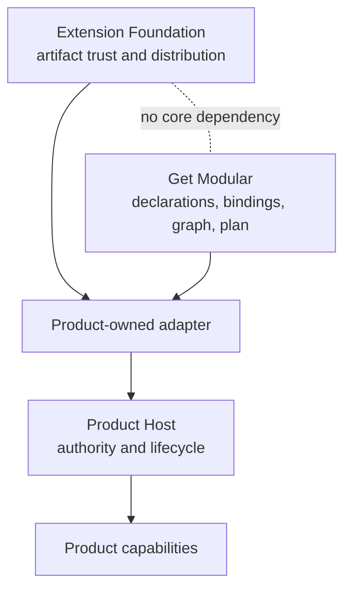
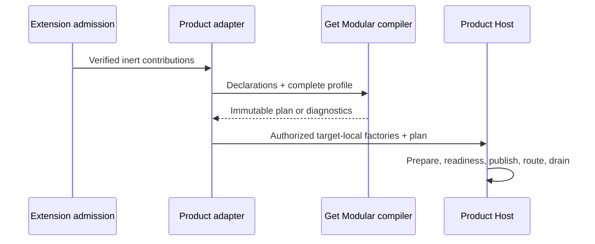

# System boundary

Get Modular owns deterministic composition semantics. It converts inert module
declarations and a complete explicit profile into an immutable plan. It does
not execute product lifecycle or decide whether code is trusted or authorized.

## Get Modular owns

- serializable validated identities for modules, capabilities,
  implementations, and local slots;
- inert declarations and explicit `required`, `optional`, and bounded ordered
  `many` dependencies;
- complete normalized profiles and explicit bindings or explicit absence;
- deterministic graph validation and compilation;
- bounded structured diagnostics;
- canonical immutable plan representation and digest;
- implementation-independent conformance vectors;
- an optional leaf construction helper only after a host supplies selected,
  authorized factories and a closed dependency object.

## Extension Foundation owns

- plugin artifact, publisher, installation, and generation identities;
- OCI distribution, provenance, signatures, admission, and revocation;
- permissions declarations, isolation contracts, quarantine, updates,
  retirement, and plugin state custody.

Extension Foundation does not import Get Modular. A product adapter is the only
place where verified extension contributions may be translated into inert Get
Modular declarations.

## Product hosts own

- product capability contracts and domain invariants;
- authorization, grants, entitlements, and desired state;
- target-local executable imports and literal loader tables;
- candidate preparation, readiness, generations, and Active Head publication;
- routing, fencing, drain, cleanup, recovery, and reconciliation.

No Get Modular API may become a service locator or a second lifecycle
authority. Registration order is never business semantics.

## Composition rule

The compiler has no filesystem scan, dynamic import, network access, clock,
randomness, environment lookup, durable state, or hidden global registry.
