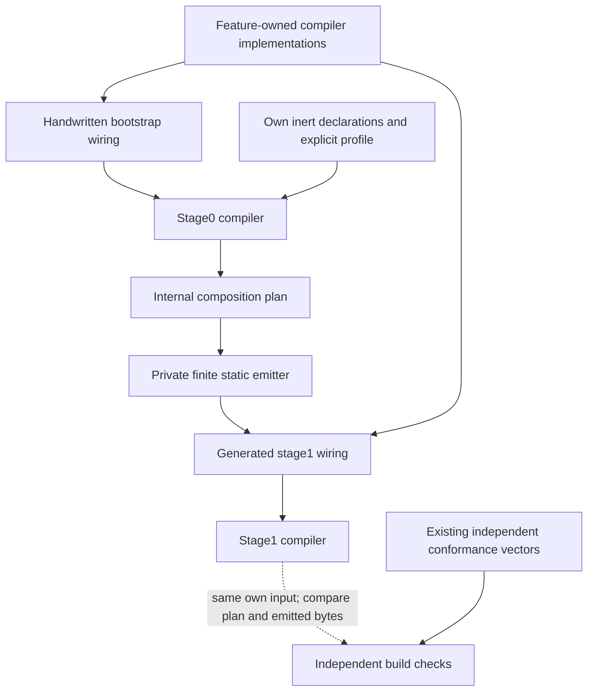
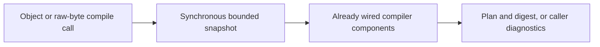

# ADR-0008: Bounded internal engine self-composition

## Context

The intended dogfooding is inside the engine: its own composition plan should
eventually determine how real compiler components are assembled. A product
adapter, a self-composed test runner, and a synthetic campaign model are different
outcomes; none substitutes for that goal.

At the reviewed PR4 revision `b21193808d4413b9852869fcd65138bbdb1faefa`,
Get Modular has accepted contracts and qualification code but no production
packages. This decision describes the architecture of the first production
core, not a later migration. It does not claim working self-use or change
accepted ADRs. Pure algorithms may be implemented while the build path is being
completed, but a handwritten production composition is not an interim release
target. The first distributed core requires the implementation evidence below.

## Options

| Option | What uses Get Modular | Tradeoff |
| --- | --- | --- |
| A: checked internal graph | The real compiler validates declarations of its own components; construction stays handwritten | Smallest increment, but not plan-driven self-composition; metadata drift must be detected |
| B: in-memory staged construction | A directly assembled compiler plans a second instance, constructed from that plan | Genuine self-use, but adds initialization, cached-instance, failure, and concurrency concerns |
| C: build-time static self-composition | A directly assembled compiler plans the real components; private tooling emits their static wiring | Genuine self-use without a runtime container; adds a finite emitter and reproducible-build obligations |

Recommend C as the required architecture of the first production core. A is an
explicit implementation checkpoint only, not a releasable fallback or a renamed
success for C. If C proves unjustified or infeasible, pause the release and
return to the owner with evidence instead of silently shipping A. B is not the
baseline. No choice requires a new package, public generator, or DI runtime.
The result is internal self-composition assembly, not compiler self-hosting,
trusting-trust mitigation, or proof of reproducible binaries.

## Decision

### One semantic implementation, two assembly roots

Use the same pure feature implementations in both paths. A small handwritten
bootstrap root constructs an ordinary working compiler, called stage0 here.
It is not a reduced validator, a second graph solver, the qualification oracle,
or a downloaded previous Get Modular release. It is honestly a second assembly
root, but not a second operational authority: the closed internal profile is the
single statement of the intended stage1 graph, and stage0 exists only to produce
that graph from a clean source checkout.

Stage0 compiles a closed internal engine profile. A private, finite build-time
emitter translates the resulting plan into ordinary static imports and typed
factory calls. The emitted wiring constructs stage1 from the same feature
implementations. Stage1 is a composition result, not another algorithm.
Stage0 remains one short literal assembly file: no branches, defaults,
validation, orchestration policy, dynamic lookup, or duplicated semantic logic.

Qualification records a private construction witness for each root: selected
factory identity, provided slot, consumed slots, dependency edges, and the
identity of the constructed object supplied to each consumer. Require the stage0
witness, selected plan, and stage1 witness to agree. The witness observes closed
typed factories and consumer injection; it is not another resolver, runtime
registry, or public API. A controlled replacement must change both the witness
and behavior observed through the public compiler boundary. Generating wiring,
calling a selected factory only for instrumentation, and then using a hidden
direct import cannot pass promotion.

The ordinary TypeScript toolchain builds both paths. Stage0 must build from a
clean checkout without generated stage1 files, a prior Get Modular package, or
imports through the stage1 public barrel. The bootstrap dependency closure is
checked independently; a supposed seed that imports generated wiring is not a
recovery path. A broken semantic implementation still requires a code fix or
revert: bootstrap is recovery from broken wiring, not an alternative solver.

### Real component boundaries

Apply the existing [Feature Module Standard profile](../architecture/feature-module-standard.md)
instead of duplicating its directory and layer rules. Start with natural
cohesive responsibilities, not one module per helper:

| Internal responsibility | Owns | Composition treatment |
| --- | --- | --- |
| Input admission | Object snapshot, raw-byte decoding, structural/resource admission | Candidate feature module with a narrow typed output |
| Composition semantics | Validated facts, compatibility, bindings, reachability, cycles, dependency order | Candidate feature module; mandatory correctness rules cannot be disabled |
| Plan output | Normalization, canonical bytes, digest | Candidate feature module; qualified library adapters stay local |
| Compiler facade | The two accepted entry points and their orchestration | Consumer of closed internal ports |
| Diagnostic rules and algorithm helpers | Normative comparison, bounded collection, graph helpers and counters | Ordinary feature-owned code; not separately pluggable merely to enlarge the graph |

These are initial boundaries, not fixed public module names or a required count.
The first implementation confirms them against actual dependencies. Shared
diagnostic rules have one owner and explicit internal APIs; do not force cycles
into this diagram or invent a global utility container.

Every cohesive compiler feature intended for stage1 starts with its owner-local
ports, pure factory, and inert declaration. It is not implemented first as an
ambient singleton or ad hoc root and wrapped as a module later. Pure algorithms,
value objects, and helpers remain ordinary feature-owned libraries; using the
module architecture from the beginning does not mean making every function a
module.

Port ownership follows the use case rather than the assembly mechanism. A
required driven port belongs to the consuming feature. A provided capability
contract belongs to the feature that owns that capability. Its adapter, factory,
and declaration remain beside that implementation. Only the private composition
root owns the selected binding. Neither an emitter nor a central catalog may
become a second owner of a port or capability identity.

Factories receive closed typed dependencies. Algorithms do not resolve services
or depend on their own module declarations, profiles, framework contexts, or
assembly path. Declaration and implementation identity remain beside the owning
feature. The composition root imports those declarations to form its private
profile and literal factory bindings; it does not invent a central ID registry.

The profile selects internal construction dependencies, not caller operations,
compiler-pass scheduling, diagnostic policy, or arbitrary processing order.
Construction order and the normative algorithm's control flow are distinct.
All mandatory validation, snapshot, resource-limit, and diagnostic obligations
remain enforced by the accepted contract, regardless of internal composition.

An independent conformance-owned promotion inventory maps accepted requirement
identities to mandatory evidence and negative mutations. It is not runtime
configuration and does not grant implementations. Deleting a mandatory rule
from its declaration, profile, and binding together must still fail conformance.
This intentional independent duplication prevents the engine from validating
the disappearance of its own obligation. Optional composition semantics that do
not occur naturally in the own graph remain covered by independent vectors; do
not invent fake internal modules merely to claim complete self-use.

### Bounded privileged kernel

The self-composed surface is the real internal construction graph of cohesive
compiler features. The following substrate remains deliberately privileged and
outside that graph: the pinned TypeScript build toolchain, the direct stage0
root, selection of the one closed own profile, the finite emitter and literal
binding allowlist, module loading and public entrypoint invocation, and the
independent conformance harness. Expanding this budget requires a new decision.
This is the same honest boundary seen in mature extension systems: first-party
features can exercise the extension model while the host, loader, and resolver
remain kernel responsibilities.

### Build-only machinery and package boundary

The core owner owns private bootstrap, profile, and emitter tooling beside the
core's build configuration. It is not a third package or a new conformance
runner API. The conformance owner supplies independent vectors against both
packed subjects through their public compiler boundary.

Only the intended static stage1 assembly and its reachable runtime dependencies
enter the eventual core artifact. Bootstrap tooling, generator, own profile,
development factory lookup tables, and conformance dependencies stay out of the
runtime tarball and public declarations. The generated direct factory calls and
the internal factory implementations they need necessarily remain runtime code.
No core-to-conformance or Get-Modular-to-Extension-Foundation dependency appears.

The emitter maps plan IDs only to an explicit allowlist of literal source
bindings. It does not resolve dependencies again, choose defaults, inspect a
filesystem for plugins, dynamically import code, or implement a generic
container. IDs never become source fragments, paths, or import specifiers.
Unknown IDs, missing bindings, extra selections, and unsupported shapes fail
the build. TypeScript checks the emitted closed dependency objects.

The allowlist maps owner-local typed handles to literal imports and factories. It
cannot use a string-keyed factory map, public barrel, `resolve(id)`, `eval`, or
runtime `import()`. Hostile but valid identities such as `node/fs`,
`constructor`, and `prototype` remain opaque data and never become code,
property lookup keys, paths, or comments.

The allowlist imports feature-owned declaration and factory handles; it must not
repeat raw identity strings or redefine ownership. Aggregation is permitted in
the private composition layer, but declaration identity remains beside its
feature implementation and has one authority.

The compiler facade and other composed consumers may import neighboring features
only through type-only ports and curated internal surfaces. They cannot import a
selected concrete implementation, its barrel, or a global resolver. Mechanical
source checks enforce `composition -> features`, never the reverse; adapters may
depend on owned ports, while ports cannot depend on adapters. Factory dependency
keys must exactly match declared slots. This prevents the generated plan from
becoming decorative metadata around handwritten construction.

The declarations, selected plan nodes, literal bindings, and emitted construction
must agree. Source import topology is not identical to capability wiring:
Engineering Foundation remains the import-boundary engine, while focused
construction checks detect missing or extra factory dependencies. Do not write
another source dependency parser or equate every import with a module edge.

Generated wiring is disposable derived output, never hand-edited authority.
The default is generation during the build from current source, without
committing the generated file. One coherent build uses the same clean source
snapshot, profile, emitter, lockfile, and pinned toolchain for both stages. It
regenerates in a disposable directory and compares exact bytes; it must not
overwrite the subject and then compare the file with itself. An input manifest
binds the observed inputs, so an unchanged plan digest alone cannot conceal a
changed implementation. A previous release is not a required seed.

Promotion uses separate fresh temporary, dependency-tree, output, incremental,
and compiler-cache roots for stage0 and stage1. A pinned integrity-checked
read-only package store may be shared, but no cached plan, wiring, compiled stage
output, generated file, or `.tsbuildinfo` counts as evidence for another stage.
The gate removes or poisons prior output before the clean-build test. Network
access is disabled and the environment is reduced to an explicit allowlist;
lockfile mutation fails the build.

An independently produced canonical `SourceManifest` covers every admitted build
input. Paths are normalized POSIX-relative strings sorted by ASCII bytes. Each
file records SHA-256 of exact bytes, size, and executable bit; symlinks, device
files, undeclared generated input, and untracked build input are rejected. The
inventory includes the transitive source closure reached by both roots,
declarations and profile, feature-owned bindings, allowlist, emitter and
templates, package/workspace manifests, lockfile, registry configuration,
relevant TypeScript configuration and build scripts, and independent obligation
inventory. The source closure inventory is computed outside the candidate
compiler so that it cannot omit its own changed input.

A separate `BuildContext` records exact Node, pnpm, and TypeScript identities,
explicit environment names and values, and the canonical release-builder target.
Platform-neutral source identity is therefore not confused with the environment
that produced an archive. An implementation change must change the source
manifest even when the plan is stable.

Wiring bytes use UTF-8 with LF, deterministic import/factory ordering, relative
literal imports, and no timestamps, absolute paths, locale, or target-specific
text. At least two independent clean workspaces reproduce the normalized plan,
source manifest, and wiring. One pinned canonical builder packs the release;
supported operating systems execute the same already-packed archive rather than
claiming byte-identical package creation across different platforms.

### No self-bootstrap on caller requests

There is no per-call own-profile compilation, runtime emitter, asynchronous
bootstrap singleton, ambient registry, top-level asynchronous initialization,
or hot replacement. Share only immutable services; working graphs, counters,
diagnostic collectors, and caches are invocation-local unless separately proved
safe. Both entry points retain ADR-0006's snapshot-before-first-await semantics.

Caller-invalid data still resolves to `ok: false`. A failed internal build,
missing factory, or generator defect is not a caller diagnostic and cannot
produce a partially valid release. Implementation defects and unavailable
platform primitives retain the accepted rejection semantics. Static imports
occur before factory invocation: this design does not claim validation before
import or process isolation. Internal imports and constructors must remain inert/pure.

### Independent evidence and recovery

Stage0/stage1 agreement only checks composition consistency. Both share the same
algorithms and can share the same bug. Keep the existing independent vectors,
expected outputs, and ordinary direct-core tests; never derive expected answers
from either candidate or let its plan select which mandatory tests run.

The comparison is finite: stage0 produces plan P0 and wiring W0; stage1 built
from W0 produces P1; the same pinned emitter produces W1 in a separate location.
Require exact P0/P1, digest, and W0/W1 equality. This is a consistency check, not
a cryptographic correctness proof or an unbounded fixed-point loop.

The conformance owner runs the same independent vectors against two temporary,
hash-identified qualification subjects with the same public compiler boundary:
one directly assembled and one generated. Only the generated stage1 subject is
eligible for the release artifact. Qualification packaging does not add a
stage0 public export or make bootstrap code distributable.

The canonical builder packs stage1 once. Qualification and publication use those
exact archive bytes; there is no repack after promotion. One immutable private
attestation binds the archive SHA-256, source manifest, build context, P0/P1,
W0/W1, construction witnesses, selected plans, and independent packed-vector
results. Instrumentation must either already exist behind a private inert hook in
the same packed bytes or prove a zero-byte-delta transformation. A witness from a
temporary subject cannot certify a different release tarball.

Before the first production release, stage0 is qualification-only and no
handwritten core assembly is distributed. Once stage1 is the accepted release
subject, a failed self-composition build fails visibly; recovery is a deliberate
revert to an exact known-good source and toolchain snapshot followed by cold
regeneration and repeated qualification. Generated wiring is never restored as an
authority. Do not silently fall back to stage0 and report successful stage1
evidence.

Feature paths may move without changing a stable internal semantic identity.
Changing that identity is a deliberate migration that updates the own profile,
binding handle, and independent promotion inventory together. During partial
migration, each release construction edge has exactly one owner: generated
stage1 wiring or one opaque handwritten adapter behind a closed port, never both.
The stage0 seed is qualification machinery and is not a second release owner.

## Delivery and acceptance

1. In the first core slice, implement cohesive feature logic with owner-local
   ports, factories, and inert declarations. Add the minimal direct stage0 root
   in the same delivery; do not introduce a temporary production composition.
2. Assemble the closed own profile and compile the real internal graph as soon
   as the first useful dependency edge exists. This is checkpoint A for feedback,
   but it cannot become the release artifact or a stable public architecture.
3. Before the first core release, add the finite private emitter and generated
   stage1 assembly for those same implementations. Run independent packed
   qualification against direct and generated subjects during this slice.
4. Release only stage1 after all evidence below is recorded. No product runtime,
   plugin bridge, generic DI framework, separate
   product consumer, or post-release migration is required for this work.

Seven focused acceptance groups, using existing test infrastructure:

- Clean bootstrap succeeds with generated wiring absent; stage0 imports do not
  reach stage1. Separate fresh stage roots, a poisoned-output test, the closed
  environment, and the complete input manifest prevent stale evidence reuse.
- Stage0 and stage1 both pass independent positive/negative vectors and packed
  public-API checks. The independent mandatory inventory detects removal of an
  obligation even when declarations, profile, and bindings all omit it.
- A missing mandatory validator, extra factory, unknown ID, or mismatched slot
  fails construction checks; a controlled valid binding change demonstrably
  changes public compiler behavior, the injected object identity, and the
  construction witness. Stage0 witness, plan, and stage1 witness agree. Hidden
  concrete imports, compiling and ignoring the plan, or calling a factory only
  for instrumentation fail this test.
- Own declaration permutations preserve plan/digest/wiring bytes; explicit
  ordered dependencies retain their profile order. Two cold workspaces reproduce
  normalized outputs; supported targets use existing CI. A scale fixture checks
  bounded growth at 100 cohesive modules without creating production modules.
- Concurrent calls and immediate caller mutation preserve snapshots and isolate
  request state for both entry points; calls perform no own-profile compilation
  or new component assembly. Required compiler invariants remain non-optional.
- Runtime package, public types, import graph, and generation output contain no
  development-only dependency, executable discovery, arbitrary code interpolation,
  generic `resolve`/service lookup, absolute path, or new public internal-module
  surface. Optional exclusions, a path rename, a partial migration, and a source
  revert recovery drill preserve one release owner and deterministic evidence.
- The canonical builder packs once; qualification executes that exact archive on
  every supported runtime target. Archive digest and all construction evidence
  are covered by one attestation. Tarball inspection and inert-import smoke prove
  that bootstrap, profile, emitter, allowlist, conformance code, development
  dependencies, source maps with private paths, and top-level import side effects
  do not leak.

Planning estimate within the first core delivery, after the initial feature
factories exist: about 2,000-4,000 handwritten changed lines for internal
declarations, private build glue, manifests, qualification, archive evidence,
and focused tests, with generated output counted separately. Deliver this as
bounded dependency-safe PRs rather than one proof mega-PR. Reassess before adding
a second solver, generic emitter, new package, or a substantially larger change.
If real components do not form a useful graph, the qualification code grows past
twice the production self-composition code, or the build path has no demonstrated
maintenance value, stop implementation and return an owner decision with
evidence; do not ship A as the production core.

Fast pull-request gates cover types, source boundaries, focused semantics,
deterministic generation, stage smoke, and packed Node execution. Promotion gates
add both independent subjects, resource and operating-system/runtime matrices,
two cold reproductions, tarball audit, archive attestation, frozen lockfile, and
offline build. Do not repeat promotion-scale matrices on every source edit.

Build failures emit stable private error codes plus phase, module, implementation,
slot, expected and actual binding, manifest/plan/witness digests, and the first
wiring difference. CI retains a structured JSON diagnostic artifact without
secrets or absolute paths. The fast daily gate should remain at most twice the
direct-build baseline, promotion at most three times it, generated stage1 runtime
overhead at most five percent, and tarball growth at most three percent or 10 KiB,
whichever is larger. Breaching a budget requires measurement and an owner review,
not silent expansion of the privileged kernel.

No additional full research cycle or new campaign protocol is required by this
decision. Exact feature names and build-tool paths are implementation details;
public API changes, new package boundaries, runtime self-bootstrap, or making
normative validators optional require a separate owner decision.

## Consequences

- The first production engine exercises its own declaration and binding model on
  real compiler components while keeping consumer startup ordinary and deterministic.
- Small pure features remain reusable without the internal self-use machinery.
- A private emitter and two roots add cost to the first core delivery; shared bugs
  still require independent tests, and no measured delivery/performance gain is
  claimed yet. This cost is accepted to avoid a later composition-root migration.
- The earlier Extension Foundation campaign-model work remains retained evidence,
  not code to import or another implementation gate. This decision does not
  delete that evidence or transfer its ownership.

## Rejected alternatives

- Declare all functions plugins: inflates the graph and obscures cohesive owners.
- Use only a manifest check and call it self-hosting: the plan would not control
  the compiler's real construction.
- Build the compiler from itself on each request: adds recursion and caller-state
  hazards without helping composition correctness.
- Require a previous released compiler or checked-in generated seed: complicates
  first-version and broken-build recovery; current-source direct bootstrap stays.
- Publish the emitter or use Cordis/DI as the compiler's authority: a broader
  runtime/framework contract is unrelated to this bounded internal build use.
- Replace independent qualification with self-consistency: identical defects can
  survive both stages, and internal self-use is not independent product adoption.

## Research basis

Six read-only hosted workers reviewed the same PR4 revision with
`gpt-5.6-sol`, `xhigh`, and fast service on 2026-08-31. Four recommended C, one B,
and one A. The industry worker retained only a short final summary; its vote is
not treated as detailed independent evidence. The bootstrap critic's objections
motivate the direct seed, drift checks, and explicit A checkpoint above. Agreement
between models is not proof and does not grant implementation authority.

Five follow-up hosted critics then examined pinned real project sources from
Dagger, the Rust compiler, Bazel, Gradle, VS Code, Backstage, Eclipse Equinox,
and the current
TypeScript build. They agreed that C remains viable only with a bounded kernel,
independent mandatory evidence, actual construction witnesses, isolated build
roots, and explicit seed provenance. Their agreement is still review evidence,
not implementation evidence or an acceptance decision.

Five additional exact-SHA hosted critics reviewed the first-core requirement from
bootstrap, Clean Architecture, delivery, security, and long-term maintenance
perspectives. They supported C conditionally and identified two release-blocking
risks: decorative composition that does not control behavior, and evidence that
does not identify the exact published archive. The source-boundary, behavioral
mutation, object-identity witness, pack-once attestation, input inventory,
recovery, debugging, and complexity constraints above incorporate those findings.
Their review still does not accept this ADR or replace implementation evidence.

[Dagger's real component processor](https://github.com/google/dagger/blob/4fbc045d2ba8d65e28b23bef84a42068702a4a9e/dagger-compiler/main/java/dagger/internal/codegen/DelegateComponentProcessor.java)
uses a generated Dagger injector to wire its own validation, generation, and
processing components. That supports internal generated composition as a real
pattern; it does not establish Get Modular's emitter design or justify copying
Java annotations, ServiceLoader, cache lifetimes, or public plugin APIs.

[Rust's bootstrap guide](https://github.com/rust-lang/rustc-dev-guide/blob/d8897a9c2e6cc3d2212df0266ca5788dcf9f081a/src/building/bootstrapping/what-bootstrapping-does.md)
separates seed, rebuilt compiler, and same-result stages. The limited lesson is
an explicit acyclic build and recovery path. Get Modular compiles declarations
to plans, not a programming language to machine code; Rust's full build system
and correctness claims are not adopted.

[Bazel's bootstrap entrypoint](https://github.com/bazelbuild/bazel/blob/c823f5a565d1ace5c42b1715af9bd4182abde29a/compile.sh)
demonstrates a finite seed-to-self-build path and explicit bootstrap outputs,
while its broader environment and distribution inputs are cautions rather than
build-isolation guidance. [Gradle's root settings](https://github.com/gradle/gradle/blob/438758aeb8fcbae1c0e2e62b756d4adbc7a35574/settings.gradle.kts)
show a layered build-logic DAG without turning product modules into build plugins.

[VS Code's extension service](https://github.com/microsoft/vscode/blob/400d86be5f490c331817a72e85870f6337652574/src/vs/workbench/services/extensions/common/abstractExtensionService.ts),
[Backstage's frontend app model](https://github.com/backstage/backstage/blob/ee97130ef6751077f50f7fb8a2ad0322a0db8df2/docs/frontend-system/architecture/10-app.md),
and [Equinox's module container](https://github.com/eclipse-equinox/equinox/blob/8a7ab003ebc825eae73d4fb2b23f760013ae299e/bundles/org.eclipse.osgi/container/src/org/eclipse/osgi/container/ModuleContainer.java)
all retain privileged host/resolver responsibilities while real first-party
features use their extension abstractions. Get Modular adopts that boundedness,
not their runtime activation, mutable registries, unload, or service lookup.

The [current TypeScript build](https://github.com/microsoft/TypeScript/blob/9a8581c393a38961489cc8409ae4dfbe97fc25ece/Herebyfile.mjs)
uses the Go toolchain for its native compiler. It supplies useful generated-file
provenance patterns but is not evidence of TypeScript compiler self-hosting.
