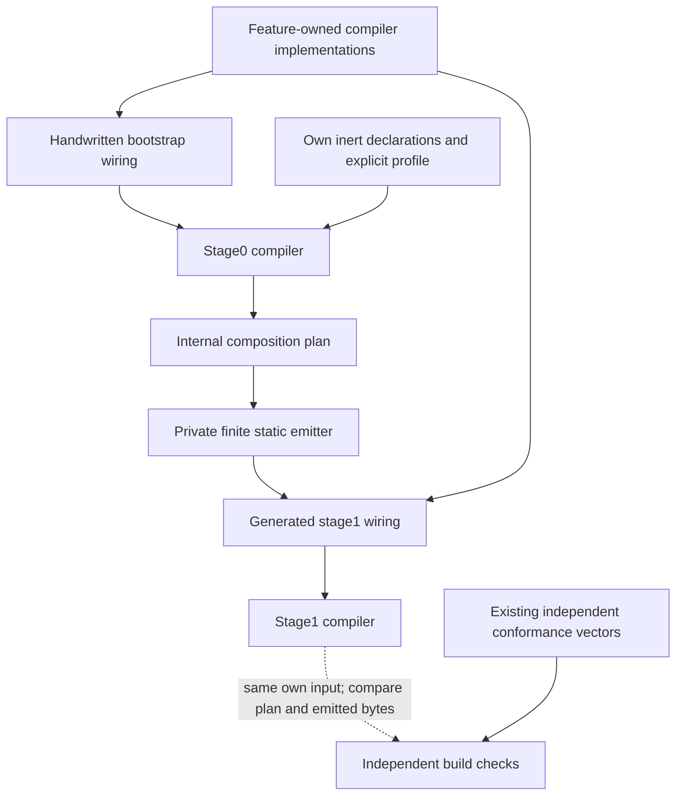
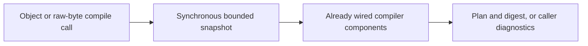

# ADR-0008: Bounded internal engine self-composition

## Context

The intended dogfooding is inside the engine: its own composition plan should
eventually determine how real compiler components are assembled. A product
adapter, a self-composed test runner, and a synthetic campaign model are different
outcomes; none substitutes for that goal.

At the reviewed PR4 revision `b21193808d4413b9852869fcd65138bbdb1faefa`,
Get Modular has accepted contracts and qualification code but no production
packages. This proposed ADR describes a future path. It does not claim working
self-use, change accepted ADRs, or block the already authorized ordinary core
implementation. Production self-composition needs acceptance of this proposal
and the implementation evidence below before becoming the distributed default.

## Options

| Option | What uses Get Modular | Tradeoff |
| --- | --- | --- |
| A: checked internal graph | The real compiler validates declarations of its own components; construction stays handwritten | Smallest increment, but not plan-driven self-composition; metadata drift must be detected |
| B: in-memory staged construction | A directly assembled compiler plans a second instance, constructed from that plan | Genuine self-use, but adds initialization, cached-instance, failure, and concurrency concerns |
| C: build-time static self-composition | A directly assembled compiler plans the real components; private tooling emits their static wiring | Genuine self-use without a runtime container; adds a finite emitter and reproducible-build obligations |

Recommend C as the target, reached after a working ordinary core. A is an
explicit intermediate or fallback result, not a renamed success for C. B is not
the baseline. No choice requires a new package, public generator, or DI runtime.

## Decision

### One implementation, two assembly paths

Use the same pure feature implementations in both paths. A small handwritten
bootstrap root constructs an ordinary working compiler, called stage0 here.
It is not a reduced validator, a second graph solver, the qualification oracle,
or a downloaded previous Get Modular release.

Stage0 compiles a closed internal engine profile. A private, finite build-time
emitter translates the resulting plan into ordinary static imports and typed
factory calls. The emitted wiring constructs stage1 from the same feature
implementations. Stage1 is a composition result, not another algorithm.

The ordinary TypeScript toolchain builds both paths. Stage0 must build from a
clean checkout without generated stage1 files, a prior Get Modular package, or
imports through the stage1 public barrel. The bootstrap dependency closure is
checked independently; a supposed seed that imports generated wiring is not a
recovery path. A broken semantic implementation still requires a code fix or
revert: bootstrap is recovery from broken wiring, not an alternative solver.

### Real component boundaries

Apply the existing [Feature Module Standard profile](../architecture/feature-module-standard.md)
instead of duplicating its directory and layer rules. Start with natural
cohesive responsibilities, not one module per helper:

| Internal responsibility | Owns | Composition treatment |
| --- | --- | --- |
| Input admission | Object snapshot, raw-byte decoding, structural/resource admission | Candidate feature module with a narrow typed output |
| Composition semantics | Validated facts, compatibility, bindings, reachability, cycles, dependency order | Candidate feature module; mandatory correctness rules cannot be disabled |
| Plan output | Normalization, canonical bytes, digest | Candidate feature module; qualified library adapters stay local |
| Compiler facade | The two accepted entry points and their orchestration | Consumer of closed internal ports |
| Diagnostic rules and algorithm helpers | Normative comparison, bounded collection, graph helpers and counters | Ordinary feature-owned code; not separately pluggable merely to enlarge the graph |

These are proposed boundaries, not fixed public module names or a required count.
The first implementation confirms them against actual dependencies. Shared
diagnostic rules have one owner and explicit internal APIs; do not force cycles
into this diagram or invent a global utility container.

Factories receive closed typed dependencies. Algorithms do not resolve services
or depend on their own module declarations, profiles, framework contexts, or
assembly path. Declaration and implementation identity remain beside the owning
feature. The composition root imports those declarations to form its private
profile and literal factory bindings; it does not invent a central ID registry.

The profile selects internal construction dependencies, not caller operations,
compiler-pass scheduling, diagnostic policy, or arbitrary processing order.
Construction order and the normative algorithm's control flow are distinct.
All mandatory validation, snapshot, resource-limit, and diagnostic obligations
remain enforced by the accepted contract, regardless of internal composition.

### Build-only machinery and package boundary

The core owner owns private bootstrap, profile, and emitter tooling beside the
core's build configuration. It is not a third package or a new conformance
runner API. The conformance owner supplies independent vectors against both
packed subjects through their public compiler boundary.

Only the intended static stage1 assembly and its reachable runtime dependencies
enter the eventual core artifact. Bootstrap tooling, generator, own profile,
development factory lookup tables, and conformance dependencies stay out of the
runtime tarball and public declarations. The generated direct factory calls and
the internal factory implementations they need necessarily remain runtime code.
No core-to-conformance or Get-Modular-to-Extension-Foundation dependency appears.

The emitter maps plan IDs only to an explicit allowlist of literal source
bindings. It does not resolve dependencies again, choose defaults, inspect a
filesystem for plugins, dynamically import code, or implement a generic
container. IDs never become source fragments, paths, or import specifiers.
Unknown IDs, missing bindings, extra selections, and unsupported shapes fail
the build. TypeScript checks the emitted closed dependency objects.

The declarations, selected plan nodes, literal bindings, and emitted construction
must agree. Source import topology is not identical to capability wiring:
Engineering Foundation remains the import-boundary engine, while focused
construction checks detect missing or extra factory dependencies. Do not write
another source dependency parser or equate every import with a module edge.

Generated wiring is disposable derived output, never hand-edited authority.
The proposed default is generation during the build from current source, without
committing the generated file. One coherent build uses the same clean source
snapshot, profile, emitter, lockfile, and pinned toolchain for both stages. It
regenerates in a disposable directory and compares exact bytes; it must not
overwrite the subject and then compare the file with itself. An input manifest
binds the observed inputs, so an unchanged plan digest alone cannot conceal a
changed implementation. A previous release is not a required seed.

### No self-bootstrap on caller requests

There is no per-call own-profile compilation, runtime emitter, asynchronous
bootstrap singleton, ambient registry, top-level asynchronous initialization,
or hot replacement. Share only immutable services; working graphs, counters,
diagnostic collectors, and caches are invocation-local unless separately proved
safe. Both entry points retain ADR-0006's snapshot-before-first-await semantics.

Caller-invalid data still resolves to `ok: false`. A failed internal build,
missing factory, or generator defect is not a caller diagnostic and cannot
produce a partially valid release. Implementation defects and unavailable
platform primitives retain the accepted rejection semantics. Static imports
occur before factory invocation: this design does not claim validation before
import or process isolation. Internal imports and constructors must remain inert/pure.

### Independent evidence and recovery

Stage0/stage1 agreement only checks composition consistency. Both share the same
algorithms and can share the same bug. Keep the existing independent vectors,
expected outputs, and ordinary direct-core tests; never derive expected answers
from either candidate or let its plan select which mandatory tests run.

The comparison is finite: stage0 produces plan P0 and wiring W0; stage1 built
from W0 produces P1; the same pinned emitter produces W1 in a separate location.
Require exact P0/P1, digest, and W0/W1 equality. This is a consistency check, not
a cryptographic correctness proof or an unbounded fixed-point loop.

Before promotion, ordinary static core remains the release path. After promotion,
a failed self-composition build fails visibly; recovery is a deliberate source
revert to the last known-good assembly. Do not silently fall back to stage0 and
report successful stage1 evidence.

## Delivery and acceptance

1. Implement the ordinary core and independent packed-artifact checks under the
   existing accepted decisions. Self-use adds no prerequisite to that work.
2. Describe the actual internal components with their own declarations/profile.
   Compile that real internal graph. If construction remains handwritten, report
   A only. Do not create a separate manifest-verification framework first.
3. In one bounded increment, add the private emitter and stage1 assembly for
   those same components. No production runtime, plugin bridge, generic DI
   framework, or separate product consumer is required for this internal slice.
4. Promote stage1 only after this ADR is accepted and the following evidence is
   recorded. Internal self-use is not a second production adopter for stable 1.0.

Six focused acceptance groups, using existing test infrastructure:

- Clean bootstrap succeeds with generated wiring absent; stage0 imports do not
  reach stage1. Damaged or stale output cannot be reused as valid build evidence.
- Stage0 and stage1 both pass independent positive/negative vectors and packed
  public-API checks. Equal own plans do not replace those checks.
- A missing mandatory validator, extra factory, unknown ID, or mismatched slot
  fails construction checks; a controlled valid binding change demonstrably
  changes the called factory. Compiling and ignoring the plan fails this test.
- Own declaration permutations preserve plan/digest/wiring bytes; explicit
  ordered dependencies retain their profile order. Repeat on supported targets
  using existing CI, not a separate campaign infrastructure.
- Concurrent calls and immediate caller mutation preserve snapshots and isolate
  request state for both entry points; calls perform no own-profile compilation
  or new component assembly. Required compiler invariants remain non-optional.
- Runtime package, public types, import graph, and generation output contain no
  development-only dependency, executable discovery, arbitrary code interpolation,
  or new public internal-module surface.

Planning estimate after the ordinary core/factories exist: about 600-1,200 changed
lines for internal declarations, private build glue, and focused tests, with
generated output counted separately. This is low-confidence sizing, not a
correctness ceiling or a compiler estimate. Reassess before adding a second
solver, generic emitter, new package, or a substantially larger change. If real
components do not form a useful graph, or the extra build path has no demonstrated
maintenance benefit, stop at A and retain the static core without claiming C.

No additional full research cycle or new campaign protocol is required by this
proposal. Exact feature names and build-tool paths are implementation details;
public API changes, new package boundaries, runtime self-bootstrap, or making
normative validators optional require a separate owner decision.

## Consequences

- The engine can exercise its own declaration and binding model on real compiler
  components while keeping consumer startup ordinary and deterministic.
- Small pure features remain reusable without the internal self-use machinery.
- A private emitter and two roots add maintenance cost; shared bugs still require
  independent tests, and no measured delivery/performance gain is claimed yet.
- The earlier Extension Foundation campaign-model work remains retained evidence,
  not code to import or another implementation gate. This proposal does not
  delete that evidence or transfer its ownership.

## Rejected alternatives

- Declare all functions plugins: inflates the graph and obscures cohesive owners.
- Use only a manifest check and call it self-hosting: the plan would not control
  the compiler's real construction.
- Build the compiler from itself on each request: adds recursion and caller-state
  hazards without helping composition correctness.
- Require a previous released compiler or checked-in generated seed: complicates
  first-version and broken-build recovery; current-source direct bootstrap stays.
- Publish the emitter or use Cordis/DI as the compiler's authority: a broader
  runtime/framework contract is unrelated to this bounded internal build use.
- Replace independent qualification with self-consistency: identical defects can
  survive both stages, and internal self-use is not independent product adoption.

## Research basis

Six read-only hosted workers reviewed the same PR4 revision with
`gpt-5.6-sol`, `xhigh`, and fast service on 2026-08-31. Four recommended C, one B,
and one A. The industry worker retained only a short final summary; its vote is
not treated as detailed independent evidence. The bootstrap critic's objections
motivate the direct seed, drift checks, and explicit A fallback above. Agreement
between models is not proof and does not grant implementation authority.

[Dagger's real component processor](https://github.com/google/dagger/blob/4fbc045d2ba8d65e28b23bef84a42068702a4a9e/dagger-compiler/main/java/dagger/internal/codegen/DelegateComponentProcessor.java)
uses a generated Dagger injector to wire its own validation, generation, and
processing components. That supports internal generated composition as a real
pattern; it does not establish Get Modular's emitter design or justify copying
Java annotations, ServiceLoader, cache lifetimes, or public plugin APIs.

[Rust's bootstrap guide](https://github.com/rust-lang/rustc-dev-guide/blob/d8897a9c2e6cc3d2212df0266ca5788dcf9f081a/src/building/bootstrapping/what-bootstrapping-does.md)
separates seed, rebuilt compiler, and same-result stages. The limited lesson is
an explicit acyclic build and recovery path. Get Modular compiles declarations
to plans, not a programming language to machine code; Rust's full build system
and correctness claims are not adopted.
