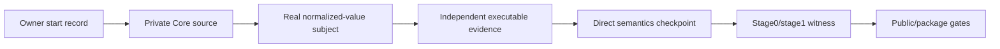

# Implementation-readiness audit and API authoring lab

**Status:** draft research. This report does not accept an ADR, create a
production package, or authorize public publication.

## Scope and authority

The audit was seeded from exact base `0f7d2fc64ae7258781e6c2676ca1e0ccc377f418`
from `agent-teams-ai/get-modular`. The current remediation subject is
`f88ead7f590c6c426f039b8884ba9da03a5ea3ce`. The branch is
`research/implementation-readiness-api-authoring`. Production Core, public
exports, runtime engine, plugin host, product integration, and package
publication are deliberately out of scope.

The committed historical review SHA is recorded in each result under
`research/implementation-readiness/evidence/raw/final-4dee/`. A later external
six-role review also inspected the remediation subject at `5a08722`; its
result envelopes remain on the verified hosted worker and are intentionally not
copied into this branch, because copying them would change the reviewed tree
and make the evidence self-referential. The external wave is not counted as
retained repository evidence. Any later source/evidence commit requires a new
subject review.

The worker manifest is the execution record. `combined-workers.json` contains
the raw result envelopes, including partial attempts. A result is positive
evidence only when its base SHA and task identity are explicit and the worker
actually observed the claimed subject. Retry count is not independent proof.

The final evidence snapshot contains 51 unique result envelopes from 64
retained raw result files: 49 completed and 2 partial. The duplicate raw
files are preserved for custody but deduplicated by task identity in
`combined-workers.json`. All 16 targeted red-team lanes completed: four each
for governance, API/cardinality, self-composition and OSS/overengineering.
Hosted workers ran on the verified new host, with `gpt-5.6-sol`; research used
`xhigh` and the API fixture lane used the project-approved `medium` split. All
workers used the default service tier, not fast mode, and network access was
disabled. The host runtime was Node `24.16.0`, while the repository requires
`>=24.18.0 <25`; this is an environment limitation and is not claimed as a
repository pass.

## Executive result

The architecture is directionally coherent for a **private normalized-value
Core checkpoint**, but the repository at the reviewed SHA is not yet
implementation-ready for a qualified Phase 3 compiler or for public package
work.

**Provisional disposition:** `CONDITIONAL` for beginning the private semantic
slice after the required owner-start record; `NO-GO` for claiming Phase 3
readiness, self-composition qualification, public API readiness, or release
eligibility at this SHA.

The profile checker has now been made transition-aware at the shape level: it
accepts only the ordered `not-claimed -> structural-conformant ->
runtime-conformant` states and rejects an out-of-order runtime state. It does
not grant a claim or verify its evidence. `governance:check` remains the
promotion authority because it verifies the same-subject qualification record,
closed evidence digests, and accepted reciprocal promotion decision. The
checked-in pre-production profile remains `not-claimed`.

The recurring blockers are concrete rather than stylistic:

1. There is no governed product-owner start record for admitting the first
   production package.
2. No executable Phase 3 compiler subject or named subject gate exists.
3. Existing normalization evidence does not cover optional absence or the
   required `many` boundary matrix.
4. `many` cardinality validation and authoring shape need one executable
   authority, including `min <= max` and zero-provider cases.
5. Self-composition dependency-record and construction-witness semantics remain
   proposed rather than accepted.
6. Raw carriers, duplicate binding records, public naming, and package carrier
   remain correctly gated by their open decisions and proposed successors.
7. The future finite emitter still needs a closed allowlist-handle schema for
   unique ECMAScript local/export identifiers, relative in-bound import paths,
   qualification exclusions, and deterministic malformed-handle diagnostics.

These findings do not require a new universal framework. They define the
minimum evidence to add around the first private semantic implementation.

## Authority and decision matrix

| Area | Current authority | Current state | Effect |
| --- | --- | --- | --- |
| Product-neutral composition | ADR-0001 | accepted | Core owns inert composition semantics; hosts own execution authority |
| Feature Module Standard | ADR-0002 | accepted | Core source follows feature-owned slices and package policy |
| Package identity/topology | ADR-0003 | accepted | Names are reserved; publication remains gated |
| Portable contract | ADR-0004 | accepted | Declaration, profile, plan and digest semantics are fixed |
| Compatibility, diagnostics, resources | ADR-0005 and ADR-0007 | accepted | Closed compatibility and bounded evidence rules apply |
| Normalization and entry points | ADR-0006 | accepted | Object/raw distinction and graph semantics are fixed where accepted |
| Executable qualification | ADR-0007 | accepted | Existing artifacts remain immutable; new evidence is additive |
| Self-composition boundary | ADR-0008 | accepted | One semantic implementation, bounded stage0/stage1 path |
| Private source admission | ADR-0015 | accepted | Private source may proceed after explicit owner start record |
| Unversioned public names | ADR-0009 | proposed | No public unversioned barrel yet |
| Primitive adapters | ADR-0010 | proposed | No production external adapter selection yet |
| Release custody | ADR-0011 | proposed | No release-eligibility or evidence-reuse claim |
| Package carrier | ADR-0012 | proposed | No package carrier or publication candidate |
| Trusted/raw carriers | ADR-0013 | proposed | Raw/object carrier exposure remains gated |
| Duplicate binding records | ADR-0014 | proposed | Repeated-record behavior remains outside the compiler |
| Dependency witness | ADR-0016 | proposed | Stage1 construction claim remains gated |

The accepted ADRs are not rewritten by this report. Proposed ADRs are used as
roadmap context only and cannot be treated as implementation authority.

## Phase readiness

| Phase | Evidence at exact base | Readiness | Minimum next condition |
| --- | --- | --- | --- |
| 0. Contract preflight | Static governance, contract and qualification checks pass | Conditional | Record owner start decision and retain exact subject/source identities |
| 1. Declarations and profiles | Schema/vectors exist; no production authoring subject | Conditional | Implement private inert declarations and complete-profile validation |
| 2. Normalization | One narrow normalization vector and oracle checks | No-go for claim | Add real subject, optional/zero/many matrix, and independent output evidence |
| 3. Graph compiler | Static graph semantics only; no compiler subject | No-go | Implement graph/compiler subject and execute gate against accepted boundary |
| 4. Plan/digest | Canonical evidence and static algorithms exist | Conditional | Prove immutable plan, digest, permutation stability, and mutation resistance |
| 5. Direct qualification | No packed production subject | Not established | Pack one private subject and run independent direct suite |
| 6. Self-composition | ADR-0008 accepted but no stage0/stage1 subject | Not established | Accept dependency-witness authority, then prove stage0/emitter/stage1 parity |
| 7. Public package | OD-004/005/006 and public naming/carrier decisions remain open | No-go | Accept required successor decisions and pass packed/public gates |

`source-admitted`, `structural-conformant`, `runtime-conformant`,
`direct-semantics-qualified`, `self-composed-qualified`, and `release-eligible`
remain distinct states. A static checker or fixture cannot promote a missing
subject into one of the latter states.

## Findings requiring correction or owner action

### R-001 - owner-start record is absent (P1)

ADR-0015 and the roadmap require an explicit product-owner start decision before
the first production source. No governed record exists at the exact base. This
is the admission precondition, not a request to accept proposed public or raw
carrier decisions.

**Action:** record a small, exact-base owner decision authorizing only a private,
non-publishable Core semantic slice. Keep OD-004, OD-005 and OD-006 unresolved.

### R-002 - no executable Phase 3 subject or gate (P1)

Multiple independent audits found that current checks validate artifacts and
oracles, not an invoked production compiler. The existing normalization ledger
contains one narrow case and does not exercise optional absence or a complete
`many` range matrix.

**Action:** implement the smallest private normalized-value subject and a named
gate. Keep the subject behind the private package boundary and run independent
vectors through its accepted compiler boundary.

### R-003 - Einput oracle over-counted inert bindings (resolved)

The original resource meter incremented `Einput` before filtering to selected
consumers, while accepted graph semantics define unselected declarations and
bindings as inert. It could reject a valid composition or produce incorrect
boundary evidence.

**Resolution:** the qualification meter now counts selected-consumer provider
occurrences only for `Einput`, `Evalid` and `Eadj`, derives `many` from the
declaration's cardinality rather than the slot name, and reports cyclic depth as
unavailable. An executable regression covers an unselected binding and a cyclic
selected graph. `providersPerManySlot` remains selected-consumer-only in this
fixture, but its applicability to supplied unselected binding lists is not
settled by the accepted text: the contract explicitly scopes `Einput` and
`graphEdges` to selected bindings, while its per-many clause only says "before
duplicate rejection". This is recorded as an authority clarification needed
before treating that counter as production resource evidence. The correction
changes qualification evidence only; it does not change product semantics.

### R-004 - cardinality and cycle/depth evidence is incomplete (P1/P2)

The audit found inconsistent or unproven `many` rules: `min <= max`, explicit
authoring shape, zero-provider optional/many, and per-limit boundary cases. The
cyclic graph `graphDepth` fact is also unspecified when topological ordering is
not available.

**Action:** preserve the explicit authoring form
`many({ min, max })`, whose normalized result has the fixed `order: "profile"`;
make invalid ranges fail deterministically; add
zero/interior/max vectors; and either define depth as unavailable on cycles or
define its exact precedence in an accepted clarification before claiming that
boundary.

### R-005 - self-composition witness authority is not closed (P1)

ADR-0008 requires a bounded stage0-to-stage1 path, but the dependency-record
and construction-witness details remain proposed in ADR-0016. The private
semantic implementation may proceed, but it cannot claim self-composed or
release-qualified output yet.

**Action:** keep direct semantic implementation separate from the later witness
work. Do not invent a second dependency authority or expose a generator API.

### R-006 - carrier and publication decisions are correctly deferred (P1)

Audits consistently distinguish useful private normalized work from blocked
public/raw work. OD-004, OD-005 and OD-006 remain open. ADR-0009, ADR-0012,
ADR-0013 and ADR-0014 are proposed.

**Action:** do not create a public barrel, raw entrypoint, package carrier, or
duplicate-record semantics in this research branch.

### R-007 - accepted baseline digest payload is under-specified (P2)

One authority audit found that the repository records ADR digests without
defining the exact bytes and canonicalization used to calculate them. This is a
reproducibility gap, not evidence of current tampering.

**Action:** document or expose the repository-owned verifier in a separate
governance correction while preserving existing accepted bytes.

### R-008 - API fixtures do not implement the accepted authoring contract (P1, narrowed)

The API lab was intentionally exploratory, but its earlier synthesis was too
generous in calling B2/B4 promising directions. ADR-0007 closes the helper
shape: `required()` and `optional()` take no arguments, `many({ min, max })`
is the explicit input form and its result has fixed `order: "profile"`, helpers do not clone/freeze, and
`defineModule(x) === x`. Most historical fixtures instead accept positional arguments,
`factory` values, alternate ordering fields, or executable loader values.

**Action:** keep all current fixtures non-authoritative. The b9 fixture now
probes the exact accepted helper shape, but it deliberately does not replace
the future compiler-handoff gate. The private implementation must still add
packed NodeNext, bundler and JavaScript-consumer checks before using API
measurements as compiler evidence; executable values remain forbidden in
declarations.

### R-009 - low-ceremony diagnostics are a false-positive prototype (P1)

The B4 fixture returns a generic `{ code, path }` shape, sorts with
`localeCompare`, and reports a cycle as `missing`. That cannot satisfy the
accepted closed diagnostic algebra, ASCII ordering, prerequisite suppression,
or structural path rules. The result is useful as a warning about low-ceremony
design, not as evidence for its diagnostic model.

**Action:** implement the closed diagnostic union and comparator only in the
real private subject, with independent expectations from the accepted catalog
and snapshots. Do not copy B4's diagnostic implementation.

### R-010 - serialization fixture evidence needs explicit scope (resolved as a scoped probe)

The earlier B6 summary was stale: the current fixture validates a closed JSON
value domain before calling `JSON.stringify` and rejects unsupported primitive
values. B5 still demonstrates the separate risks of locale-aware ordering and
ordinary object-literal handling of an own `__proto__` key. The B6 source probe
also rejects array hooks, accessors, symbols, non-enumerable properties, extra
array keys, sparse arrays, cycles, non-canonical indexes, negative zero and
oversized arrays.

**Resolution:** retain the historical B6 concern as non-current evidence, keep
B5 as negative evidence, and state explicitly that B6 is a disposable bounded
hostile-shape probe rather than canonicalization, resource-profile, or
trust-boundary proof. It does not establish RFC 8785 ordering or the accepted
profile's depth, string-byte, value-occurrence, or object-property limits. The
probe also rejects lone surrogates in object keys and compares equivalent
objects built with different insertion orders, but this remains only a
representation-level observation.

### R-011 - W0/W1 parity is not a raw-byte comparison contract (P1)

Three composition critics independently confirmed that stage0 and stage1 have
different emitted roots and relative import paths. Comparing their emitted
source bytes directly is therefore not reproducible. The repository still has
no canonical W0 schema or extraction algorithm.

**Action:** before self-composition qualification, define W0 and W1 as the same
path-independent canonical wiring tuples/IR and specify extraction and emitter
normalization. Keep source bytes as secondary evidence only.

### R-012 - direct subject staging profile closure (resolved as a stale claim)

The earlier report incorrectly said that direct staging omitted the profile.
The current guide includes `own-profile.js`, its declaration file, and every
file in the profile's reachable private closure in the staging set.

**Resolution:** remove this as a current blocker. The closure rule remains a
qualification requirement, while direct and stage1 evidence remain gated by
the unresolved witness authority and a real subject.

## API authoring lab

The fixtures are disposable and do not define a public API. They use a common
intended scenario vocabulary, but executed subsets differ by fixture and are
reported separately. The lab measures authoring and typing, not compiler
correctness. The raw worker record for the blocked B3 lane is retained for
custody but is not counted as completed evidence; its provider envelope must
not override the payload's blocked classification.

| Candidate | Result observed | Strength | Limitation |
| --- | --- | --- | --- |
| Descriptor object | Compact source declaration; serializability was not executed by the B1 probe | Explicit and inspectable | More object ceremony; no compiler diagnostics |
| Typed `defineModule` | 4-19 authoring LOC in variants; strong inference | Good local DX and typed activation seam | Current fixtures violate accepted helper/identity semantics; needs exact-shape subject |
| Declaration + activation factory | Clear split between inert data and executable binding | Preserves Clean Architecture boundary | Stable diagnostic model absent in fixture |
| Low-ceremony typed candidate | 7 LOC authoring, 4 LOC generic glue in one run; 17 scenarios executed | Useful ergonomics signal; no framework leakage | Diagnostic model and several helper semantics are not accepted; no reachability, roots, cycles or disabled proof |
| Inference and declaration emit b5 | 506-byte serialized declaration; `constructor` and `then` survived, own `__proto__` did not | Makes literal-key and declaration-emit risks visible | Ordinary object literals are unsafe for hostile keys; not engine evidence |
| Hostile-key serialization b6 | Closed fixture preserved `__proto__`, `constructor`, `then` and Unicode; integer-index behavior is recorded as native JSON numeric ordering | Supports explicit safe-record/ordered-entry design | Tests representation only; no RFC 8785 ordering, graph or trust boundary |
| Accepted helper-shape b9 | Runtime probe covers `required()`, `optional()`, `many({ min, max })` and `defineModule(x) === x`, including fresh mutable plain-object results | Closest fixture to accepted helper syntax | Synthetic only; no compiler, graph or packed-consumer evidence |
| Disablement/removal b7 | 15 deterministic host-owned desired-state scenarios and TypeScript declaration emit | Shows a localized host/adaptor seam | Excluded from Core API measurements; does not implement runtime disable, cleanup, generations or recovery |
| DX/navigation-at-scale b8 | 17 authoring LOC, 14 generic glue LOC, one declaration file and one binding locus | Preserves literal inference and keeps framework types out | Inline declarations become harder to navigate as scale grows; synthetic only |

The lowest-ceremony candidate is a useful syntax direction, not an automatic
selection. The decisive production shape must first match the accepted helper
contract and closed diagnostic algebra. It must keep declaration metadata
inert, keep executable factories at the composition boundary, and avoid
containers, reflection, decorators, filesystem scanning, registration-order
semantics and framework types in product ports.

One inference/serialization fixture also exposed a concrete hazard: an ordinary
object-literal representation did not preserve an own `__proto__` key. This is
not a reason to expose hostile arbitrary keys in the product API; it is evidence
that any trusted-object or dependency-record representation must use an explicit
closed identifier-safe domain, null-prototype records or ordered entries, and
dedicated serialization tests. A shallow `Object.freeze` or JSON round-trip is
not sufficient proof of alias isolation or key preservation.

### Required scenario matrix for the real subject

The fixtures covered only a syntax-lab subset. The production qualification
subject must separately execute the Core semantic matrix:

- unique and duplicate module IDs;
- owner/feature locality;
- required, optional and explicit `many({ min, max })` with normalized profile ordering;
- zero, one, interior and maximum provider counts;
- duplicate provider, missing required, absent optional and ambiguous binding;
- version/capability mismatch;
- dependency cycle, multi-root closure and unreachable selection;
- deterministic ordering independent of input order;
- bounded diagnostics, resource boundaries and cascade suppression;
- complete profile validation without executable discovery;
- serialization and stable plan digest;
- mutation resistance for declarations, plans, inputs and diagnostics.

Host-owned adapter qualification is a separate matrix and must not be counted
as Core compiler evidence. It covers disabled root/provider impact and the
literal executable loader table for the selected private profile. The Core
returns a plan or bounded diagnostics; the host owns authorization,
disablement, loader construction and lifecycle behavior.

The plan/digest lane adds two mandatory cases before a Phase 4 claim: a valid
reversed ordered-`many` composition whose plan order and digest change, and a
defined result for `graphDepth` when the selected graph is cyclic. The latter
must either be unavailable/suppressed after the cycle finding or have an
accepted, deterministic precedence; returning an arbitrary depth from an empty
topological result is not evidence.

The graph-semantic fixture's `global-suppression` and `cycle-suppression`
branches are deliberate oracle mutants used only by the mutation-resistance
test. They are not alternate production semantics. Input-order permutation in
this fixture proves graph-set determinism only; ordered-`many` order changes
belong to the separate plan/digest matrix above.

## OSS and industry lessons

The OSS lanes were required to use pinned source or authoritative documentation.
Several hosted attempts correctly marked themselves blocked where the requested
source checkout was unavailable; those attempts are not positive project
evidence. The transferable conclusions below are therefore limited to verified
observations and the repository's accepted boundary.

| Source family | Transferable idea | Explicit rejection |
| --- | --- | --- |
| VS Code / Theia contribution models | Declarative contributions, narrow extension points, lazy activation, and host-owned services | Treating contribution metadata as authorization or exposing host container types |
| Fastify / Avvio | Encapsulation and dependency-scoped registration can improve locality | Global mutable registry or registration order as business meaning |
| Gradle / Bazel | Explicit declared inputs, graph ownership, deterministic planning and cacheable build boundaries | Hidden discovery and mutable `latest` resolution |
| OSGi / IntelliJ-style systems | Scoped services, lifecycle ownership and explicit unload obligations are valuable evidence | Claiming safe unload, recovery or generation guarantees without host proof |
| Effect-style layers | Typed composition can improve dependency visibility and testability | Making an external effect runtime the public semantic contract |

The implementation patterns are consistent with the primary project
documentation: [VS Code contribution points](https://code.visualstudio.com/api/references/contribution-points)
keep extension contributions declarative and host-defined; [Theia services and
contributions](https://theia-ide.org/docs/services_and_contributions/) separates
services from contributions; [Fastify encapsulation](https://fastify.dev/docs/latest/Reference/Encapsulation/)
uses scoped visibility; and [Gradle plugins](https://docs.gradle.org/current/userguide/plugins.html)
make plugin application and inputs explicit. These sources are precedent for
boundaries and authoring ergonomics, not authority for Get Modular semantics.

The VS Code, Theia and Equinox worker attempts that lacked the requested
immutable source were correctly recorded as source-unavailable. Their absence
cannot be converted into positive industry evidence. A later research pass may
use the linked official documentation or pinned source archives, but production
architecture must not claim details that were not inspected.

These lessons support a small semantic Core plus replaceable host/adapters. They
do not justify importing a full framework into the contract or writing a
universal runtime before a real consumer requires it.

## Anti-pattern catalogue

The following are prohibited for this stage because they erase ownership,
determinism or reversibility:

- a global module manager, service locator, generic `resolve`, or hidden
  dependency bag;
- registration order as dependency or business semantics;
- executable imports during declaration discovery or filesystem scanning;
- decorators/reflection metadata as a required public mechanism;
- framework/container types in domain, application ports or public contracts;
- a facade that silently falls back when a selected binding is missing;
- accepting `Record<string, unknown>` plus `JSON.stringify` as a declaration
  safety boundary;
- locale-aware comparison such as `localeCompare` for canonical or diagnostic
  ordering;
- mutation of an immutable plan after digest calculation;
- accepting proposed ADRs through a roadmap or fixture label;
- using historical `v1`/`v2` paths as concurrent public API generations;
- conflating module identity, package identity, publisher identity and runtime
  generation;
- claiming readiness, unload, recovery, fencing or isolation from a graph result;
- publishing an evidence runner, report or attestation as a public API before a
  real external subject exists;
- counting unselected declarations as selected graph edges or `Einput`/`Evalid`/
  `Eadj`; these declarations still contribute to explicitly named
  declaration-world resource limits;
- deleting user data as a side effect of module or plugin retirement.

## Contradictions and reconciliation

- Some Phase 3 workers returned `NO-GO`, while others returned `CONDITIONAL`.
  This is a scope distinction: Phase 3 qualification is not ready, but a
  bounded private implementation is conditionally possible after the owner
  start record.
- `Einput` was rated P1 by one lane and P2 by another. The observed defect is
  the same; it is P1 when it invalidates the required subject gate and P2 when
  treated as fixture-only evidence.
- The targeted API critics corrected the earlier fixture synthesis: B2/B4 are
  not accepted-contract implementations, and B4's cycle result is a false
  positive. This raises API/diagnostic readiness from a generic hazard to a
  concrete P1 evidence block without selecting a replacement API.
- Composition critics agree that W0/W1 parity is blocked, but distinguish the
  raw-entrypoint wording from that block. Private qualification-only raw work
  can be documented separately; production/public raw exposure remains gated.
- The M1 object-only/raw-gated sequencing and the distinction between private
  qualification archives and publication archives are now explicit in the
  roadmap and self-composition guide. The remaining gap is executable subject
  evidence, not an export or packing contradiction.
- Candidate fixtures disagree on diagnostics because they are syntax prototypes,
  not competing semantic implementations. No fixture result chooses the public
  API.
- The VS Code, Theia and Equinox lanes were correctly marked source-unavailable;
  absence of source is not positive industry evidence.
- OSS critics agree that replaceable adapters and overengineering controls have
  no executable Core proof yet. The accepted Pure DI direction can proceed as a
  private design constraint, but adapter readiness and complexity budgets remain
  unproven.

## Integrator consensus

Four independent integrators reviewed aligned exact-base evidence snapshots.
They independently converged on `CONDITIONAL` for a bounded private
normalized-value Core slice and `NO-GO` for Phase 3/4 exit, public packaging,
runtime conformance, self-composition and release claims. Sixteen later
topic-specific critics then attacked that synthesis. The conclusion below is
based on reproducible findings, not vote count:

| Red-team topic | Critics | Converged result | Material correction |
| --- | ---: | --- | --- |
| Governance/admission | 4 | `NO-GO` for current admission/phase claims | Owner-start custody remains unenforced; promotion validation is now present |
| API/cardinality/serialization | 4 | `NO-GO` for API selection/claims | Current fixtures violate accepted helper semantics and contain false-positive/silent-loss cases |
| Self-composition/witness | 4 | `NO-GO` for stage0/stage1 claims | ADR-0016, W0/W1 and direct staging are not executable authority |
| OSS/DI/overengineering | 4 | `CONDITIONAL` only for private semantics | Adapter replaceability and complexity budgets have no executable proof |

- admission is blocked until an ADR-0015 owner-start record exists;
- the current qualification is static/oracle-only and has no executable Core
  subject or named Phase 3 gate;
- `many` range/empty-cardinality validation and resource applicability need one
  executable authority;
- the original `Einput` oracle counted unselected binding entries and was
  corrected; `providersPerManySlot` applicability to unselected binding lists
  remains an accepted-authority ambiguity, so no production interpretation is
  claimed;
- the private `NormalizedPlan` handoff and self-composition witness authority
  are not sufficiently defined for implementation claims; the M1 export matrix
  is now explicit;
- the API fixtures are useful authoring evidence, but none is a semantic engine
  or public API decision.

The integrators and targeted critics also agreed that blocked or
source-unavailable OSS attempts are limitations, not negative evidence against
the named projects. The red-team results tighten the evidence classification;
they do not create a new authority or reopen accepted ADRs.

The first completed integrator also found an execution-hygiene issue: copying
disposable fixtures into a normal product worktree makes repository checks
discover them as production files outside `packages`. The final evidence is
therefore materialized under the repository's excluded
`tests/qualification/implementation-readiness/` path, while raw worker results
and the report stay under `research/`. Fixture presence must never weaken
production admission. A local `pnpm check:fast` reproduced a second detail:
the current checker treats any nested `package.json` as a production artifact,
even under `tests/qualification`. The retained fixtures therefore store those
small worker manifests as `fixture-package.json`; the worker result preserves
the original command and the final evidence remains non-production.

## Quantitative limits and success criteria

The current lab provides directional measurements, not a production budget.
Authoring variants showed approximately 4-19 authoring LOC and 0-17 generic
fixture LOC depending on syntax. The low-ceremony run used one declaration file,
one binding location, and no framework leakage. These numbers must not be used
to claim engine complexity or runtime performance.

The next private implementation checkpoint should measure:

1. production-like semantic source LOC separately from tests and fixtures;
2. generic glue ratio with an explicit denominator;
3. files and binding loci needed for one new module/provider;
4. diagnostic quality for missing, ambiguous, cycle and cardinality failures;
5. permutation determinism and plan digest stability;
6. packed private subject behavior on the repository's supported Node version;
7. memory/time bounds at the accepted profile limits.

## Recommended next task

After recording the owner-start decision, implement one bounded private Core
checkpoint:

1. Add `packages/core` as a private, non-publishable package following the
   Feature Module Standard.
2. Implement inert declarations and normalized-value validation with named
   internal ports and Pure DI. Do not add a container or public barrel.
3. Implement graph closure, cardinality and deterministic diagnostics only for
   accepted normalized inputs. Keep raw carriers and duplicate binding records
   out of the claimed subject.
4. Add the real subject gate and independent vectors listed above, including the
   fixed `Einput` oracle regression.
5. Run a direct packed qualification subject and record an exact checkpoint;
   do not call it self-composed or release-eligible.

The finite stage0/emitter/stage1 work follows only after its dependency-record
and construction-witness authority is accepted and the direct subject is real.
The first product adapter follows after the private semantic checkpoint, not
before it.

## Open product decisions

These should be shown to the product owner rather than guessed by an
implementation worker:

- whether and when to record the private Core start decision;
- final acceptance of the public unversioned name map;
- package carrier/resolution policy;
- raw trusted-object and byte-carrier semantics;
- repeated binding-record diagnostics;
- the exact accepted dependency record and construction witness;
- what first product adapter owns activation, factory failures, readiness and
  recovery after the semantic Core checkpoint.

## Remediation applied

The exact-head remediation corrected only evidence and report inaccuracies
found by the six-role review:

- the branch-head metadata and final-review record from the preceding wave are
  retained with its exact evidence identity;
- the report and B1 fixture now distinguish source probing from executed
  serialization; the accepted `many({ min, max })` shape remains a required
  follow-up for the non-authoritative authoring fixture rather than a claimed
  API selection;
- B7 is explicitly host-owned desired state and excluded from Core API
  measurements;
- the raw document-batch limit fixture includes the profile document in its
  aggregate byte budget;
- the resource meter now applies selected-consumer rules to `Einput`, `Evalid`
  and `Eadj`, derives many cardinality from declarations, suppresses cyclic
  depth, and has a regression test; per-many applicability remains explicitly
  unclaimed pending authority clarification;
- resource-profile qualification is part of the full check command;
- the B6 representation probe rejects hostile array/object shapes before
  serialization, explicitly records integer-index ordering, and remains
  outside canonicalization and resource-profile proof;
- exact-head B6/B9 probe output is retained in
  `evidence/exact-head-api-probes.json`, bound to the fixture input digests and
  the `f88ead7` subject commit; B9 still explicitly reports no compiler handoff;
- first-production admission now checks accepted private package identities,
  private status, and absence of publication fields independent of active
  blockers.

No production package, Core API, runtime engine, plugin host or accepted ADR was
changed. Existing owner-start, Phase 3 subject, self-composition and release
gates remain open below.

## Review status

The audit, API lab, OSS comparison, integrator synthesis and targeted red-team
results are harvested in the retained historical evidence bundle. Six hosted
reviewers inspected exact `22acecf` and completed with conditional findings;
their result envelopes remain external to avoid self-referential review files.
The later `f88ead7` commit added the B6 integer-index regression and corrected
wording, so that earlier exact-head review is not current evidence. The local
B6/B9 executions for `f88ead7` are retained in
`evidence/exact-head-api-probes.json`; a fresh review is still required for the
current branch head. No production-scope violation or qualified Phase
3/compiler or public-package claim is made. A commit that changes source,
fixtures, or evidence is not reviewed by an earlier wave.

**Current conclusion:** the research supports proceeding to a small private
semantic Core after the owner-start precondition, but it does not support
starting public package work, runtime lifecycle, Cordis adoption, plugin host
work, raw carriers, or self-composition qualification at this exact base.
