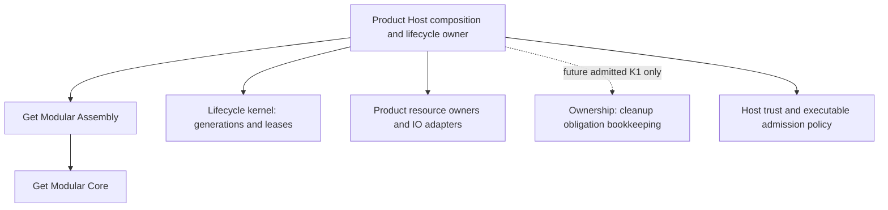

<!-- markdownlint-disable MD001 -->
<!-- cspell:ignoreRegExp /[\u0400-\u04FF]+/gu -->
<!-- cspell:words finalizer TOCTOU thenables -->

# Shared plugin lifecycle kernel: план выделения

Дата: 2026-09-28. Статус на 2026-09-30: **L0, L1, L2a, L2b1,
L2b2a, L2b2b и L2b2c слиты; H13 follow-up PR #9 слит;
L2c0 и L2c1 слиты; G1 P0 слит в GM PR #123, qualification и первый
production consumer ещё открыты. ReviewRouter исключён из scope этой задачи**.
Владелец общего контракта: Get Modular architecture. Первый consumer: существующий
`modularity-host-test`, исключительно TEST. Production adoption и публикация pending.

### Коррекция L3, 2026-09-30 (предложение, ещё не принятый ADR)

На GM `9c722ceff4ede307d06d7a4b63fdebe615f54c53` текущие
`architecture/sdk-growth/profile.yaml` и `qualification-policy.yaml`
перечисляют только Core и Assembly. Пробелы происхождения их релизов 0.1.0
не являются baseline lifecycle-kernel. Однако ADR-0029 §Decision/Delivery
требует S3/G1 до публичного lifecycle-релиза, поэтому
candidate/private guard остаётся до принятия successor ADR. G1 Core/Assembly
остаётся `hold`, порядок ownership K1 не меняется.

Наименьший scope L3 без ReviewRouter - **отдельная квалификация первого
lifecycle-пакета**, без заявления, что исторический G1 пройден. Successor ADR
должен назвать доверенного владельца qualification и конкретный защищённый
release-commit workflow вне контроля candidate. Его retained authenticated
receipt связывает независимо наблюдаемые source commit/tree, закреплённые
toolchain/policy/verifier revision, credential-free build, один удержанный архив
с SHA-256/SRI и установленный disposable consumer. Перед upload проверить те же
receipt, authority и архив; после отдельно разрешённого upload сверить скачанные
registry bytes и повторить consumer check. Версия 0.1.0 пока proposed: npm
readback 2026-09-30 вернул E404, что само по себе не доказывает отсутствие
закрытой/недоступной версии; перед утверждением release identity нужен новый
registry/history readback.
Переиспользовать single-attempt publication/reconciliation из ADR-0019;
добавить аутентифицированный lifecycle mode в candidate admission guard и
rejecting tests. Candidate-authored JSON и зелёный `sdk-growth:check` не дают
полномочий на выпуск. Для публикации нужно отдельное разрешение владельца на
точные version/archive/tags. Предварительная оценка: 1 700-2 900 changed LOC
для решения, profile, qualification, тестов отказа, release adapter и consumer
evidence при наличии подходящего protected runner/attestation механизма.
Сверка GitHub 2026-09-30: у GM нет environment и release workflow; main
защищён ruleset с тремя обязательными CI. Поэтому protected qualification
workflow ещё нужно создать и закрепить отдельно от проверяемого candidate;
оценка остаётся условной. Новый общий authority service не предлагается. До
реализации нужны принятие owner и независимое review этого изменённого scope.

L4 всё ещё требует конкретного продуктового запроса и Host с настоящей
исполняемой границей плагина. Read-only поиск в production sources Orchestrator
`d5c38e7a`, Agent Runtime `c9b8efe4`, Platform `a3ce96e0` и Token `f2609237`
не нашёл действующего dynamic plugin loader.
Orchestrator описывает будущую plugin system, Agent Runtime явно исключает
dynamic plugins из нынешнего passive setup/contained-turn scope. Не объявлять
TEST Host production consumer и не добавлять kernel к статическим жизненным
циклам ради закрытия L4. Продуктовую функцию, trust class, entrypoint и
recovery owner нужно выбрать до реализации.

**Повторная TEST-проверка 2026-09-30.** На чистом `modularity-host-TEST`
`fcc10b2501420aacf9f904e976a4d230d3f02e68` принят offline replay
`evidence/runs/2026-09-30T09-39-44-032Z-90412/evidence.json`: обе exact пары
установлены из архивов, typecheck прошёл, на каждой 164/164 теста, 23 admission
child-сценария и 126 отдельных lifecycle-сценариев. Archive kernel закреплён
за clean source `e0e2290cfcbf8d8300beaa57aee9c8337429d67d` и SHA-256
`c1f047fa0ce7396fa2430b4043524656dfe98dc0f8b5950749af9bf764238c8b`;
код пакета и build tool на текущем GM `9c722cef` от этого source не отличается.
Это завершает доступную сейчас проверку поведения в TEST, не L3 и не L4.
Копирование архива в fake registry без lifecycle release adapter не доказывает
publication/readback contract; такой тест добавлять вместе с L3c, когда он
проверит настоящий release path.

Read-only разбор Agent Runtime `c9b8efe4` показал: ordinary factory создаёт
`provider` вместе с `prepareLaunch`, а process получает именно этот
`prepareLaunch`. Отдельная горячая регистрация provider может смешать
поколения. Если появится реальный caller динамической регистрации, минимальная
единица - целое ordinary Host-поколение с исходным cleanup owner; новая feature
потребует собственного ADR, reviewed CMS pin delta и sandbox/TEST проверки.
Сейчас нет требования менять поколение без пересоздания Host, поэтому L4
Agent Runtime не начинать и не создавать API ради закрытия плана.

Если owner принимает successor, реализация L3 идёт тремя отдельными PR от
актуального GM main:

1. **L3a, решение и отказ по умолчанию:** successor ADR фиксирует только
   lifecycle-first-surface исключение; G1 Core/Assembly и K1 не трогает.
   Добавить отдельный профиль exact source/archive/authority, двухрежимную
   candidate/public admission и негативные fixture на неподписанный receipt,
   чужой source, missing archive и изменение G1. Public mode остаётся закрыт
   до L3b evidence. Примерно 400-700 changed LOC.
2. **L3b, qualification:** защищённый verifier на закреплённом source revision
   независимо читает release commit/tree, собирает один архив без credentials,
   записывает toolchain/policy/verifier и архив в один authenticated receipt,
   затем проверяет установленный архив в новом disposable consumer. Проверки
   отказывают при drift любого поля, подмене workflow или artifact bytes.
   Примерно 800-1 400 changed LOC; до кода проверить доступный механизм
   protected execution и immutable retention.
3. **L3c, публикационный контур:** узкий wrapper существующего ADR-0019 release
   state machine для lifecycle identity, durable intent и readback; CMS/TEST
   pin мигрирует только с reviewed delta и точным evidence. Тестировать lost
   upload/readback/tag outcome на fake registry. Реальный npm upload и tags
   выполняются только после отдельного exact owner authorization. Примерно
   500-800 changed LOC.

Каждый PR должен сохранить candidate TEST claims и запрет public claim до
доказанных фаз. При невозможности независимой protected authority остановиться
на L3a/hold, а не ослаблять обязательную provenance связь.

## 1. Решение и границы обещания

**Рекомендуется выделить сейчас маленький `@get-modular/lifecycle-kernel` в Get
Modular:** синхронные состояния поколения, допуск вызовов и удержание call/custody
lease. Реальные import, разрешения, асинхронная работа, resources, cleanup, retry,
readback и reload orchestration принадлежат Host. Первый результат: работающий
кандидат пакета, проверенный через установленный tarball в TEST Host, с закрытой
публикацией до требуемого admission. Это отдельный контракт, не реализация
`@get-modular/ownership` под другим именем.

Владелец выбрал раннее выделение общей библиотеки. Successor ADR-0029
принят в Get Modular PR #121; L1 candidate package слит в PR #122. Эти
checkpoint не меняют G1 `hold` и не разрешают публичный релиз.

Целевая гарантия полного TEST lifecycle slice **после L2b2a-L2b2c**: после закрытия
admission новый вызов не начинается; после отзыва ранее выданный вызов не
получает нового обычного Host effect; таймаут наблюдателя не освобождает ещё
используемый ресурс; старое поколение не получает полномочия нового. L2a
доказывает только pure kernel и one-shot интеграцию. Replacement/readback
claims требуют L2c. Все гарантии относятся к поддержанным Host-mediated
операциям и exact package/adapter из evidence.

Не обещать перехват произвольного JavaScript, отмену уже совершённого эффекта,
удаление всех native listeners, unload ESM из процесса или защиту от кода,
самостоятельно использующего `process`, filesystem, network и native modules.
Для недоверенного executable необходим отдельный процесс/изоляция Host.

## 2. Закреплённая исходная база

| Источник | Точная идентичность и вывод |
| --- | --- |
| OpenClaw | `5117d94bdf94b2848a3f28b22ce1e3bc28b63e65`; исходники и тесты прочитаны через `git show`, dirty checkout не использован как authority. Тесты в этой задаче не запускались. |
| GM remote main | `d555dfd47d14bf39e30a77737775872cb93ecdbe`, получен через `gh api`; локальный `origin/main` оставался `6b31f20fe3e5fb8324812aa2ee907905751cde71`. Новые документы прочитаны через GitHub contents API по remote ref. |
| GM ADR-0028 | SHA-256 `6edd5c84db53f63525f03df6da21f6b4da284b770cbc727f7a4ed8e170551973`; remote bytes совпали с локальным закреплённым источником. |
| GM ownership `.d.ts` | SHA-256 `b69c3dbfe5f81d3e344cf48ebed07efb6eaf01b93756891a2cddbf97cddca88d`; только C0 declaration evidence, не установленный пакет. |
| CMS | Полные remote bytes: SHA-256 `d5bb71e5a700014f9f0a09b17d1f33d24b30b66c49b273c9fb65584672c51e4f`. |
| Agent Runtime | `c9b8efe485e2736bbaba4e9c47914fe3ac849b8a`. Активный `architecture/get-modular/consumer-profile.json` pin `ac49bb3374946330ec820591f8195a22d2c90900` и retained CMS bytes **совпадают с текущим upstream**. Старый C0 pin-blocker не является текущим блокером. |
| Ownership C0 | `contractRevision=ar-c0-c0dc683e-r3`, `status=frozen-c0-only`; `requiredDistinctScopes=2`, `provenDistinctScopes=1`, recovery owner unreturned-construction debt отсутствует. Это исторически замороженное evidence, не текущий CMS profile. |
| GM G1 | `architecture/sdk-growth/status.json`: `pending`, `activation=hold`, `qualified=false`, все release/authority claims false. Отсутствуют trusted authority transport, привязка PR base/exact candidate, binding выпущенного artifact к source и released observations/custody receipts. |
| TEST Host | [Предыдущий план](https://github.com/agent-teams-ai/modularity-host-test/blob/fcc10b2501420aacf9f904e976a4d230d3f02e68/docs/implementation-plan.md): main `12a17598936448a7a2acb8255901ba9e5cde562c`, accepted synthetic evidence для опубликованной пары Core/Assembly 0.1.0 и отдельно candidate 0.2.0. Это не production scope. |

Текущая сверка на 2026-09-29: GM remote `main` уже `24d6557a1b04b01a3a73c64b1d9a9afd83d89c8f`;
CMS SHA-256 `33b41d5babf0a431c97e8e596a56e6ec1557ba1a0b26d39bf23e13d9a19e1fbd`
совпадает с pin TEST. Таблица выше сохраняет исходный исследовательский baseline.
Agent Runtime remote `c9b8efe` сохраняет более ранний pin `ac49bb33` и bytes
`d5bb71e5`; его принятая passive setup scope не получает автоматически новую
dynamic guidance. До L4 требуется reviewed delta и миграция pin с evidence;
dynamic adoption там остаётся pending.
G1 по-прежнему `hold`: ReviewRouter `62ac1c8d` имеет EF v3 adapter и custody
компоненты, но production composition использует v1 codec; защищённый producer
не подключён к startup, concrete operator auth/approval source и released GM
source-binding receipts не доказаны. Приватный infra-репозиторий фиксирует inactive
candidate, не live activation. L3 требует отдельного bounded owner scope для
этой интеграции; изменение `status.json` не заменяет evidence.
Read-only аудит 2026-09-29 закрепил EF main `6503c8fe`, RR `62ac1c8d`, приватный infra
и GM `24d6557a`: RR Octokit resolver связывает run/head/tree, но
не доверенный PR base/merge-base; Core/Assembly 0.1.0 history не содержит
аутентифицированной связи registry archive с source. Core Actions artifact
10025685624 побайтово совпал с npm tarball, но historical upload custody не
доказана; для Assembly retained build artifact не найден. Эти разные исходы
записаны в плане G1 (workspace-документ, пока не перенесён) и слитом GM PR #123;
`hold` сохраняется. GM pin EF 1.5.1, тогда как
RR v3 adapter использует 1.6.0, а текущий EF source 1.6.1. Это разные exact
subjects; миграция требует проверки опубликованного архива, а не смены числа.

Решение owner от 2026-09-30: ReviewRouter не является нужным consumer или
обязательным integration Host для этой задачи. RR PR #485 закрыт без merge,
его CI отменён. Предыдущие RR/EF/infra исследования остаются историческим
описанием одного возможного G1 пути, но **не backlog реализации lifecycle
kernel**. До выбора реального production dynamic Host не начинать продуктовые
интеграции или переносить RR authority работу в другой репозиторий.
Сверка remote main на 2026-09-30: Get Modular `9c722cef`, TEST Host
`fcc10b25`, Agent Runtime `c9b8efe4`; первый и второй уже содержат принятые
L0-L2c срезы. Исторические SHA выше оставлены как baseline исследования.

Перед L0/каждым implementation PR снова получить remote SHA, сравнить полный CMS
с consumer pin и сохранить reviewed delta. Не следовать движущемуся `main`.
Исходный CMS baseline содержал историческую reciprocal-ссылку на прежний AR pin;
исправить текущую guidance при её плановом обновлении, не менять frozen C0 bytes.

Центральная [early product advantage policy][quality] прочитана: брать из
OpenClaw проверяемые гарантии и успешные защиты, не объявлять сравнительное
превосходство по наличию библиотеки. Её текст здесь не дублируется.

## 3. Что действительно показывает OpenClaw

Все ссылки ниже закреплены на одном OpenClaw commit. Они являются source/test
evidence о реализации; это не результат свежего исполнения тестов и не основание
для побайтового переноса runtime.

| Pattern | Доказанное по исходнику и существующему тесту | Общее правило | Что оставить Host |
| --- | --- | --- | --- |
| Registration rollback | [Resource source][oc-registration] отделяет physical custody, inspection/borrower claims и rollback; cleanup pending удерживается. [Тест][oc-registration-test] ждёт cleanup после failed registration и сохраняет исходную и cleanup ошибки. | Logical unpublish/revoke не равен physical release; failed construction должен иметь достижимого owner. | Формат регистрации, snapshots, какие registrations компенсировать, handler errors, cleanup order. |
| Commands | [Dispatch][oc-command] проверяет exact selection/registry перед и после dynamic import. [Execution lock][oc-command-lock] закрывает новый admission, считает admitted calls и освобождает в `finally`. [Тесты][oc-command-test] задерживают cleanup до завершения команды и покрывают self-clear. | Начать учёт до callback; идентичность поколения проверять после await и перед эффектом; self-retirement не ждёт себя. | Sender/channel policy, команды, transport, async context, error projection. |
| Hooks | [Timeout][oc-hook] сохраняет raw work отдельно от raced observer. [Тест][oc-hook-test] доказывает pending drain после timeout. [Host cleanup][oc-host-hook] ставит session cleanup перед runtime и не пропускает siblings при ошибке. | Timeout не снимает retention; результат observer не доказывает settlement владельца. | Hook policy, error aggregation, deadline, dispatch order, host/session prerequisites. |
| Providers/streams | [Acquisition][oc-provider] сначала закрывает executable views, затем releases; exact retained registry/instance, cached release completion. [Stream test][oc-stream-test] запрещает позднее использование disposed owner; далее отдельно проверяет retained consumers. | Invocation authority и physical custody различны; stream удерживает exact owner до terminal work. | SDK wrappers, iterator/result protocol, provider auth, terminal/return semantics. |
| Services/reload | [Stop][oc-service-stop] удерживает startup/stopping, timeout возвращает pending settlement; [start][oc-service-start] сохраняет raw startup после observer timeout. Тесты покрывают [поздний startup][oc-service-test-late], [failed-start cleanup][oc-service-test-failed] и [fenced routes/events][oc-service-test-fence]. | Один raw cleanup flight; не запускать successor поверх неопределённого stop; поздний результат остаётся owned. | Service lifecycle, 5-секундный budget, health/diagnostics, restart policy и порядок exporters. |
| Cache | [Retention][oc-cache-retain] выдаёт claims точной cache instance; [retirement][oc-cache-retire] публикует completion до выполнения; [native artifacts][oc-cache-native] удерживаются после bounded timeout. [Тесты][oc-cache-test] сохраняют cleanup после закрытия request scope и последнего borrower. | Owner cleanup живёт дольше запроса; reuse cache key не даёт старому owner удалить successor. | Cache key/content rules, native captures, files, process cache, storage и recovery driver. |

Существенные намеренные различия:

- `AsyncWorkScope.beginClose()` переводит OpenClaw в `closing`, но [run/track][oc-work]
  продолжают допуск до `closed`. Наш `quiesce` немедленно отказывает **новым**
  call/custody acquisitions. Удержанная работа продолжает settlement. Не называть
  это универсальным исправлением OpenClaw: там cleanup descendants имеют другой контракт.
- Registration disposers обходятся FIFO ([188-191][oc-registration-order]);
  instance disposers LIFO ([708][oc-instance-order]); session hooks идут первыми.
  Единого общего cleanup order из этого не следует. В kernel его не будет.
- [Self-retirement][oc-self] может вернуть `{errors: []}` раньше финального
  disposal. В новом Host API acknowledgement имеет отдельный тип `requested`;
  `released` возможен лишь после actual cleanup evidence.
- [Native-effect test][oc-native] явно ожидает, что незарегистрированный
  `process.on` listener переживёт disposal. Pre-import rejection нового TEST Host
  сильнее только для заранее отвергнутого executable, но не очищает эффекты
  уже разрешённого произвольного кода.
- [Retained consumer test][oc-stream-test] показывает, что второй удержанный
  consumer в OpenClaw может начать `run()` уже после начала `dispose()` owner.
  Наш первый kernel после `quiesce` не выдаёт новый call lease, после `retire`
  отзывает старый, а custody не даёт invocation authority. Такой переносимый
  сценарий **не поддерживается первой поставкой**; для него потребуется отдельный
  доказанный consumer scope, а не незаметное расширение API.
- Сохраняем существующие успешные protections OpenClaw. Наличие разных owners
  и deadline policies объясняет часть объёма; шесть похожих flow не доказывают,
  что их можно заменить одним универсальным async manager.

## 4. Выбор владельца и формы поставки

| Вариант | Оценка и объём | Решение |
| --- | --- | --- |
| **Отдельный optional `@get-modular/lifecycle-kernel`** | 🎯 9/10 🛡️ 8/10 🧠 5/10. Первый candidate + one-shot TEST (L0-L2a): ~500-750 production, ~620-900 tests, ~440-700 docs/admission LOC. Расширенный TEST lifecycle (L2b/c) дополнительно ~800-1,200 production, ~1,000-1,500 tests, ~270-450 docs LOC. | Рекомендуется. Чистая generation/lease policy полезна Host с borrowed providers, даже если owned cleanup tickets отсутствуют. Не меняет ownership API и не добавляет Core/Assembly зависимости. Цена: отдельный package/admission/version surface и новые Host semantics в поздних slices. |
| Successor расширяет `@get-modular/ownership` | 🎯 6/10 🛡️ 7/10 🧠 7/10. ~900-1,500 production, ~1,200-1,800 tests, ~500-850 docs/gates LOC. | Не выбирать сейчас. Если добавить async driver, нарушается sync/no-callback contract; если добавить только generation/lease, смешиваются cleanup obligation и invocation authority. Потребуется явная замена callable freeze и K1 scope/eligibility, всё равно остаются Host adapters. |
| Host-owned implementation + conformance; временный repo-internal module | 🎯 7/10 🛡️ 7/10 🧠 4/10. ~500-850 production, ~700-1,050 tests, ~300-500 docs/gates LOC сейчас; позже ещё ~350-650 LOC упаковки/миграции. | Хорош для неповторяющейся orchestration. Для доказанных generation/lease invariants откладывает requested extraction и допускает расходящиеся копии. Internal module в GM не даёт consumer поддержанного import; deep import или фиктивный private export проблему не решает. |

Почему GM: здесь уже владелец product-neutral composition и optional local
bookkeeping; новый kernel остаётся чистой policy library. XF сохраняет extension
trust/capability contracts; EF сохраняет checker/qualification tooling; AR сохраняет
process/provider supervision. Library не должна зависеть от этих consumers.
Новый ADR добавляет ровно один package root и один feature, не общий plugin SPI.



Core/Assembly не импортируют kernel. Kernel не импортирует Core, Assembly,
ownership, XF, EF, Node, provider SDK, product types. Никаких runtime dependencies,
clock, Promise, callbacks, timers, AbortController, filesystem или ambient registry.
Каждый Host создаёт свой kernel; graph declaration и kernel generation не имеют
общего nominal identity. Domain/application consumers получают узкие порты Host,
а не kernel, registry или DI-container.

## 5. Три независимых вида идентичности

| Понятие | Владелец и срок | Не означает |
| --- | --- | --- |
| Module declaration / Core implementation ID | Инертный compile-time/configuration объект, выбранный Host; может повторно строиться. | Ни executable instance, ни grant, ни ownership. |
| Executable generation | Opaque runtime identity, minted kernel; Host связывает её с проверенным artifact digest, configuration snapshot и instance. Новая загрузка получает новую identity даже при том же plugin ID и тех же bytes. | Ни digest string, ни номер версии, ни право import. |
| Lease | Opaque membership identity конкретного kernel/generation. `call` удерживает admitted execution; `custody` удерживает lifetime для pending acquisition/stream/borrower. | Ни cleanup ticket, ни permission пользователя, ни физическая resource handle. |

Host не заменяет generation identity сравнением строк plugin ID/path/cache key.
Diagnostic sequence number создаётся Host и не принимает участие в authorization.
Forgery через копию объекта, spread, prototype, symbol или token другого kernel
отвергается runtime membership, даже если TypeScript обойдён.

## 6. Точный candidate API

Это предлагаемый contract для L0, не изменение ADR-0028 `.d.ts`. Финальные
declarations находятся в одном новом owning contract и производятся пакетом;
consumer не копирует их. Private brands различают идентичности и на уровне типов,
и runtime membership остаётся обязательной защитой при обходе TypeScript.

```ts
type Phase = "staged" | "active" | "quiescing" | "retiring" | "retired";
declare const generationBrand: unique symbol;
declare const callLeaseBrand: unique symbol;
declare const custodyLeaseBrand: unique symbol;
interface Generation { readonly [generationBrand]: true }
interface CallLease { readonly [callLeaseBrand]: true }
interface CustodyLease { readonly [custodyLeaseBrand]: true }
type Lease = CallLease | CustodyLease;
type Refusal = "foreign-generation" | "foreign-lease" | "wrong-lease-kind"
  | "invalid-phase" | "admission-closed" | "revoked" | "released-lease"
  | "retained-work";
type Result<T> = { readonly ok: true; readonly value: T }
  | { readonly ok: false; readonly reason: Refusal };
interface GenerationSnapshot {
  readonly phase: Phase;
  readonly calls: number;
  readonly custody: number;
}
interface LifecycleKernel {
  stage(): Generation;
  activate(generation: Generation): Result<"active">;
  quiesce(generation: Generation): Result<"quiescing">;
  resume(generation: Generation): Result<"active">;
  retire(generation: Generation): Result<"retiring" | "retired">;
  beginCall(generation: Generation): Result<CallLease>;
  retainCustody(generation: Generation): Result<CustodyLease>;
  checkCall(lease: CallLease): Result<"admitted">;
  release(lease: Lease): Result<"released" | "already-released">;
  finishRetirement(generation: Generation): Result<"retired">;
  snapshot(generation: Generation): Result<GenerationSnapshot>;
}
declare function createLifecycleKernel(): LifecycleKernel;
```

Все операции synchronous, atomic относительно одного JS execution agent, не
вызывают consumer code. Нет guarantee thread/process synchronization. Snapshot
fresh/frozen, без handles, callbacks, raw errors и permissions. Внутренние WeakMap
membership records сохраняют terminal validity, пока вызывающий держит identity;
kernel не содержит глобального сильного списка retired generations.

`retired` означает завершение **kernel bookkeeping**. Kernel не видит physical
cleanup и не способен выдать его receipt. Host обязан вызывать `finishRetirement`
только после подтверждения своих obligations; наружный статус `released`
вычисляется Host из обоих фактов. Отдельно запрещён import runtime из type-only
fixtures, который прячет лишнюю публичную поверхность.
Compile-negative fixtures обязаны отвергать `checkCall(custodyLease)` и передачу
`Generation` вместо `Lease`, помимо runtime-тестов forged/cross-kernel objects.

### 6.1 Transition table

| Operation | Разрешённое before | After / правило |
| --- | --- | --- |
| `stage` | Новый owner | `staged`, counts 0; executable ещё не загружен. |
| `activate` | `staged` | `active`; readiness и atomic routing commit доказаны Host. Repeated activate - `invalid-phase`. |
| `beginCall` | `active` | Fresh held call lease; increment до callback. Во всех остальных фазах `admission-closed`. |
| `retainCustody` | `staged`, `active` | Fresh custody lease; для staging acquisition выдаётся до import/start/await. В closing фазах отказ. |
| `quiesce` | `active`, `quiescing` | `quiescing`, закрывает новые lease; existing held calls ещё могут завершать уже начатую работу. Идемпотентен. |
| `resume` | `quiescing` | `active` только для rollback до irrevocable retirement; существующие leases сохраняются. |
| `retire` | Любая нетерминальная | `retiring` **синхронно**, existing call authority отозвана; counts не изменяются. `retiring/retired` идемпотентны. |
| `checkCall` | Held call lease, generation `active/quiescing` | `admitted`; это только local lifetime authority. Custody lease не даёт invocation. |
| `release` | Любая фаза, held lease | Decrement ровно один раз; repeated release возвращает `already-released`, не изменяет counts. Можно release после revoke. |
| `finishRetirement` | `retiring`, оба counts = 0 | `retired`; с удержанием `retained-work`; repeated retired success. |
| `snapshot` | Любая валидная generation | Immutable inert facts, без transitions. |

Порядок отказов фиксирован: foreign membership раньше phase; для `checkCall`
foreign, затем wrong kind, затем released, затем revoked. Refusal не меняет state.
`resume` после `retire` невозможен: новая попытка требует новую generation.
Нет implicit auto-release из timer, GC finalizer, abort, failed observer или
exception thrown после запуска resource acquisition.
Новое acquisition после `quiesce` запрещено даже внутри уже принятого вызова:
Host должен получить custody lease **до** начала каждого возможного позднего
acquisition. Существующий call lease сохраняет право завершить работу, но не
обходит закрытый admission новых ресурсов.

### 6.2 Kernel vs будущий ownership K1

| Единственный источник факта | Хранит | Никогда не дублировать |
| --- | --- | --- |
| Lifecycle kernel | Generation phase, held call/custody leases, counts. | Host `closed`/`active` флаги, independently editable refcount или другой transition reducer для того же поколения. |
| Effect owner / Host сейчас | Resource values, disposer/raw flight, partial acquisitions, action-specific result и readback, fixed prerequisites. | Новый Host-local clone `reserve/fulfill/transfer/beginCleanup/settleCleanup` из ADR-0028. |
| Ownership K1, только после admission | Pending/owned/transferred/released cleanup obligation, attempt claims и refinement по ADR-0028. | Второй общий resource ledger в kernel/Host. После K1 effect owner хранит payload/raw causes по ticket, а не вторую ownership phase. |

Один resource может иметь один owned ticket и много custody leases от borrowers;
один call может не владеть ни одним ресурсом. Release lease не вызывает disposer
и не переводит ticket в `released`. Borrowed pool не получает owned ticket и не
закрывается Host. Эта семантическая независимость оправдывает отдельные пакеты;
их admission flags относятся к разным scope, а не к двум копиям одного состояния.

## 7. Host contract и алгоритмы

Первая интеграция меняет только TEST Host. На закреплённом `12a1759` он имеет
one-shot `OwnedResource`, construction ticket, operations и один `close`; там
**нет** stream, retry/readback driver, replacement/cache или bounded inventory.
L2a сохраняет уже доказанный one-shot cleanup и вводит kernel generation/leases;
L2b/L2c ниже добавляют новые Host semantics отдельными проверяемыми slices.
Вспомогательные функции adapter не являются новыми graph nodes. Это не общий
экспортируемый plugin runtime.

### 7.1 Pre-import boundary

1. Снять инертный bounded inventory всего выбранного graph: declarations,
   dependencies, artifact IDs/digests, requested capabilities. Не выполнять
   plugin getters, `register()`, module evaluation или plugin-provided resolver.
2. Host проверяет полную selected closure, tenant/subject/grants, supported
   artifact policy и frozen mapping ID -> trusted literal loader. Metadata не
   выбирает путь `import()` самостоятельно. Core compile проходит на metadata.
3. Создать и сильно удержать construction-attempt owner **до первого import**,
   `stage()` и заранее `retainCustody()` для acquisition. Grant/readiness policy
   находится в Host, kernel не принимает verdict за сертификат безопасности.
4. После каждого async admission/artifact lookup повторно проверить Host live
   authority. Проверить exact bytes/executable dependency closure перед eval;
   use captured immutable bundle либо Host TOCTOU protection. Изменившиеся bytes
   требуют новой попытки. Только после graph-wide успеха вызвать loaders.
5. Сначала вызвать `Assembly.prepare` с инертными literal Host wrappers: это
   проверяет plan/handles, но не вызывает plugin import/factory. Для начального
   старта после этого разрешён `prepared.run`; для exclusive replacement только
   после old stop barrier из §7.5. Host factories регистрируют отдельно
   освобождаемые allocations немедленно, до следующего await/throw.
   `prepared.run` сохраняет собственный current-Promise/handoff contract;
   kernel не меняет Promise assimilation rules Assembly.
6. Проверить products/readiness, подготовить закрытый routing carrier. Последний
   live check, kernel `activate` и смена Host routing pointer выполняются в одном
   синхронном trusted commit, без await/getter/logging/callback. Все fallible
   проверки/allocations выполнить заранее. До commit ни один callable не published.

Preparation error даёт zero executable-import/factory counters для всей graph,
включая «первый node валиден, последний denied». Rejection после разрешённого
import не обещает отсутствие top-level effects; их custody у named factory/Host.

### 7.2 Invocation, late await и streams

- Public wrapper привязан к точной generation. `beginCall` выполняется до
  invocation; Host хранит raw promise и generation в owner-local call record.
  `finally` освобождает call lease после **raw** settlement, не после observer race.
- Каждый **обычный plugin-initiated** Host-mediated effect проверяет `checkCall`
  и актуальные subject/grant facts непосредственно перед irreversible admission.
  После await повторить проверки; проверка только на входе не защищает позднюю
  continuation. Это не путь для cleanup: его authority остаётся приватной у
  Host owner, не передаётся plugin и действует только на уже удержанные
  cleanup obligations после revoke.
- Резервировать отдельную custody до каждого provider/stream acquisition.
  Возвращённый поздно resource сохранить у owner, затем проверить lifetime;
  если revoked, не отдавать public view, выполнить разрешённый cleanup через
  приватную Host authority по тому же owner. `quiesce` не разрешает начинать
  новое acquisition даже внутри ранее принятого call. Если acquisition отвергся
  после возможного внешнего эффекта и handle не вернулся, outcome `unknown`:
  сохраняется attempt/readback owner, а не выдумывается отсутствие ресурса.
- Для stream call lease живёт через чтение/`result()` до terminal settlement.
  Custody хранит resource между входным acquire и завершением consumer cleanup.
  Idle retained stream не получает новую call authority после quiesce. Уже
  начатый вызов при quiesce может закончить; retire закрывает его новые эффекты.
  Iterator `return()`/cancel - Host protocol, не автоматический признак release.
  При retirement Host сам начинает закрытие idle consumer через приватную
  authority, потому что ожидание его custody **до** close создало бы цикл.
  Для простого `retainStream().run()` занятый consumer закрывается после
  settlement собственных уже принятых raw calls: иначе callback может
  использовать физический ресурс после `close`. Это правило не переносится
  механически на terminal `next/result`, где `close` служит shutdown protocol.
- Клиент не получает raw provider, generation administration или generic kernel
  reference. Неподдерживаемые getter/thenable/native output shapes отклоняются
  Host adapter до publication; не строить общий Proxy/membrane framework.
  Если callback уже вернул native Promise, а его `Symbol.species` бросает до
  установки trusted observer, Host может удержать lease/debt, но не может
  гарантировать process survival при позднем unhandled rejection. L2a TEST
  фиксирует это как исключённый output shape, а не как доказанную обработку.
  Для произвольного plugin code до production adoption нужен Host-owned
  completion channel с доверенным producer либо изоляция исполнения.

**H04 TEST terminal slice после L2b1.** Host хранит private `StreamRecord` с
точной generation, custody, уже начатыми raw `next/result/return` tickets и
одним close flight. Public TEST view даёт только `next`, явный `result`,
`return`/`cancel` и async iterator identity. Каждый `next` и каждый явный
`result` получает call lease до callback и освобождает его после собственного
raw settlement; `result` не вызывается автоматически и не кешируется. `{done:
true}` заканчивает итерацию, но не доказывает physical consumer close. Новый
обычный вызов после close/revoke отклоняется до callback.

`return`/`cancel`/Host retirement синхронно публикуют один close flight и
начинают private consumer close до ожидания pending `next`. Если итерация
началась и ещё не завершилась, captured iterator `return` запускается один
раз. Его ранний acknowledgement не освобождает custody: требуются успешный
consumer close, поддержанный `return(done:true)` и settlement всех уже начатых
`next/result/return`. Если `result` никогда не был вызван, ожидать его нечего;
idle/iterator-only consumer завершает явный close либо retirement. Ошибка
close/return сохраняет debt и блокирует зависимый owned disposer, успешные
siblings завершаются. Late `done:false` после revoke не публикует payload.
Отдельный `cancel`/`return` отзывает effect authority уже начатых вызовов этого
stream даже при active Host; raw lease при этом остаётся до settlement.
Результат native `return` проверяется до любой Promise assimilation, чтобы
thenable в acknowledgement не подменил `done:false`.
Этот TEST protocol исключает произвольные getters/thenables, генератор с
`return(done:false)`, `throw()` и общую Proxy-оболочку. H06 cohort и H13
inventory остаются отдельными slices; kernel API не меняется.

### 7.3 Retirement и собственная команда reload

Host API раздельный: `requestRetirement(g) -> {kind:"requested", operationId}`,
`observeRetirement(operationId, waitOptions) -> observation`,
`readRetirement(operationId) -> current facts`. Operation ID - диагностика,
не credential; route проверяет caller authorization.

1. Синхронно создать retained retirement record с joinable deferred raw flight
   **до любых cleanup/abort callbacks**, затем вызвать `retire` для всех views
   affected cohort и закрыть public routing. Только после этого сигнализировать
   abort, иначе reentrant callback может войти в ещё открытую sibling view.
2. Запустить под **приватной Host cleanup authority** разрешённые cancel/close
   для idle streams, активных consumers и pending startup. Этот путь видит лишь
   конкретные уже owned obligations, не создаёт новую обычную plugin invocation,
   не вызывает `checkCall` и не доступен из plugin API. Acquisition, начатое до
   revoke, сохраняет custody до handoff/cleanup; новое после revoke запрещено.
3. Для каждого resource выполнить его фиксированные prerequisites: raw work
   settlement, consumer close и physical disposer в порядке, который требует
   этот ресурс. **Нет общего ожидания custody=0 до запуска cleanup:** consumer
   close/physical release сами снимают соответствующую custody. Wrapper Host
   после каждого `release` синхронно пробуждает retained driver; kernel не
   хранит callback. Независимые siblings продолжают cleanup при ошибке, dependent
   action ждёт доказанного prerequisite. Ни FIFO, ни LIFO не выводятся из Core.
   Для TEST: revoke views -> начать private stream close -> settle raw work ->
   release owned resource -> dispose capture, с документированными зависимостями.
4. После подтверждения physical obligations и обоих counts=0 вызвать
   `finishRetirement`; записать terminal facts **до** разрешения observers.
   При unresolved debt record остаётся у recovery owner, `released` не
   возвращается. Observer timeout не меняет этот raw flight.

Команда, вызвавшая своё retirement, получает только `requested` и возвращается;
последний raw completion даёт owner продолжить cleanup. Plugin API не предоставляет
ожидание собственного drain. Trusted Host observer получает `self-wait`
**до await**, если его текущий invocation lease входит в affected cohort, либо
он выполняется внутри cleanup callback/driver той же operation. Это запрещает
цикл `driver -> disposer -> observe(driver)` и self-join через другое поколение
cohort. Host передаёт этот provenance через свой scoped async context или явный
внутренний callback context; kernel не хранит ambient context и не дублирует
phase/counters. Для вложенных вызовов сохранять цепочку активных ancestor frames
и точную identity operation object: проверка только верхнего frame или строкового
operation ID пропускает self-join через вложенный observer и повторно
использованный ID. Завершённый frame теряет запрет после raw settlement;
detached continuation с уже завершённым raw call может наблюдать retained
operation. H06/H09 отдельно проверяет оба порядка nested same-turn callback.

### 7.4 Timeout, cleanup failure и recovery

| Событие | Изменяется | Сохраняется / следующий шаг |
| --- | --- | --- |
| Observer deadline/cancel | Только observer получает `incomplete`/`cancelled`; detach timer/listener. | Raw flight, leases, resources, action outcome, owner. Повторное observe присоединяется, не вызывает stop снова. |
| Raw success после timeout | Owner фиксирует success, освобождает lease; released только при полном cleanup. | Receipt доступен позднему read/observe в пределах явного retention contract ниже. Ранний timeout-result не переписывается задним числом. |
| Raw failure после timeout | Action-specific failure и исходная cause фиксируются до observers. | Нет automatic replay. Readback может доказать release или retry-safe. |
| Stop outcome unknown | Debt `unresolved`; dependent cleanup и successor для эксклюзивного resource остановлены. | Exact action/attempt identity и resource retained. Не считать exception доказательством, что эффекта не было. |
| Owner доказывает retry-safe | Один explicit retry только данного failed action, с новым attempt identity. | Уже successful actions не повторяются; concurrent retries получают один raw flight. |
| Readback доказывает release | Refine тот же unresolved attempt, без повторного физического действия. | Старая claim/attempt не может переписать новую. До K1 эти факты принадлежат effect owner; не вводить generic ticket API. |
| Failed construction, handle не вернулся | Original cause primary; cleanup/debt отдельно. | Retained attempt owner уже достижим через Host operation handle; одной Promise closure/error недостаточно. |

Wait budgets выбирает Host по конкретной операции. Kernel не задаёт 5/30 секунд.
В TEST использовать управляемые часы/deferred. Один owner observer cohort имеет
один deadline, поздний join не продлевает его; после timeout новая явная cohort
получает новый budget, всё ещё наблюдает исходный raw flight. Уже записанный
полный success выигрывает совпавший deadline; неполное состояние возвращает
`incomplete`. Детерминированно проверить оба порядка same-turn settlement.

Recovery owner в TEST - harness-held `TestRecoveryOwner`, создаваемый до
construction; он выдаёт operation ID и удерживает конкретный `TestHost` до
physical completion. Его `close/read/observe` достижимы после construction
failure или потери returned handle. Это **новое расширение** нынешнего one-shot
Host, а не уже доказанная возможность. Начальная capacity: не более 64
unresolved construction attempts/generations. Один generation занимает один
slot на весь lifetime; H06 cohort из нескольких generations не превращает их
задним числом в один slot и не требует нового slot для retirement. Slot
резервируется **до** construction,
import и acquisition, поэтому последующий cleanup уже принятого obligation
никогда не получает отказ из-за переполненного inventory. Пока debt/unknown
остаётся, operation занимает slot даже после settlement текущего Promise;
`cleanup-incomplete` является результатом текущего cleanup flight, но не
terminal inventory receipt и slot не освобождает;
новая операция получает явный отказ до какого-либо executable effect. После
полного physical
completion Host удаляет raw promises, resource payloads, callback closures и
raw causes из owner-held graph, включая успешно закрытых siblings в cohort с
оставшимся debt, оставляя только инертный terminal receipt:
operation ID, outcome code и безопасный cause summary. Хранятся последние 256
terminal receipts в порядке завершения; старые вытесняются детерминированно.
`read/observe` для неизвестного или вытесненного ID возвращает
`unknown-or-expired`, никогда ложный `released`. Это не durable audit log:
потребитель, которому нужен долговременный receipt, сохраняет его сам.
Post-terminal `close` сохраняет идемпотентный outcome без постоянного удержания
старого raw flight и construction payload; до terminal все concurrent callers
получают одну исходную flight. Проверить capacity/eviction без assertions о GC.
Kernel capacity не изобретает;
process crash и durable recovery не покрыты.

**AR сегодня такого construction recovery owner не доказал.** Переименование
error, добавление detached `.catch()` или новый generic registry не исправляют
этот C0 blocker. Перенос ядра в AR потребует реального lifecycle owner/use case
из §10, а не присвоения TEST claims production профилю.

### 7.5 Replacement и cache

**L2c делится на два TEST PR.** Варианты оценены по уверенности/надёжности/
сложности (чем больше сложность, тем тяжелее реализация): два PR
🎯 9/10 🛡️ 9/10 🧠 5/10, примерно 650-950 и 950-1350 changed LOC;
один PR 🎯 8/10 🛡️ 8/10 🧠 7/10, примерно 1600-2300 LOC;
три PR 🎯 8/10 🛡️ 9/10 🧠 6/10, примерно 350-500, 400-600 и
950-1350 LOC. Два PR дают самостоятельный физический stop barrier перед
необратимым route replacement без третьего промежуточного gate.
Текущий `TestHost.construct()` сразу публикует
root, а `driveRetirement()` при ошибке завершает исходный close flight с
`cleanup-incomplete`. Простая обёртка не способна отложить публикацию и позже
уточнить уже завершённый flight. H06/H09 и H13 доказаны в TEST main; kernel API
не меняется. Ни один PR не заявляет durable recovery или arbitrary JS isolation.

**L2c0: staged construction и exclusive stop barrier.** Host добавляет
`constructStaged(run, rootOf) -> {status: "constructed", token} | inert-failed | cancelled`
и `activateConstructed(token) -> published | activation-refused`; прежний
`construct()` остаётся convenience path с тем же поведением. Token номинально
связан с точными Host и generation и не раскрывает callable root. До activation
Host может приобретать приватные ресурсы, но не публикует route, root или effect
view. Извлечение root/readiness завершается до выдачи token. Raw Assembly
outcome, `created` и callable root остаются только у Host; staged failure
возвращает инертный code/summary без `raw`. Старый `construct()` сохраняет
свой прежний outcome shape для совместимости. L2c0 вводит минимальный
trusted live-authority port, установленный Host до stage, а не вердикт caller в
аргументе activation. `activateConstructed` синхронно читает текущие grants
из этого порта и проверяет Host, token и generation authority. Отзыв между
stage и activate даёт отказ. Порт Host-owned, не plugin callback; между
проверкой и commit нет `await`, plugin getter или callback. Повторный/чужой
token получает отказ.
`close()` между stage и activate отзывает token и очищает уже acquired resource.
H13 inventory различает `constructed` и `published`, сохраняя один slot на
generation. Все прежние one-shot/stream outcomes сохраняются.

Отдельный Host-owned `ExclusiveStopRecord` получает только доверенные
`StopPorts`: `stop(attemptId)` и `readback(attemptId)` с ответом `released`,
`retry-safe` или `unknown`. Возвращаемый `resource.dispose()` является **одним
физическим completion Promise**: raw stop rejection сохраняет action failure,
но Promise остаётся pending, пока readback не докажет release или единственный
явный retry не завершится подтверждённым release. Поэтому исходный Host close
flight и H13 slot остаются retained; завершённые sibling resources могут быть
скомпактированы. Caller не поставляет собственное доказательство release.
Readback допустим после settlement raw stop; `released` разрешает тот же attempt
без повтора действия, `retry-safe` допускает только один новый attempt
(первоначальный плюс один retry), `unknown` удерживает debt. Late readback
прежнего attempt не меняет новый. Одновременные reconcile/retry присоединяются
к одному действию; operation/attempt и flight публикуются до callbacks.
Обычный disposer, который отверг Promise, сохраняет прежний terminal
`cleanup-incomplete`: новая pending semantics относится только к явному
exclusive stop record. Self-wait из cleanup и active affected ancestors
отвергается до waiter enrollment, detached inactive observer допускается.

L2c0 exit: staged root недоступен до activation, включая failure receipt;
отзыв grant между stage и activate отказывает; close между stage/activate
освобождает ресурс; чужой/повторный token отвергнут; stop rejection удерживает
тот же H13 slot; readback release завершает **исходный** Host close; retry не
повторяет успешных siblings; stale readback и callback self-wait безопасны.
Тесты используют управляемые deferred и отдельный счётчик физических stop.
L2c0 не содержит route/cache/replacement или rollback claims.

**L2c1: один `ReplacementSlot` для synthetic exclusive resource.** Slot владеет
route pointer, одной активной operation и инертным cache blueprint; H13 владеет
generation slots, `ExclusiveStopRecord` - physical stop, kernel - фазами и
leases. До old retire Host резервирует H13 slot candidate; при capacity refusal
старый route остаётся доступен. Каждый ранний preflight отказ закрывает этот
ещё не использованный Host до terminal operation receipt, освобождая H13 slot;
если cleanup неожиданно остаётся unknown, receipt честно сообщает debt и
удерживает slot. Operation и raw flight публикуются до callbacks;
вторая request получает `busy`. API: `requestReplacement(candidateId)` даёт
`requested | busy | capacity-refused`; `readReplacement` и
`observeReplacement` используют отдельную identity operation; trusted
`reconcileStop`/`retryStop` уточняют захваченный stop record. Неизвестный или
вытесненный ID возвращает `unknown-or-expired`; хранить не более 256 инертных
terminal replacement receipts. Наблюдательский timeout не завершает operation.

До остановки old допустимы только полный **инертный** inventory/admission,
Core compile и Assembly prepare с generation-specific lazy bindings. Сейчас
`runAdmission` объединяет prepare/construct/finally-close и делает snapshot
grants; для L2c1 требуется явный Host split с L2c0 live authority port и exact
immutable TEST artifact/loader closure. Не переиспользовать prepared Assembly
handle, связанный с прежним Host. Candidate loader/import/factory/acquisition
не вызываются до physical stop: top-level evaluation может захватить ресурс.
Последовательность: reserve -> inert preflight -> old retire/H06 cohort drain ->
подтверждённый stop -> повторная проверка **всего** selected set, текущих grants,
artifact и loader identity -> `constructStaged(signal => prepared.run({ signal }),
rootOf)`, который создаёт ticket/custody до первого factory ->
readiness -> свежая permissions check -> единый синхронный
`activateConstructed`/route/cache commit. Нет `await`, getter или callback
между activation и сменой pointer. Stop-before-start допускает перерыв, но
число одновременных физических owner не превышает одного. Unknown stop
запрещает даже candidate import. Во время async construction Host проверяет
live grants и captured exact loader mapping **перед каждым loader**, после
его settlement **до factory**, затем перед acquisition и каждым Host effect.
Если первый loader ждёт, а grant следующего node отозван, следующий loader
не вызывается. Поздний loader result остаётся owned для cleanup, но не
публикуется после revoke.

Cache содержит только immutable inert facts/blueprint, не executable handle и
не прежний Assembly prepared object. Key охватывает exact selected graph,
artifact closure и trusted loader identity; удаление compare-by-exact-value.
Eviction выключает lookup, а удержанные bytes/resources освобождаются их
physical owner. В TEST exact artifact задаётся immutable fixture set; нельзя
объявлять произвольный mutable filesystem подтверждённым. Invalidated cache
не запускает import сам.

После old retire его generation не возрождается. При candidate failure Host
сначала завершает physical cleanup candidate; только затем резервирует новый
H13 generation slot и выполняет свежую admission прежнего **точного** artifact
для rollback. Unknown candidate cleanup блокирует rollback. Capacity refusal,
изменённые grants/artifact или rollback failure оставляют route пустым и
возвращают явный outcome. Ни автоматического бесконечного retry, ни borrowed
predecessor disposal. До old retire отказ inert preflight оставляет прежний
route и resources без изменений.

L2c1 exit: denied последний node не исполняет candidate loader; pending/unknown
stop сохраняет нулевые candidate counters; изменение grants/artifact/loader во
время stop отвергается перед import; отзыв во время первого loader блокирует
следующий; более 64 последовательных ранних отказов не занимают H13 slots;
concurrent/reentrant requests дают один
flight; stale readback/retry и timeout не меняют старый receipt; fresh rollback
держит physical owners <= 1 и старые refs отозванными; старый cleanup не
удаляет новый cache value. Отдельно проверить H13 capacity/debt/receipt eviction,
nested self-wait и deadline races. Независимый oracle считает imports, factory,
acquire, physical stop, effects и route. Exact candidate tarball и обе pinned
Core/Assembly пары проходят source-bound replay; обновить TEST profile,
CMS pin при delta, enforcement и evidence без изменения GM kernel surface.

## 8. Обязательные acceptance cases

Не писать тест на каждую функцию и слой. В таблице указана поломка, которая делает
тест красным; oracle authored независимо от production reducer. Новый контракт
не выдавать за исправление существующего TEST поведения: если оно уже безопасно,
сохранить regression и применить целевой mutant на candidate implementation.

| ID / ближайшая граница | Наблюдаемый сценарий и ожидаемый отказ/результат | Что ломается в неправильной реализации |
| --- | --- | --- |
| K01 package | Forged, copied, cross-kernel tokens; release дважды; stale old generation. | Structural identity или negative/refcount mutation. |
| K02 package | `quiesce` отказывает new call/custody; held call допускается; `retire` отзывает held call; release остаётся возможным. | Общий `closed` flag смешивает admission, execution и retention. |
| K03 package | `retire` с held call/stream, `finishRetirement` refused до release; resume retired denied. | Timeout/phase автоматически снимают retention или восстанавливают authority. |
| H01 installed TEST | Поздний denied node во всей selected graph; counter top-level import/factory = 0. | Incremental load-before-admission или trust из plugin metadata. |
| H02 installed TEST | Controlled await, revoke, затем effect sink; effect counter не увеличивается. | Check только перед первым await. |
| H03 installed TEST | Acquisition начал выделение, revoke, late returned resource; public view absent, owned cleanup once. | Late result потерян/опубликован, reject ошибочно означает empty. |
| H04 installed TEST | Один raw command + idle stream, retire; private close начинается **до** ожидания custody, обычный effect после revoke denied; owned disposer один раз после terminal settlement, не по observer timeout. | Цикл custody -> cleanup, effect через отозванный call, release у raced Promise или iterator done без consumer cleanup. |
| H05 Host | Self-retirement возвращает requested; handler заканчивается; external observer позже видит actual released. | Self-deadlock или ранний fake cleanup success. |
| H06 Host | Synchronous reentry и concurrent observers видят один published raw flight; awaited observe из disposer и из другой generation того же cohort получает `self-wait`. | Promise присвоен после callback, stop запускается дважды или driver ждёт сам себя. |
| H07 Host | Timeout, поздний reject, readback/retry-safe; successful sibling не повторён, unknown action не replayed. | Потерянные ошибки, blanket retry, stale attempt пишет в новый. |
| H08 Host | Failed registration/construction + cleanup failure; operation handle остаётся reachable, original cause сохранена. | Recovery только через потерянную Promise closure/error. |
| H09 Host | Abort listener входит в sibling cohort; все admissions уже закрыты. | Revoke/abort чередуются, callback проскальзывает в sibling. |
| H10 Host | Borrowed pool/provider не dispose; shared owned resource через две capabilities dispose once. | Cleanup по значению capability/graph node вместо effect owner. |
| H11 Host | Old stop unknown: candidate import/factory/acquire/start counters = 0; после подтверждённого stop start допустим только при свежих grants. Grant отозван во время pending old stop: после settlement candidate import/factory/acquire/start остаются 0. Old cleanup под reused cache key не удаляет новый value. | Candidate захватывает эксклюзивный resource до stop, выполняет loader со stale grant или старое поколение удаляет successor. |
| H12 Host | Fixed dependency cleanup: prerequisite unknown удерживает dependent; unrelated sibling может cleanup; success/deadline в обоих порядках. | Универсальный LIFO, ложное success на deadline boundary. |
| H13 Host | 64 unresolved entries блокируют новое admission без удаления debt; 257-й terminal receipt вытесняет самый ранний, raw payload очищен, read старого ID даёт `unknown-or-expired`. | Capacity теряет cleanup obligation, terminal retention течёт бесконечно или read ложно подтверждает release. |
| H14 Host | Staged token не раскрывает root/raw outcome; чужой/double token, отозванный grant и close до activation запрещают publication, а физический cleanup сохраняется. | Callable root утекает до commit или stale stage активируется после revoke. |
| H15 Host | Более 64 последовательных denied replacements не исчерпывают H13 capacity; grant, отозванный пока первый loader ждёт, не допускает следующий loader/factory. | Ранний отказ течёт slot или проверка разрешений выполняется только до первого `await`. |
| A01 admission | Новый root, forbidden type/runtime import, deep subpath, nested manifest, unsupported export condition, package install script. | Package появился вне source inventory или API observer coverage. |
| A02 evidence | Drifted CMS, missing/no-op command, altered archive, candidate claims release while G1 hold. | Docs/private flag/кандидат сам сертифицирует public readiness. |

K01-K03 работают на exact packed public root и TypeScript supported/minimum
fixtures; не нужны их копии в каждом adapter suite. H01-H04 проходят реальные
public `prepared.run`/typed factories там, где construction должен существовать.
Для H01 отказ допустим до `run`, но нельзя подменить всю проверку тестом одной
условной функции. H05-H13 - ближайший Host boundary с контролируемыми promises.

Для bug fix сначала показать красный прежний код, где это применимо. Для нового
контракта записать fail-on-mutant evidence: пропуск admission fence, release на
observer timeout, keyed-only generation lookup, raw flight publish после callback.
Не генерировать expected trace из той же state table/reducer, которую проверяем.

## 9. Admission, CMS и порядок решений

**ADR-0028 не редактировать и не выдавать за разрешение lifecycle package.**
Сохранить его callable freeze, hashes и исторические C0 records. Отдельный
successor ADR с новым номером по актуальному decision registry должен:

1. Добавить `packages/lifecycle-kernel`, owner, root-only surface и запреты §4;
   зафиксировать API §6 и различие с ownership. Разрешить substantive candidate
   implementation + TEST tarball consumption до G1, если это ограниченное
   исключение явно принято owner. Это конкретный delta, не blanket waiver.
2. Назвать точные production/development roots, first-source/package admission,
   blocking checks и classification. `private: true`, unpublished или `0.0.0`
   не исключают source/SDK requirements. Пока allowlist запрещает root, L1 не
   начинается; сначала L0 меняет эту owning authority и rejecting checks.
3. **Сохранить S3 -> G1 -> K1** для ownership. C0 two-production-scope condition
   остаётся условием K1/A1. OpenClaw и два TEST adapters его не выполняют.
   Новый candidate lane называется L1/L2a-L2c, а не K1/A1. Никакого скрытого AR-local
   duplicate ownership coordinator при остановленном K1.
4. Разделить `candidate-source-admitted`, `candidate-tests-passed`,
   `public-surface-qualified`, `published`, `consumer-adopted`. Даже successful
   source gates и tarball evidence не переводят G1 `hold` в active. G1 остаётся
   обязательным перед qualified public lifecycle surface/release; K1 не является
   dependency lifecycle-kernel, поскольку тот не реализует owned tickets.
5. Обновить **текущий** CMS: правило explicit dynamic Host scope, mapping
   declaration/generation/lease, exact boundary of guarantees, supported TEST
   example и ссылки на enforcing commands. Не заменять простой passive cleanup
   пример универсальным lifecycle framework. В этом же delivery обновить
   затронутый TEST profile/pin/evidence/rejecting gates. AR pin обновлять только
   вместе с reviewed doc delta в owning adoption PR; до этого dynamic adoption
   остаётся pending, без ложного stale-pin-blocker для старой passive scope.

Если owner выбирает вместо этого расширение ownership/K1, необходимо явно
изменить conditional topology и доказательства двумя successor decisions GM/AR;
план не рекомендует такой обход. Снятие условия «два production scopes» у K1
не требуется для выбранного раннего generation/lease extraction.

## 10. Delivery и путь к первому реальному Host

Все PR от свежего main или указанного предыдущего stacked PR. При смене base
сохранить/переиспользовать evidence неизменённых inputs; проверить недоказанную
фазу, затем один final full CI на exact mergeable head. Оценки - changed LOC,
не формула процента готовности; lock/generated отдельно и объяснимо.

| PR | Scope / владелец / содержимое | Production / tests / docs+gates LOC | Exit и независимое review |
| --- | --- | --- | --- |
| **L0 GM** | Architecture owner: новый ADR, candidate admission, current CMS guidance, exact root policy и rejecting tests. Никакого runtime stub. | 0 / 80-140 / 220-360 | Решение принято; root проверяется реально; старые ADR hashes сохранены. Astra review topology, K1 separation, pre-G1 claim. |
| **L1 GM** | Один worker owns `packages/lifecycle-kernel`, один feature, полный §6 API, build/package/types, fixed pure tests и SDK candidate root classification. | 300-450 / 320-470 / 100-180 | Substantive library, source+declaration edges, public-root tarball, negative fixtures. Тарбол candidate, release hold. Независимый Astra review exact SHA, identity/state/reentry. |
| **L2a TEST** | Worker owns one-shot TEST Host adapter/profile/evidence. Установить exact candidate tarball; stage/activate/call/custody заменить kernel facts, сохранить нынешние construction/close outcomes. | 200-300 / 220-290 / 120-160 | Самостоятельный checkpoint: сохранённые existing one-shot tests + H01/H03/H08 в их применимой форме, packed lineage и CMS pin. Не объявлять stream/recovery/replacement готовыми. |
| **L2b1 TEST** | Отдельный Host command/retained-consumer slice: post-await lease, idle close сразу, busy close после собственных raw calls, multi-failure debt, single-flight retirement и self-wait одного поколения. | ~180 / ~330 / ~80 фактически до retained evidence | 76 named tests и 38 focused lifecycle cases на обеих exact парах; H02/H05 и часть H04/H06/H10. Не заявлять iterator/result, borrowing boundary или bounded inventory. |
| **L2b2a TEST** | H04 terminal stream: captured next/result/return, raw tickets, cancel effect fence, single close flight. Только TEST fixtures. | ~170-250 / ~190-270 / ~50-90 | Слит PR #6, `de4d21bd`; accepted replay на source `6c6740a`: 99 тестов, 23 admission и 61 focused на обеих exact парах. Pending next/result, late chunks, failed close и fire-and-forget ошибки закрытия проверены. |
| **L2b2b TEST** | H06/H09 cohort: один owner для fixed generation set, exact operation identity, все views/routes revoked до abort callback. | ~350-500 / ~450-700 / ~100-180 | Слит PR #7, `e345445e`; source `01b4696` имеет accepted replay 118 тестов, 23 admission и 80 focused на обеих exact парах; linked active frames, pre-retirement cleanup self-wait и общий observer deadline прошли независимое review без P0-P2. |
| **L2b2c TEST** | H13 bounded recovery inventory: reserve до executable work, 64 unresolved, 256 инертных receipts и deterministic eviction. | ~300-450 / ~400-650 / ~100-200 | Слит PR #8, `405c594a`, затем fix PR #9, `277a20a5`: fixture-owned reservation закрывается при preparation failure. Exact source `de4e9ce` имеет accepted replay 130 тестов, 23 admission и 92 focused на обеих pinned парах. Independent review без P0-P2. |
| **L2c0 TEST** | Один writer owns staged construction и Host-owned exclusive stop record; прежний construct/close path сохранён. | ~250-380 / ~330-470 / ~70-100 | Слит PR #10, `ef1bc0d5`. Source `ea6d47d` имеет accepted replay 143 тестов, 23 admission и 105 focused на обеих pinned парах. Readback/retry уточняют исходный pending close, не обходят H13; independent review без P0-P2. Route/replacement не заявлены. |
| **L2c1 TEST** | Один writer owns replacement slot, inert cache/preflight и fresh rollback через L2c0. | +515 / +568 / +142, всего -29 | Слит PR #11, `fcc10b25`. Source `955e329` имеет accepted replay: 164/164 теста, 23 admission и 126 lifecycle на обеих pinned парах, typecheck. Три P1 и один P2 воспроизведены и исправлены; финальные два Astra review без P0-P2, CodeQL pass, Cubic skipping. Host serializes shutdown и отказывает detached delivery после construction settlement. G1 не меняется. |
| **L3 public qualification** | После owner decision - отдельный lifecycle-first-surface successor ADR и L3a-L3c из коррекции выше. RR не назначен реализацией; Core/Assembly G1 остаётся `hold`. | Предварительно 1 700-2 900 changed LOC при наличии protected authority; прежние 7 200-11 700 LOC относились к отклонённому RR пути. | P0 GM PR #123 слит как `bec157f1`; до принятия successor public mode закрыт. Публикация exact archive/tags остаётся отдельным owner decision. |
| **L4 consumer** | Выбранный product Host: один production dynamic plugin slice, две различающиеся нагрузки внутри одного owner, например команды и retained stream. Отдельный adoption ADR/profile и cleanup/recovery contract. | 400-750 / 400-650 / 180-280 | Один доказанный vertical slice; воспроизводимые TEST/sandbox checks. Не весь AR runtime. Exact SDK/consumer qualification и независимый technical review. |

L1 и L2a можно готовить как dependency-safe stack после L0. L1 review идёт,
пока L2a adapter развивается на закреплённом candidate; каждый PR имеет
отдельный revert. L2a доказывает ценность package без ожидания новых stream
semantics; L2b1/L2b2a/L2b2b/L2b2c/L2c0/L2c1 добавляют новые claims только после своих exact tests/review.
Для public lifecycle claims L3 опирается на необходимый subset L2b2a-L2b2c/L2c0-L2c1, а не
молча считает one-shot evidence доказательством replacement. G1 trusted
authority work может идти независимо. Не объединять GM/TEST/AR/XF/EF в mega-PR.

Для L3 сначала проверить, нужна ли публичная поставка именно сейчас и какой
реальный owner предоставляет недостающие G1 facts. Текущий GM `status.json`
запрещает release claim; менять gate только отдельным принятым решением с
доказательствами. Исторические Core/Assembly 0.1.0 source-binding gaps и четыре
G1 blocker остаются, но не являются поручением интегрировать ReviewRouter,
Agent Runtime, EF, XF или infra автоматически. Миграция инфраструктуры также не
является зависимостью lifecycle kernel.

Ближайший production target выбирать по **существующему или реально заказанному
dynamic Host**, а не создавать fake «второй scope». В текущем AR доказана passive
assembly, не plugin loader. Поэтому L4 сначала называет product request,
entrypoint, lifecycle owner, cleanup holder, supported executable class и actual
recovery entrypoint. Если уже есть dynamic Host в другом Agent Teams продукте,
адаптировать его bounded slice; если первым становится AR, новый explicit plugin
use case получает отдельный adoption scope. Это не меняет старый ownership C0.

Для первого production применения маленького policy kernel второй repository
consumer не нужен. Однако **общий async runtime/SPI** допускается к обсуждению
только после второго независимого production Host, сопоставления различий и
доказанного повторения orchestration. Несколько типов synthetic adapters или
source evidence OpenClaw не превращаются в этот второй consumer.

## 11. Проверки и правила исполнения

- Реальные agent команды, launch/provisioning, terminal runtime, task assignment,
  smoke-flow или provider runs не запускать. Позднее runtime проверки только в
  новых `*-TEST`/sandbox projects и явно тестовых identities; не использовать
  локальный рабочий runtime владельца даже для открытия terminal/runtime.
- Implementation/review workers преимущественно hosted, отдельные workspaces,
  непересекающийся ownership. Реализация `gpt-6-sol medium` по этому подробному
  контракту; review `gpt-6-astra low`, поднять до medium для race/authority review.
  Передать worker запреты и критерии тестов §8 явно, не полагаться на local AGENTS.
- Перед установкой новых зависимостей проверить свежую стабильную версию и
  совместимость. Kernel runtime dependencies = 0. Сохранить существующие pinned
  tooling versions, если нет отдельного согласованного upgrade. На observed GM
  ref: `pnpm@11.20.0`, Node range `>=24.18.0 <25`; выбрать exact supported patch.
  Отдельная Node 26 migration не считается уже проведённой.
- В GM подключить предлагаемые `lifecycle:build`, `lifecycle:typecheck`,
  `lifecycle:test`, `lifecycle:pack:test` к **реальным** `check:fast`/`check`,
  обновить Foundation roots, source rules, feature profile и SDK root coverage
  вместе с первым root. Запретить Core/Assembly -> kernel и kernel -> external
  включая type imports. Не создавать no-op commands/pending-root exemptions.
- Existing `pnpm ownership:checkpoint:test`, `foundation:check`,
  `sdk-growth:check`, FMS/profile, docs и governance gates остаются применимыми.
  Добавленная command chain проверяется rejecting fixture: удаление/подмена
  leaf command должно краснеть. `sdk-growth:check` success при status hold
  доказывает лишь текущий pending contract, не activation.
- Быстрый TS preflight `tsc7 --noEmit` с нужным project config допустим; финальные
  minimum/build compiler и repo commands обязательны. Не менять tsconfig ради
  unsupported TS7. Все тяжёлые build/full checks на изолированном hosting.
- Packed test: чистый source SHA, фиксированная версия, exact tarball SHA-256/SRI,
  manifest/export conditions/files, no source/deep imports, no lifecycle scripts,
  frozen install в disposable TEST directory. Проверить consumer реально грузит
  эти bytes; Core/Assembly pair отдельно закреплена и не подменяется workspace.
- Evidence связывает source SHA/tree, archive hash, tool/runtime versions,
  test IDs, consumer SHA, CMS full hash и gate status. Candidate/released subjects
  раздельны. Unchanged evidence повторно не прогонять без конкретного риска.
- Reviewer читает exact diff и source contract; не только generated summary.
  Сначала pure kernel correctness, затем отдельная Host custody/trust проверка,
  затем packaging/authority. Финальное утверждение ограничено проверенным slice.

## 12. Rollback, риски и готовность

| Риск | Оценка | Контроль |
| --- | --- | --- |
| Смешать lifetime и permissions/physical closure | Важность 10/10 | Узкий sync API, отдельные Host receipts; negative late-effect/retention cases. |
| Две state machines владеют одним фактом | Важность 9/10 | §6.2 owner table, запрет Host generation flags и запрет клона K1 ticket API. |
| Обойти G1 через private package/TEST | Важность 9/10 | L0 source admission, все roots governed; qualification/release hold остаётся rejecting. |
| Новый пакет окажется чрезмерной границей | Вероятность 4/10 | 300-450 production LOC kernel, no runtime deps; API сокращать при отсутствии реального usage в L2a. |
| Неожиданная cleanup длительность/unknown effect | Важность 9/10 | Single raw flight, retained owner, honest incomplete, fixed prerequisites/readback. |
| Public scope раньше доказанной portable orchestration | Вероятность 6/10 | Экспорт только policy kernel, отдельный Host adapter, никаких universal wrappers/SPIs. |

L0 откатывается отдельным revert вместе с source admission guidance, если L1 ещё
не доставлен. L1+L2a-L2c1 при необходимости откатываются в обратном dependency order;
baseline TEST implementation/evidence сохраняются в истории, не живым production
fallback. Не dual-run оба ledger на одном ресурсе. При production rollout drain
старой версии обязателен; uncertain outstanding effects не исчезают от revert.
Публично выпущенные версии не переписывать; rollback consumer pin на предыдущий
совместимый exact artifact и safe fresh generation, release исправляется patch.

Первый candidate package готов после L0-L2a: точные gates, first-surface
classification, импорт exact tarball и независимое review без подтверждённых
P1/P2 в заявленной области. Hostile Promise species/rejection остаётся явно
исключённым TEST shape, не гарантией process survival. Полный TEST lifecycle
claim требует L2b2a-L2b2c; readback claim требует L2c0, replacement -
L2c1. Это **не** опубликованная библиотека, AR adoption или доказанная
arbitrary-code isolation. Production readiness требует отдельно доказанного L3 и scope L4; npm
publication требует отдельного разрешения владельца.

### Осталось решить только на фактах

1. **Первый production dynamic Host:** product/repository, реальный request,
   resource recovery entrypoint и supported trust class. До выбора L0-L2c
   полностью независимы и не требуют выдумывать AR scope.
2. **Публичный релиз:** нужен ли он до первого реального Host, и если да, кто
   владеет узким G1 qualification path. ReviewRouter исключён; четыре текущих
   blocker нельзя устранить утверждением в плане.

## Ссылки на authority и source evidence

[quality]: https://github.com/agent-teams-ai/.github/blob/main/docs/engineering-quality-standard.md#early-product-advantage
[oc-registration]: https://github.com/openclaw/openclaw/blob/5117d94bdf94b2848a3f28b22ce1e3bc28b63e65/src/plugins/registry-registration-resources.ts#L16-L101
[oc-registration-order]: https://github.com/openclaw/openclaw/blob/5117d94bdf94b2848a3f28b22ce1e3bc28b63e65/src/plugins/registry-registration-resources.ts#L168-L211
[oc-registration-test]: https://github.com/openclaw/openclaw/blob/5117d94bdf94b2848a3f28b22ce1e3bc28b63e65/src/plugins/loader.instance-cleanup.test.ts#L402-L462
[oc-command]: https://github.com/openclaw/openclaw/blob/5117d94bdf94b2848a3f28b22ce1e3bc28b63e65/src/plugins/plugin-command-runtime.ts#L146-L188
[oc-command-lock]: https://github.com/openclaw/openclaw/blob/5117d94bdf94b2848a3f28b22ce1e3bc28b63e65/src/plugins/command-execution-lock.ts#L34-L94
[oc-command-test]: https://github.com/openclaw/openclaw/blob/5117d94bdf94b2848a3f28b22ce1e3bc28b63e65/src/plugins/plugin-command-runtime.test.ts#L416-L473
[oc-hook]: https://github.com/openclaw/openclaw/blob/5117d94bdf94b2848a3f28b22ce1e3bc28b63e65/src/plugins/hook-timeout.ts#L3-L27
[oc-hook-test]: https://github.com/openclaw/openclaw/blob/5117d94bdf94b2848a3f28b22ce1e3bc28b63e65/src/plugins/hooks.timed-work.test.ts#L9-L57
[oc-host-hook]: https://github.com/openclaw/openclaw/blob/5117d94bdf94b2848a3f28b22ce1e3bc28b63e65/src/plugins/host-hook-cleanup.ts#L181-L210
[oc-provider]: https://github.com/openclaw/openclaw/blob/5117d94bdf94b2848a3f28b22ce1e3bc28b63e65/src/plugins/capability-provider-acquisition.ts#L47-L114
[oc-stream-test]: https://github.com/openclaw/openclaw/blob/5117d94bdf94b2848a3f28b22ce1e3bc28b63e65/src/plugins/plugin-instance.consumer.test.ts#L352-L408
[oc-service-stop]: https://github.com/openclaw/openclaw/blob/5117d94bdf94b2848a3f28b22ce1e3bc28b63e65/src/plugins/services.ts#L239-L320
[oc-service-start]: https://github.com/openclaw/openclaw/blob/5117d94bdf94b2848a3f28b22ce1e3bc28b63e65/src/plugins/services.ts#L635-L684
[oc-service-test-late]: https://github.com/openclaw/openclaw/blob/5117d94bdf94b2848a3f28b22ce1e3bc28b63e65/src/plugins/services.replacement.test.ts#L271-L283
[oc-service-test-failed]: https://github.com/openclaw/openclaw/blob/5117d94bdf94b2848a3f28b22ce1e3bc28b63e65/src/plugins/services.replacement.test.ts#L673-L733
[oc-service-test-fence]: https://github.com/openclaw/openclaw/blob/5117d94bdf94b2848a3f28b22ce1e3bc28b63e65/src/plugins/services.replacement.test.ts#L785-L851
[oc-cache-retain]: https://github.com/openclaw/openclaw/blob/5117d94bdf94b2848a3f28b22ce1e3bc28b63e65/src/plugins/plugin-cache.ts#L136-L163
[oc-cache-retire]: https://github.com/openclaw/openclaw/blob/5117d94bdf94b2848a3f28b22ce1e3bc28b63e65/src/plugins/plugin-cache.ts#L399-L428
[oc-cache-native]: https://github.com/openclaw/openclaw/blob/5117d94bdf94b2848a3f28b22ce1e3bc28b63e65/src/plugins/plugin-cache.ts#L470-L485
[oc-cache-test]: https://github.com/openclaw/openclaw/blob/5117d94bdf94b2848a3f28b22ce1e3bc28b63e65/src/plugins/plugin-cache.test.ts#L724-L788
[oc-work]: https://github.com/openclaw/openclaw/blob/5117d94bdf94b2848a3f28b22ce1e3bc28b63e65/src/shared/async-work-scope.ts#L52-L101
[oc-self]: https://github.com/openclaw/openclaw/blob/5117d94bdf94b2848a3f28b22ce1e3bc28b63e65/src/plugins/plugin-instance.ts#L645-L652
[oc-instance-order]: https://github.com/openclaw/openclaw/blob/5117d94bdf94b2848a3f28b22ce1e3bc28b63e65/src/plugins/plugin-instance.ts#L695-L722
[oc-native]: https://github.com/openclaw/openclaw/blob/5117d94bdf94b2848a3f28b22ce1e3bc28b63e65/src/plugins/loader.instance-cleanup.test.ts#L317-L355
